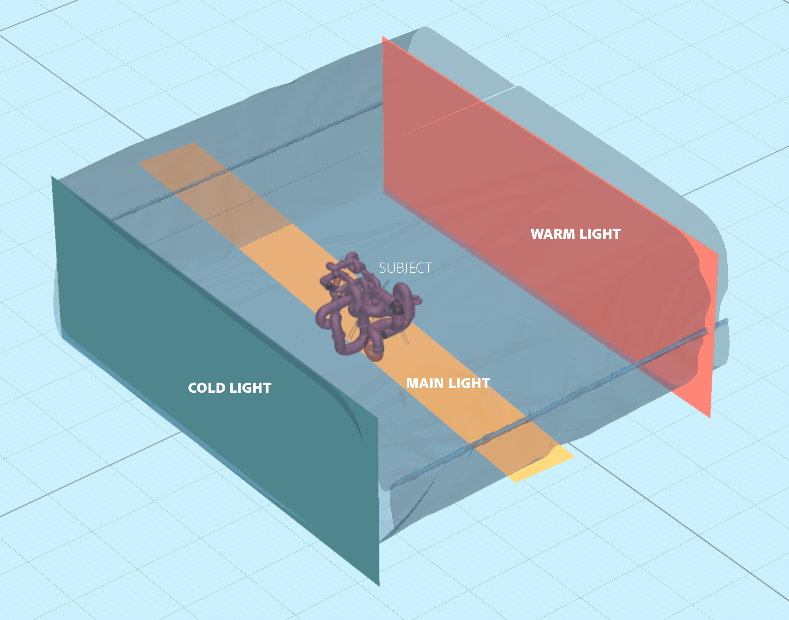
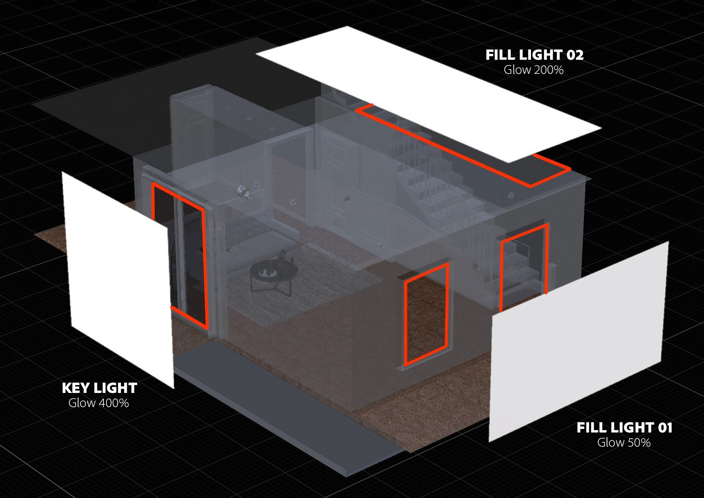

# Suggerimenti e tecniche per l’illuminazione 3D in CGI

Scopri l’illuminazione 3D e come creare diverse condizioni di luce per alterare completamente una scena generata da computer e gli oggetti in essa.

Percepiamo il mondo intorno a noi usando i nostri sensi: sentiamo, sentiamo, odoriamo, vediamo. Possiamo vedere perché i nostri occhi raccolgono informazioni che ci arrivano da particelle elementari chiamate fotoni. Queste informazioni vengono elaborate dal nostro cervello per produrre un&#39;immagine. Ciò che interpretiamo come colore, lucentezza, trasparenza o qualità metalliche di un oggetto sono tutti prodotti dall&#39;interazione tra i fotoni e la superficie dell&#39;oggetto.

La meccanica della luce in una scena 3D generata da computer (CGI) segue lo stesso principio naturale della dispersione dei fotoni, attraverso un processo chiamato ray tracing. I raggi rimbalzano dalle forme e interagiscono con i loro materiali, definendo come gli oggetti appaiono nell’immagine finale. Le luci espongono la dimensionalità di tutto ciò che esiste in una scena 3D.

Alcuni materiali sono più sensibili di altri alle condizioni di illuminazione. Ad esempio, i metalli: un oggetto cromato riflette tutto ciò che lo circonda. Se una luce viene spostata, diventa più luminosa o più grande, tutte queste informazioni sono visibili direttamente sulla superficie cromata quasi come dettagli speculari, quindi possono apparire completamente diverse da una condizione di luce all’altra.

## Come lavorare con le luci 3D per creare rendering 3D efficaci

La creazione di un rendering 3D non segue sempre lo stesso processo, ma spesso comprende i seguenti passaggi:

1. Creazione o acquisizione di oggetti
1. Assemblaggio scena
1. Inquadratura della scena
1. **Illuminazione**
1. Creazione o assegnazione del materiale
1. Rendering

Quando si arriva alla fase di illuminazione, è ideale impostare le luci prima di lavorare sui materiali. A tale scopo, puoi assegnare all’intera scena un materiale opaco di colore grigio neutro. In questo modo, potrai vedere e capire più chiaramente in che modo le luci influenzano le sagome degli oggetti nella scena. Una volta completati i materiali, l’illuminazione potrebbe richiedere un’ulteriore rifinitura.

È meglio lavorare sulle luci una alla volta. La luce attiva dovrebbe essere l’unica visibile nella scena, mentre tutte le altre luci dovrebbero essere temporaneamente spente. In questo modo, potrai vedere come ogni singola luce influenza la scena e modificarla cambiandone le proprietà, come posizione, direzione, intensità, ecc.

Un altro trucco utile consiste nel creare una sfera con un materiale metallico lucido (cromato o a specchio). Questa &quot;sfera a specchio&quot; riflette efficacemente l&#39;intera scena circostante, in modo da poter facilmente determinare la posizione, la direzione o le dimensioni della luce. In caso di luci ambiente, potrai vedere il suo riflesso nella sfera dello specchio, che ti aiuterà a impostare il suo orientamento nello spazio.

## Tipi di luci in Adobe [!DNL Dimension]

### Luci ambientali

Le luci ambiente sono immagini equirettangolari (sferiche), che vengono avvolte intorno all’intera scena. Come suggerisce il nome, queste luci servono a emulare l&#39;intero ambiente, comprese le sorgenti luminose, che vi sono conservate.

Quando crei una nuova scena in [[!DNL Dimension]](https://www.adobe.com/products/dimension.html), verrà creata una luce ambiente predefinita. Ecco perché si è immediatamente in grado di vedere qualcosa nella scena. Adobe [!DNL Dimension] Le risorse iniziali includono un certo numero di luci ambiente, che puoi provare immediatamente. Inoltre, [Adobe [!DNL Stock]](https://stock.adobe.com/search?filters[content_type:3d]=1&amp;filters[3d_type_id][0]=2&amp;load_type=3d+lp) offre un&#39;ampia selezione di luci ambiente.

Le luci ambiente producono risultati altamente realistici e consentono di risparmiare molto tempo. Per ottenere manualmente un risultato simile, dovreste creare l’intero ambiente in 3D (comprese le varie sorgenti luminose), operazione che rappresenta un’enorme quantità di lavoro.

Esistono molti modi per creare le luci ambiente, tra cui l’acquisizione da una scena 3D o da una foto e l’utilizzo di sistemi parametrici. Se la luce ambiente è ottenuta da una scena 3D, il processo è semplice. L’immagine di output deve essere a 32 bit, in modo da acquisire i dati sulla luce di tutte le luci presenti nella scena. La videocamera 3D deve utilizzare la proiezione equirettangolare (per generare un&#39;immagine sferica).

Potete anche creare luci ambiente acquisendo fotografie del mondo reale. Per questo flusso di lavoro, è necessaria una fotocamera a 360° (ad esempio, [Ricoh Theta Z1](https://theta360.com/en/about/theta/z1.html)). La fotocamera viene quindi utilizzata per il bracketing dell’esposizione (o esposizione a forcella), ovvero per scattare più foto dello stesso ambiente, scattate con una gamma di valori di esposizione diversi (da sottoesposizione a sovraesposizione). Queste immagini vengono quindi utilizzate per creare immagini a 32 bit, spesso denominate HDR (High Dynamic Range). Un modo per assemblare un’immagine di questo tipo è con la funzione Unisci come HDR in Photoshop. L’intervallo di esposizione incorporato diventerà la proprietà di intensità.

In entrambi i casi, le sorgenti luminose (e le loro intensità) vengono incorporate in queste immagini e, una volta utilizzate in [!DNL Dimension].

Con questi metodi hai acquisito tutte le luci, i riflessi e i dettagli necessari, ma le app 3D consentono di continuare a modificarli nello spazio 3D, in modo da poter regolare la rotazione dell’illuminazione, nonché modificare l’intensità e il colore complessivi.

### Luci direzionali

Oltre alle luci ambiente, che emettono luce a 360 gradi, esistono anche luci direzionali, che emettono luce da una sola direzione. Vengono utilizzate per emulare torce e altri tipi di luci provenienti da un emettitore ben definito e possono essere di forma circolare o quadrata.

L’uso delle luci direzionali offre pieno controllo sull’impostazione dell’illuminazione. L’illuminazione della scena con queste luci funziona come nella fotografia tradizionale, in cui ogni luce può essere controllata in modo indipendente, per creare la propria illuminazione fotografica virtuale. Uno dei metodi di illuminazione più comuni è il sistema di luce a 3 punti.

[!DNL Dimension] consente di controllare la rotazione e l’altezza con un semplice clic e trascinamento su un oggetto 3D. In questo modo, potete dirigere dinamicamente i raggi di luce. Questi parametri possono essere regolati anche manualmente.

Puoi modificare il colore e l’intensità delle luci direzionali e regolare la forma della sorgente luminosa: puoi renderla circolare o rettangolare, allungarla o ingrandirla. Infine, potete ammorbidire i bordi della sorgente luminosa.

![Modifica della forma di una luce direzionale in Adobe [!DNL Dimension]](assets/Mastering3dlighting_12.gif)

Se rendete la sorgente di luce più piccola dell’oggetto, le ombre risulteranno più nitide, con un contorno più nitido, perché i raggi non possono oltrepassare l’oggetto illuminato. Le sorgenti di luce più grandi producono invece ombre più morbide: in questo caso, infatti, i raggi provengono da tutti i lati dell’oggetto (contrassegnati in rosso nell’illustrazione seguente), creando una serie di ombre. Queste ombre sono attenuate dai raggi che provengono dalla direzione opposta.

### Sole e cielo

La luce solare è un particolare tipo di luce direzionale. Il processo di impostazione è molto simile a una normale luce direzionale, tuttavia questa luce cambierà automaticamente il colore con l&#39;altezza; quando è vicina all&#39;orizzonte (valori bassi dell&#39;angolo di altezza), diventerà gradualmente più calda per simulare il tramonto. Il colore può essere modificato anche mediante i predefiniti. Nel frattempo, la presenza di nuvole influisce sulla morbidezza delle ombre.

![Manipolazione delle proprietà di illuminazione per la luce solare sul modello 3D di un’auto in Adobe [!DNL Dimension]](assets/Mastering3dlighting_15.gif)

Siamo in grado di emulare il cielo utilizzando le luci ambiente, e qualsiasi luce ambiente con il cielo può essere utilizzata. Ora dobbiamo allineare la luce solare (prodotta in [!DNL Dimension]) con il Sole, acquisito nella luce ambiente. Un modo veloce per farlo è creare una sfera e assegnarvi un materiale metallico; questo ci fornirà riflessioni in tempo reale dell&#39;ambiente, così possiamo utilizzare Punta la luce verso il punto per allineare la luce solare con il Sole.

Se la luce ambiente presenta un cielo coperto, la proprietà Nuvolosità può essere utilizzata per soddisfare queste condizioni più da vicino.

![Manipolazione delle proprietà di nuvolosità per la luce ambiente del cielo sul modello 3D di un’auto in Adobe [!DNL Dimension]](assets/Mastering3dlighting_17.gif)

Una volta associate la luce solare e la luce ambiente del cielo, puoi ruotarle insieme utilizzando la proprietà Rotazione globale.

### Luci basate su oggetti

Gli oggetti possono essere trasformati in sorgenti luminose attivando la proprietà Bagliore per i relativi materiali. In questo modo, è possibile creare oggetti come lampadine, luci al neon, softbox e vari tipi di schermi e display.

Il vantaggio principale di questo tipo di illuminazione è il decadimento dell’intensità, che produce risultati molto naturali. Questo è molto utile per la visualizzazione di prodotti o altre scene in studio.

Potete controllare la morbidezza delle ombre ridimensionando l’oggetto luminoso con lo strumento trasformazione. Se lo ingrandisci, aumenta anche l’intensità della luce.

A differenza dei precedenti tipi di luce, queste luci possono utilizzare anche le texture, oltre ai colori. Le texture possono essere associate al colore di base dei materiali e l’intensità della luce viene controllata con un cursore del bagliore.

## Esempi di illuminazione 3D efficace

### Illuminazione per prodotti

Ci sono molte tecniche fotografiche per impostare la luce per una foto di prodotto. Useremo una delle configurazioni più utilizzate, ovvero il sistema di luce a 3 punti.

Questa configurazione è costituita da tre luci:

1. **Indicatore luminoso:** utilizzata come sorgente luminosa principale, proviene approssimativamente dalla direzione della videocamera

   

1. **Luce a cerchio:** orientato sul lato opposto rispetto alla trasparenza, questo viene utilizzato per esporre la sagoma del soggetto.

   

1. **Luce di riempimento:** meno intensa e utile per riempire le aree più scure, viene utilizzata per le aree non raggiunte dalle due luci precedenti.

   

Esistono due modi per creare l’illuminazione a 3 punti [!DNL Dimension] - utilizzo di luci direzionali (aggiunte singolarmente alla scena o utilizzando un predefinito Luce a 3 punti) o tramite oggetti luminosi.

### Illuminazione creativa

L&#39;illuminazione creativa viene utilizzata quando l&#39;accuratezza fisica non è l&#39;obiettivo primario. Questo include scene astratte e surreali di tutti i tipi, senza porre limiti alla nostra fantasia.

Nell’esempio precedente, l’idea era di ritrarre un ambiente simile a un sogno: colori pastello e superfici lisce. Il sistema di illuminazione è costituito da tre pannelli luminosi (due laterali e quello principale dal basso). Tutti i pannelli sono troppo grandi, il che crea ombre e luci molto morbide. Le sorgenti luminose sono colorate e il colore viene trasferito nel materiale assegnato agli oggetti nella scena.

Il soggetto della scena (tubi) è completamente circondato dalla geometria delle pareti. Questo farà sì che i raggi di luce rimbalzino e si mescolino insieme in modi interessanti. Giocare con toni freddi e caldi spesso produce un bel contrasto (questa tecnica è talvolta utilizzata nella fotografia di ritratti).

### Visualizzazione di interni

La creazione di una visualizzazione di un interno 3D segue una serie di regole, che garantiscono quasi sempre buoni risultati. Per questo caso d’uso, considereremo solo la luce naturale (nessuna sorgente artificiale, come le lampade).

Prima di tutto, una scena come questa deve trovarsi in un ambiente chiuso. Proprio come nella vita reale, l&#39;interno avrà bisogno di pareti, pavimento, soffitto e finestre. In questo modo la luce entra dalle finestre e rimbalza (tramite un processo chiamato ray tracing). Questo comportamento produce un’illuminazione molto naturale (ad esempio, le aree occluse, come gli angoli, saranno più scure).

Poiché la scena è quasi completamente circondata da geometria architettonica, vedremo pochissima illuminazione e quasi nessuna riflessione dalla luce ambiente. Tuttavia, in questo caso, stiamo di fatto costruendo il nostro ambiente, che è l&#39;interno stesso. Così la luce reagirà con gli oggetti nella scena rimbalzando da loro e dalle pareti circostanti. Gli oggetti si rifletteranno a vicenda e rifletteranno solo le pareti circostanti. Tuttavia, è consigliabile aggiungere una luce ambiente con il cielo. In questo modo verrà aggiunto un riempimento blu diffuso.

Il modo più semplice per impostare questa luce è usare piani con materiali luminosi. In questo caso abbiamo tre piani, che coprono tutte le aperture all&#39;interno.

L’intensità della luce è controllata dalla proprietà Bagliore sui materiali dei piani. Puoi aggiungere un colore o anche una texture, per proiettare ombre interessanti. L’uso di materiali luminosi fornirà anche il decadimento dell’intensità della luce, molto importante per l’illuminazione di interni.

### Illuminazione per esterni

Creare un’illuminazione per esterni è abbastanza semplice e si riduce all’uso di un sistema di luci Sole e cielo (vedi sopra). È importante abbinare correttamente la luce del sole alla luce ambiente del cielo, prestando attenzione sia all’orientamento che al valore della nuvolosità.

La scena stessa gioca un ruolo importante in questo. Per produrre risultati convincenti, utilizza gli oggetti presenti nella scena come catalizzatori che interagiscono con la luce. Nel rendering della foresta mostrato sopra, gli oggetti (varie piante, tronchi e alberi) sono posizionati l&#39;uno vicino all&#39;altro.

Ciò significa che ci saranno molte complesse interazioni di ray tracing, poiché la luce rimbalza tra gli oggetti. I punti ombreggiati appaiono scuri (come previsto), mentre le aree esposte restano luminose.

![Utilizzo della Rotazione globale in Adobe [!DNL Dimension] per riorientare il sistema di luci Sole e cielo in una scena 3D](assets/Mastering3dlighting_34.gif)

Spero che questa panoramica illustri l’importanza di padroneggiare le luci 3D in varie situazioni. Dovresti essere pronto a produrre risultati più convincenti.

Buona illuminazione! Scarica il [ultima versione](https://creativecloud.adobe.com/apps/download/Dimension) del Dimension oggi.
