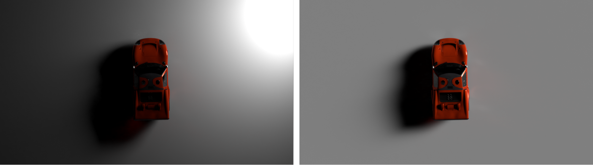

# Suggerimenti e tecniche per la padronanza dell&#39;illuminazione 3D nei CGI

Informazioni sull&#39;illuminazione 3D e su come creare diverse condizioni di luce che possono alterare completamente una scena generata da un computer e il modo in cui gli oggetti vi appaiono.

Noi percepiamo il mondo che ci circonda usando i nostri sensi: sentiamo, sentiamo, odoriamo, vediamo. Possiamo vedere perché i nostri occhi raccolgono informazioni che ci vengono portate da particelle elementari chiamate fotoni. Queste informazioni vengono elaborate dal nostro cervello per produrre un&#39;immagine. Ciò che interpretiamo come colore dell’oggetto, lucidità, traslucidità o qualità metalliche sono tutti prodotti dell’interazione tra i fotoni e la superficie dell’oggetto.

La meccanica della luce in una scena 3D generata da un computer segue lo stesso principio naturale della diffusione fotonica, attraverso un processo chiamato [ray trace](https://en.wikipedia.org/wiki/Ray_tracing_(graphics)). I riquadri rimbalzano le forme e interagiscono con i loro materiali, definendo in modo efficace la modalità di visualizzazione degli oggetti nell&#39;immagine finale. Le luci espongono la dimensionalità di tutto ciò che esiste in una scena 3D.

Alcuni materiali sono più sensibili alle condizioni di illuminazione di altri. Prendete ad esempio metalli: un oggetto cromo riflette praticamente tutto ciò che lo circonda. Se una luce viene spostata, diventa più luminosa o più grande, tutte queste informazioni sono visibili direttamente sulla superficie cromatica in un dettaglio quasi speculare, in modo che possano apparire completamente diverse da una condizione di luce all&#39;altra.

## Come utilizzare le luci 3D per creare rendimenti 3D efficaci

Il processo di creazione di un rendering 3D non è mai stato esattamente lo stesso, ma questi sono i passi più comuni:

1. Creazione o acquisizione di oggetti
1. Assemblaggio scena
1. Inquadrare la scena
1. **Illuminazione**
1. Creazione o assegnazione di materiale
1. Rendering

Quando si arriva alla fase di illuminazione, è ideale impostare le luci prima di lavorare sui materiali. A tale scopo, è possibile assegnare un materiale grigio neutro e chiaro all&#39;intera scena. In questo modo, potrete vedere e capire più chiaramente come le luci influenzano le silhouette degli oggetti sulla scena. Una volta completati i materiali, l&#39;illuminazione potrebbe aver bisogno di un ulteriore raffinamento.

È meglio lavorare alla luce una alla volta. La luce attiva dovrebbe essere l&#39;unica visibile nella scena, mentre tutte le altre luci dovrebbero essere temporaneamente spente. In questo modo, potrete vedere come una luce specifica influenza la scena, e cambiarla lavorando sulle sue proprietà, come la posizione, la direzione, l&#39;intensità, ecc.

Un altro trucco utile è quello di creare una sfera con un materiale di metallo lucente (cromo o specchio). Questa &quot;palla speculare&quot; riflette l&#39;intera scena circostante, in modo da poter determinare facilmente la posizione, la direzione o la dimensione della luce. In caso di luci ambientali, potrete vedere il suo riflesso nella palla specchio, che aiuterà a impostarne l&#39;orientamento nello spazio.

## Tipi di luci in Adobe [!DNL Dimension]

### Luci d&#39;ambiente

Le luci di ambiente sono immagini equirettangolari (sferiche), avvolte intorno all&#39;intera scena. Come suggerisce il nome, queste luci servono per emulare l&#39;intero ambiente, comprese le sorgenti luminose, che sono memorizzate in esse.

Quando si crea una nuova scena in [[!DNL Dimension]](https://www.adobe.com/products/dimension.html), verrà creata una luce di ambiente predefinita per l&#39;utente. Ecco perché si riesce immediatamente a vedere qualsiasi cosa sulla scena. Adobe [!DNL Dimension] Starter Assets include un certo numero di luci dell&#39;ambiente che è possibile provare immediatamente. Inoltre, [Adobe [!DNL Stock]](https://stock.adobe.com/search?filters[content_type:3d]=1&amp;filtri[3d_type_id][0]=2&amp;load_type=3d+lp) offre una vasta selezione di luci di ambiente.

Le luci ambientali producono risultati estremamente realistici e possono risparmiare molto tempo. Per ottenere qualcosa di simile manualmente, bisognerebbe creare l&#39;intero ambiente in 3D (comprese varie sorgenti luminose), che è un lavoro significativo.

Esistono molti modi per creare luci ambientali, tra cui l&#39;acquisizione da una scena 3D, da una fotografia e l&#39;utilizzo di sistemi parametrici. Se la luce dell&#39;ambiente è costituita da una scena 3D, il processo è semplice. L&#39;immagine in uscita deve essere a 32 bit, che catturerà le informazioni sulla luce di tutte le luci presenti nella scena. La telecamera 3D deve utilizzare la proiezione equirettangolare (per riprodurre un&#39;immagine sferica).

È anche possibile creare luci ambientali catturando fotografie del mondo reale. Per questo flusso di lavoro è necessaria una telecamera da 360 (ad esempio, [Ricoh Theta Z1](https://theta360.com/en/about/theta/z1.html)). La telecamera viene quindi utilizzata per l&#39;impostazione della staffa di esposizione o per effettuare più riprese dello stesso ambiente, scattate con una serie di valori di esposizione diversi (da sottoesposto a sovraesposto). Queste riprese vengono utilizzate per costruire immagini a 32 bit, spesso definite HDR (abbreviazione di High Dynamic Range). Un modo per assemblare un&#39;immagine di questo tipo è la funzione Unisci a HDR in Photoshop. L&#39;intervallo di esposizione incorporato diventerà la proprietà dell&#39;intensità.

In entrambi i casi, le sorgenti luminose (e la loro intensità) vengono &quot;cotte&quot; in queste immagini e la luce viene emessa una volta utilizzate in [!DNL Dimension].

In questi metodi avete acquisito tutte le luci, i riflessi e i dettagli di cui avete bisogno, ma le app 3D vi consentono di continuare a modificarle nello spazio 3D, in modo da poter regolare la rotazione dell&#39;illuminazione e cambiare l&#39;intensità e il colore complessivi.

### Luci direzionali

Oltre alle luci per l&#39;ambiente, che emettono luce da 360°, sono presenti anche le luci direzionali che emettono luce da una sola direzione. Vengono usate per emulare torce e altri tipi di luci provenienti da un emettitore ben definito, e possono essere modellate come cerchio o quadrato.

L&#39;utilizzo di luci direzionali offre il pieno controllo sull&#39;impostazione dell&#39;illuminazione. L&#39;illuminazione della scena con queste luci avviene nello stesso modo della fotografia tradizionale, dove ogni luce può essere controllata in modo indipendente, consentendo di costruire una propria illuminazione fotografica virtuale. Una delle impostazioni di illuminazione più utilizzate è il sistema a 3 punti.

[!DNL Dimension] consente di controllare la rotazione e l&#39;altezza facendo semplicemente clic e trascinando un oggetto 3D. In questo modo è possibile indirizzare dinamicamente i raggi luminosi. Questi parametri possono essere regolati manualmente.

È possibile modificare il colore e l&#39;intensità delle luci direzionali, nonché regolare la forma della sorgente luminosa, renderla circolare o rettangolare, stirarla o ingrandirla. Infine, potete ammorbidire i bordi della sorgente luminosa.

![Modifica della forma di una luce direzionale in Adobe  [!DNL Dimension]](assets/Mastering3dlighting_12.gif)

Se si riduce la sorgente luminosa rispetto all&#39;oggetto, le ombre saranno più nitide, con un contorno più chiaro, perché i raggi non riescono a superare l&#39;oggetto illuminato. Le sorgenti luminose più grandi producono ombre più sottili, perché in questo caso i raggi provengono da tutti i lati dell&#39;oggetto (contrassegnati in rosso nell&#39;illustrazione sottostante), creando una matrice di ombre. Queste ombre sono ammorbidite dai raggi provenienti dalla direzione opposta.

### Sole e cielo

La luce solare è un particolare tipo di luce direzionale. Il processo di configurazione è molto simile alla luce direzionale regolare, ma la luce cambia automaticamente il colore con l&#39;altezza; quando è vicino all&#39;orizzonte (valori di angolo di altezza bassa), diventerà gradualmente più caldo per simulare il tramonto. È inoltre possibile modificare il colore utilizzando i predefiniti. Nel frattempo, l&#39;oscurità influenzerà la morbidezza dell&#39;ombra.

![Manipolazione delle proprietà di illuminazione per l&#39;illuminazione solare su un modello di auto 3D in Adobe  [!DNL Dimension]](assets/Mastering3dlighting_15.gif)

Siamo in grado di emulare il cielo usando le luci dell&#39;ambiente, e qualunque luce ambientale che mostri il cielo può essere usata. Ora, dobbiamo allineare la luce solare (prodotta in [!DNL Dimension]) al sole, catturata nella luce ambientale. Un modo rapido per farlo è creare una sfera e assegnargli un materiale metallico; questo ci fornirà riflessioni in tempo reale dell&#39;ambiente, così possiamo usare la luce Aim in punto per allineare la luce del sole al sole.

Se la luce dell&#39;ambiente presenta un cielo sovrapposto, la proprietà di oscurità può essere utilizzata per adattarsi più da vicino a queste condizioni.

![Manipolazione delle proprietà di nuvolosità per l&#39;illuminazione dell&#39;ambiente cielo su un modello di auto 3D in Adobe  [!DNL Dimension]](assets/Mastering3dlighting_17.gif)

Una volta abbinati la luce Sole e la luce Ambiente cielo, è possibile ruotarli insieme utilizzando la proprietà Rotazione globale.

### Luci basate su oggetti

Gli oggetti possono essere trasformati in sorgenti luminose, attivando la proprietà Glow per i relativi materiali. In questo modo, è possibile creare oggetti come lampadine, neon, softbox, schermi e display di ogni tipo.

Il vantaggio principale di questo tipo di illuminazione è il deterioramento dell&#39;intensità, che produce risultati molto naturali. Questa funzione è molto utile per la visualizzazione dei prodotti o per altre scene in studio.

Potete controllare la morbidezza delle ombre scalando l&#39;oggetto luminoso verso l&#39;alto o verso il basso, utilizzando lo strumento di trasformazione. Aumentando il volume aumenterà anche l&#39;intensità della luce.

A differenza dei precedenti tipi di luci che abbiamo coperto, queste luci possono anche utilizzare texture, oltre ai colori più naturali. Le texture possono essere collegate al colore di base dei loro materiali e l&#39;intensità della luce è controllata attraverso un dispositivo di scorrimento della luce.

## Esempi di illuminazione 3D efficace

### Illuminazione del prodotto

Esistono molte tecniche fotografiche per impostare la luce per un prodotto ripreso. Useremo una delle configurazioni più utilizzate, ovvero il sistema a 3 punti luminosi.

Questa configurazione è composta da tre luci:

1. **Luce del tasto:** utilizzata come sorgente primaria, questa lampeggia approssimativamente dalla direzione della telecamera

   

1. **Luce di ribaltamento:** orientata sul lato opposto rispetto alla chiave, viene utilizzata per esporre la siluetta del soggetto.

   

1. **Luce di riempimento:** meno intensa e più utile per riempire le aree più scure, utilizzata per le aree che le due luci precedenti non raggiungono.

   

Esistono due modi per creare l&#39;illuminazione a 3 punti in [!DNL Dimension] - utilizzando le luci direzionale (aggiungendole individualmente alla scena o utilizzando una preimpostazione della luce a 3 punte) o attraverso oggetti luminosi.

### Illuminazione creativa

L&#39;illuminazione creativa viene utilizzata quando la precisione fisica non è l&#39;obiettivo principale. Questo include scene astratte e surreali di tutti i tipi, quindi non ci sono confini reali dove la nostra immaginazione può portarci.

Nell&#39;esempio precedente, l&#39;idea era quella di rappresentare un ambiente simile a un sogno: caramelle, colori pastello e superfici lisce. Il sistema di illuminazione è costituito da tre piastre luminose (due laterali e la principale che brilla dal basso). Tutte le piastre luminose sono irrealisticamente grandi, il che crea ombre e luci molto lisce. Le sorgenti luminose sono colorate e il colore viene trasferito nel materiale assegnato agli oggetti della scena.

Il soggetto della scena (pipe) è completamente circondato dalla geometria delle pareti. Ciò causerà che i raggi luminosi saltino avanti e indietro e si mescolano in modi interessanti. La riproduzione con toni caldi rispetto a VS spesso produce un contrasto gradevole (questa tecnica viene talvolta utilizzata nella fotografia di ritratti).

### Visualizzazione interna

La creazione di una visualizzazione di un interno 3D segue una serie di regole, che quasi sempre garantiscono buoni risultati. In questo caso, considereremo solo la luce naturale (nessuna sorgente artificiale, come le lampade).

Innanzitutto, una scena come questa deve trovarsi in un ambiente chiuso. Proprio come nella vita reale, l&#39;interno avrà bisogno di muri, pavimento, soffitto e finestre. In questo modo, la luce passa attraverso le finestre e si rimbalza (attraverso un processo denominato traccia a raggi). Questo comportamento produce un&#39;illuminazione molto naturale (ad esempio, le aree chiuse, come gli angoli, saranno più scure).

Poiché la scena è quasi completamente circondata da geometria architettonica, la luce dell&#39;ambiente mostra una scarsa illuminazione e quasi nessuna riflessione. Tuttavia, in questo caso, stiamo effettivamente costruendo il nostro ambiente, che è l&#39;interno stesso. Quindi la luce reagirà con gli oggetti della scena rimbalzando da loro e dalle pareti circostanti. Gli oggetti rifletteranno solo l&#39;uno l&#39;altro e le pareti intorno a loro. Tuttavia, è bene aggiungere una luce ambientale, con il cielo. Questo aggiungerà un po&#39; di riempimento blu diffuso.

Il modo più semplice per impostare questa luce è usare aerei con materiali luminosi. In questo caso di utilizzo abbiamo tre aerei che coprono tutte le aperture all&#39;interno.

L’intensità della luce è controllata dalla proprietà di brillamento sui materiali dei velivoli. Potete aggiungere un colore o anche una trama, che può essere utilizzata per creare ombre interessanti. L&#39;utilizzo di materiali luminosi produrrà inoltre un effetto di dissoluzione dell&#39;intensità della luce, che è molto importante per l&#39;illuminazione interna.

### Illuminazione esterna

Creare illuminazione esterna è abbastanza semplice e si riduce all&#39;utilizzo di un sistema di illuminazione Sun e Sky (vedi sopra). È importante che la luce del sole corrisponda correttamente alla luce dell&#39;ambiente in cielo, prestando attenzione sia all&#39;orientamento che al valore delle nuvole.

La scena stessa gioca un ruolo importante in questo contesto. Per ottenere risultati convincenti, utilizzate gli oggetti della scena come catalizzatori che interagiscono con la luce. Nel rendering della foresta illustrato in precedenza, gli oggetti (piante, tronchi e alberi) vengono posizionati in prossimità l&#39;uno dell&#39;altro.

Ciò significa che ci sarà un&#39;interazione complessa di tracciatura dei raggi, mentre la luce si sposta tra gli oggetti. Le macchie ombreggiate appariranno scure (come previsto), mentre le aree esposte rimangono luminose.

![Utilizzo della rotazione globale in Adobe  [!DNL Dimension] per riorientare il sistema di illuminazione Sun e Sky in una scena 3D](assets/Mastering3dlighting_34.gif)

Spero che questa panoramica illustri l&#39;importanza della padronanza delle luci 3D in varie situazioni. Dovresti essere pronto a produrre risultati più convincenti.

Buona luce! Scaricare l&#39;ultima versione di Dimension  di oggi.
