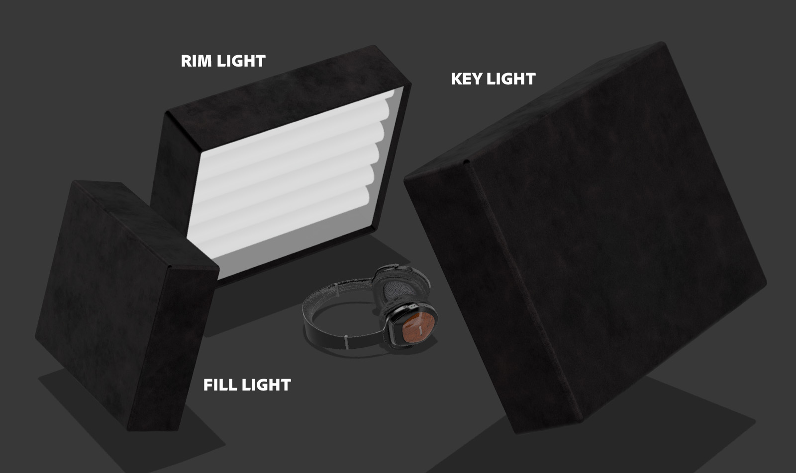

# Suggerimenti e tecniche per la masterizzazione dell’illuminazione 3D in CGI

Scoprite l’illuminazione 3D e come creare diverse condizioni di luce che possono alterare completamente una scena generata dal computer e l’aspetto degli oggetti.

Percepiamo il mondo che ci circonda usando i nostri sensi: sentiamo, sentiamo, odoriamo, vediamo. Possiamo vedere perché i nostri occhi raccolgono informazioni che ci arrivano dalle particelle elementari chiamate fotoni. Queste informazioni vengono elaborate dal nostro cervello per produrre un&#39;immagine. Ciò che interpretiamo come colore dell&#39;oggetto, lucentezza, traslucidità o qualità metalliche sono tutti prodotti dell&#39;interazione tra i fotoni e la superficie dell&#39;oggetto.

La meccanica della luce in una scena 3D generata al computer segue lo stesso principio naturale dello scattering dei fotoni, attraverso un processo chiamato ray tracing. I raggi rimbalzano sulle forme e interagiscono con i loro materiali, definendo in modo efficace l’aspetto degli oggetti nell’immagine finale. Le luci espongono la dimensionalità di tutto ciò che esiste in una scena 3D.

Alcuni materiali sono più sensibili alle condizioni di illuminazione di altri. Prendete i metalli, per esempio: un oggetto chrome riflette praticamente tutto ciò che lo circonda. Se una luce viene spostata, diventa più luminosa o più grande, tutte queste informazioni sono visibili direttamente sulla superficie cromata in un dettaglio quasi simile a uno specchio, quindi possono apparire completamente diverse da una condizione di luce all&#39;altra.

## Come utilizzare le luci 3D per creare rendering 3D efficaci

Il processo di creazione di un rendering 3D non è mai esattamente lo stesso, ma questi sono i passaggi più comuni:

1. Creazione o acquisizione di oggetti
1. Assemblaggio scena
1. Inquadratura della scena
1. **Illuminazione**
1. Creazione o assegnazione di materiale
1. Rendering

Quando si arriva alla fase di illuminazione, è ideale impostare le luci prima di lavorare sui materiali. A tale scopo, potete assegnare un materiale grigio neutro all’intera scena. In questo modo, sarai in grado di vedere e capire più chiaramente in che modo le luci influenzano le sagome degli oggetti nella scena. Dopo che i materiali sono stati completati, l&#39;illuminazione potrebbe aver bisogno di ulteriori miglioramenti.

È meglio lavorare sulle luci una alla volta. La luce attiva dovrebbe essere l’unica visibile nella scena, mentre tutte le altre luci dovrebbero essere temporaneamente spente. In questo modo, sarai in grado di vedere come una luce specifica influenza la scena e cambiarla lavorando sulle sue proprietà, come la posizione, la direzione, l&#39;intensità, ecc.

Un altro trucco utile è creare una sfera con un materiale metallico luccicante (cromato o specchio). Questa &quot;palla specchio&quot; rifletterà in modo efficace l’intera scena attorno ad essa, in modo da poter facilmente determinare la posizione, la direzione o le dimensioni della luce. Nel caso delle luci d&#39;ambiente, potrete vedere il suo riflesso nella sfera a specchio, che aiuterà a impostare il suo orientamento nello spazio.

## Tipi di luci in Adobe [!DNL Dimension]

### Luci ambientali

Le luci ambiente sono immagini equirettangolari (sferiche), che vengono avvolte intorno all&#39;intera scena. Come suggerisce il nome, queste luci servono a emulare l&#39;intero ambiente, comprese le sorgenti di luce, che sono immagazzinate in esse.

Quando create una nuova scena in [[!DNL Dimension]](https://www.adobe.com/products/dimension.html), viene creata una luce ambiente predefinita. Ecco perché si è immediatamente in grado di vedere qualunque cosa nella scena. Adobe [!DNL Dimension] Le risorse iniziali includono un certo numero di luci ambiente, che puoi provare immediatamente. Inoltre, [Adobe [!DNL Stock]](https://stock.adobe.com/search?filters[content_type:3d]=1&amp;filters[3d_type_id][0]=2&amp;load_type=3d+lp) offre un&#39;ampia selezione di luci ambiente.

Le luci ambiente producono risultati altamente realistici e possono farti risparmiare molto tempo. Per ottenere manualmente qualcosa di simile, è necessario creare l&#39;intero ambiente in 3D (comprese varie sorgenti di luce), che è una quantità significativa di lavoro.

Esistono molti modi per creare luci ambiente, tra cui l’acquisizione da una scena 3D, da una foto e l’utilizzo di sistemi parametrici. Se la luce ambiente è ricavata da una scena 3D, il processo è semplice. L&#39;immagine di output deve essere a 32 bit, per catturare le informazioni sulla luce di tutte le luci nella scena. La telecamera 3D deve utilizzare la proiezione equirettangolare (per generare un&#39;immagine sferica).

Puoi anche creare luci ambiente acquisendo fotografie del mondo reale. Per questo flusso di lavoro, è necessaria una videocamera 360 (ad es. [Ricoh Theta Z1](https://theta360.com/en/about/theta/z1.html)). La telecamera viene quindi utilizzata per la funzione di bracketing dell&#39;esposizione o per scattare più foto dello stesso ambiente, utilizzando una gamma di diversi valori di esposizione (da sottoesposta a sovraesposta). Queste riprese vengono quindi utilizzate per creare immagini a 32 bit, spesso chiamate HDR (High Dynamic Range). Un modo per assemblare una tale immagine è con la funzione Unisci come HDR in Photoshop. L’intervallo di esposizione incorporato diventa la proprietà intensità.

In entrambi i casi, le sorgenti luminose (e le loro intensità) vengono &quot;infornate&quot; in queste immagini e, una volta utilizzate nelle [!DNL Dimension].

Con questi metodi hai acquisito tutte le luci, i riflessi e i dettagli necessari, ma le app 3D ti consentono di continuare a modificarli nello spazio 3D, così puoi regolare la rotazione dell’illuminazione e modificare l’intensità e il colore complessivi.

### Luci direzionali

Oltre alle luci ambiente, che emettono luce a 360 gradi, ci sono anche luci direzionali, che emettono luce da una sola direzione. Sono usati per emulare torce elettriche e altri tipi di luci provenienti da un emettitore ben definito e possono essere a forma di cerchio o quadrato.

L’uso delle luci direzionali offre un controllo completo sulla configurazione dell’illuminazione. L’illuminazione della scena con queste luci è eseguita nello stesso modo della fotografia tradizionale, in cui ogni luce può essere controllata in modo indipendente, consentendo di creare la propria illuminazione fotografica virtuale. Una delle impostazioni di illuminazione più comunemente utilizzate è il sistema di illuminazione a 3 punti.

[!DNL Dimension] dispone di un’azione pratica, Luce mirata in corrispondenza del punto, che consente di controllare la rotazione e l’altezza semplicemente facendo clic e trascinando su un oggetto 3D. In questo modo, potete dirigere dinamicamente i raggi di luce. Questi parametri possono essere regolati manualmente.

Puoi modificare il colore e l’intensità delle luci direzionali, nonché regolare la forma della sorgente luminosa, rendendola circolare o rettangolare, allungandola o rendendola più grande. Infine, potete ammorbidire i bordi della sorgente di luce.

![Modifica della forma di una luce direzionale nell’Adobe [!DNL Dimension]](assets/Mastering3dlighting_12.gif)

Se rendete la sorgente di luce più piccola dell’oggetto, le ombre saranno più nitide, con un contorno più nitido, perché i raggi non possono oltrepassare l’oggetto illuminato. Le sorgenti luminose più grandi producono ombre più morbide, perché in questo caso i raggi provengono da tutti i lati dell’oggetto (segnati in rosso nell’illustrazione qui sotto), creando una serie di ombre. Queste ombre sono ammorbidite dai raggi provenienti dalla direzione opposta.

### Sole e cielo

La luce solare è un tipo speciale di luce direzionale. Il processo di impostazione è molto simile a quello di una normale luce direzionale, tuttavia questa luce cambia automaticamente il colore con l&#39;altezza; quando è vicino all’orizzonte (valori di angolo di altezza bassi), diventa gradualmente più caldo per simulare il tramonto. Il colore può essere modificato anche utilizzando i predefiniti. Nel frattempo, la nuvolosità influenzerà la morbidezza dell&#39;ombra.

![Manipolazione delle proprietà di illuminazione per l’illuminazione solare su un modello di auto 3D in Adobe [!DNL Dimension]](assets/Mastering3dlighting_15.gif)

Siamo in grado di emulare il cielo usando le luci dell&#39;ambiente, e possiamo usare qualsiasi luce dell&#39;ambiente che rappresenti il cielo. Ora dobbiamo allineare la luce del sole (fatta in [!DNL Dimension]) con il Sole, catturato nella luce ambiente. Un modo rapido per farlo consiste nel creare una sfera e assegnarvi un materiale metallico; questo ci fornirà riflessioni in tempo reale dell&#39;ambiente, così possiamo usare la luce Aim in un punto per allineare la luce solare con il sole.

Se la luce ambiente presenta un cielo coperto, la proprietà nuvolosità può essere utilizzata per corrispondere più strettamente a queste condizioni.

![Manipolazione delle proprietà di nuvolosità per l’illuminazione ambientale del cielo su un modello di auto 3D in Adobe [!DNL Dimension]](assets/Mastering3dlighting_17.gif)

Una volta accoppiate la luce solare e la luce ambiente del cielo, potete ruotarle insieme utilizzando la proprietà Rotazione globale.

### Luci basate su oggetti

Gli oggetti possono essere trasformati in sorgenti luminose, attivando la proprietà Bagliore per i loro materiali. In questo modo, è possibile creare oggetti come lampadine, luci al neon, softbox e tutti i tipi di schermi e display.

Il vantaggio principale di questo tipo di illuminazione è il decadimento dell&#39;intensità, che produce risultati molto naturali. Questa funzione è molto utile per la visualizzazione di prodotti o altre scene realizzate in studio.

Potete controllare la morbidezza delle ombre ridimensionando l’oggetto luminoso in alto o in basso, utilizzando lo strumento trasformazione. Rendendolo più grande aumenterà anche l&#39;intensità della luce.

A differenza dei precedenti tipi di luci che abbiamo coperto, queste luci possono anche utilizzare texture, oltre ai colori semplici. Le texture possono essere associate al colore di base dei loro materiali e l&#39;intensità della luce viene controllata tramite un cursore del bagliore.

## Esempi di illuminazione 3D efficace

### Illuminazione del prodotto

Esistono molte tecniche fotografiche per impostare la luce di uno scatto di prodotto. Useremo una delle configurazioni più usate, ovvero il sistema di illuminazione a 3 punti.

Questa configurazione è composta da tre luci:

1. **Luce chiave:** utilizzata come sorgente primaria, si illumina approssimativamente dalla direzione della telecamera

   

1. **Luce a cerchio:** orientata sul lato opposto rispetto alla chiave, questa viene utilizzata per esporre la sagoma del soggetto.

   

1. **Luce di riempimento:** meno intensivo e utile per riempire le aree più scure, viene utilizzato per aree che le due luci precedenti non raggiungono.

   

Esistono due modi per creare l’illuminazione a 3 punti in [!DNL Dimension] - utilizzando le luci direzionali (aggiungendole individualmente alla scena o utilizzando un predefinito Luce a 3 punti) o tramite oggetti luminosi.

### Illuminazione creativa

L&#39;illuminazione creativa viene utilizzata laddove l&#39;accuratezza fisica non è l&#39;obiettivo principale. Questo include scene astratte e surreali di tutti i tipi, quindi non ci sono confini reali dove la nostra immaginazione può portarci.

Nell&#39;esempio di cui sopra, l&#39;idea era di rappresentare un ambiente onirico: caramelle, colori pastello e superfici lisce. Il sistema di illuminazione è costituito da tre piastre luminose (due laterali e quella principale che brilla dal basso). Tutte le lastre luminose sono irrealisticamente grandi, il che crea ombre e luci molto uniformi. Le sorgenti luminose sono colorate e quel colore viene trasferito nel materiale assegnato agli oggetti nella scena.

Il soggetto della scena è completamente circondato dalla geometria delle pareti. Questo causerà il rimbalzo dei raggi di luce e la loro miscelazione in modi interessanti. Giocare con toni freddi e caldi spesso produce un bel contrasto (questa tecnica è talvolta utilizzata nella fotografia di ritratti).

### Visualizzazione interna

La creazione di una visualizzazione di un interno 3D segue un certo insieme di regole, che quasi sempre garantiscono buoni risultati. Per questo caso d&#39;uso, considereremo solo la luce naturale (nessuna sorgente artificiale, come le lampade).

Prima di tutto, una scena come questa deve essere in un ambiente chiuso. Proprio come nella vita reale, l&#39;interno avrà bisogno di pareti, pavimento, soffitto e finestre. Questo assicurerà che la luce passi attraverso le finestre e poi rimbalzi (attraverso un processo chiamato ray tracing). Questo comportamento produce un’illuminazione molto naturale (ad esempio, le aree occluse, come gli angoli, saranno più scure).

Poiché la scena è quasi completamente circondata da geometria architettonica, vedremo pochissima illuminazione e quasi nessun riflesso proveniente dalla luce ambiente. Tuttavia, in questo caso, stiamo effettivamente costruendo il nostro ambiente, che è l&#39;interno stesso. Così la luce reagirà con gli oggetti nella scena rimbalzando su di loro e sui muri circostanti. Gli oggetti si rifletteranno l&#39;uno con l&#39;altro e i muri attorno ad essi. Tuttavia, è buona idea aggiungere una luce Ambiente, con il cielo. Questo aggiungerà un riempimento blu diffuso.

Il modo più semplice per impostare questa luce è usando piani con materiali luminosi. In questo caso d&#39;uso abbiamo tre piani, che coprono tutte le aperture interne.

L&#39;intensità della luce è controllata dalla proprietà del bagliore sui materiali dei piani. Potete aggiungere un colore o anche una texture, che può essere utilizzata per creare ombre interessanti. L&#39;uso di materiali luminosi fornisce anche il decadimento dell&#39;intensità della luce, che è molto importante per l&#39;illuminazione interna.

### Illuminazione per esterni

Creare un’illuminazione esterna è abbastanza semplice e si riduce all’utilizzo di un sistema di illuminazione Sole e Cielo (vedi sopra). È importante abbinare correttamente la luce solare alla luce ambiente basata sul cielo, prestando attenzione sia all’orientamento che al valore della nuvolosità.

La scena stessa gioca un ruolo importante in questo. Per ottenere risultati accattivanti, usate gli oggetti nella scena come catalizzatori che interagiscono con la luce. Nel rendering della foresta mostrato sopra, gli oggetti (piante, tronchi e alberi diversi) sono posizionati uno vicino all’altro.

Ciò significa che ci sarà molta interazione complessa con il ray tracing, poiché la luce rimbalza tra gli oggetti. Le macchie ombreggiate appariranno scure (come previsto), mentre le aree esposte rimangono luminose.

![Uso della rotazione globale nell’Adobe [!DNL Dimension] per riorientare il sistema di illuminazione del sole e del cielo in una scena 3D](assets/Mastering3dlighting_34.gif)

Spero che questa panoramica illustri l&#39;importanza di controllare le luci 3D in varie situazioni. Dovresti essere pronto per iniziare a produrre risultati più convincenti.

Buona illuminazione! Scarica il [ultima versione](https://creativecloud.adobe.com/apps/download/Dimension) del Dimension oggi.
