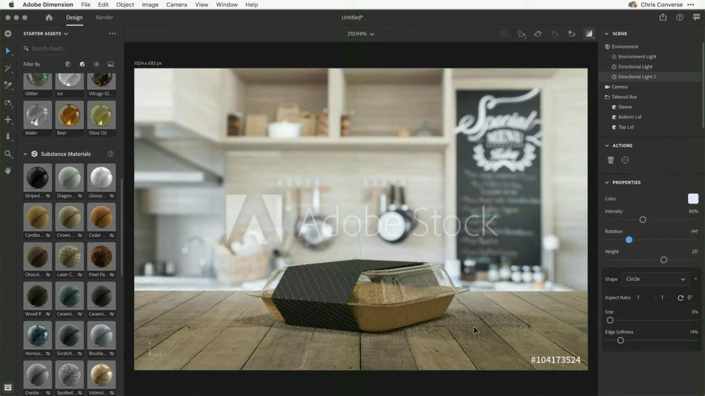

# Adobe di esercitazioni per 3D e VR

Crea contenuti coinvolgenti in 3D più velocemente con modelli, materiali e illuminazione di alta qualità. [!DNL Dimension] semplifica la creazione di visualizzazioni del marchio, illustrazioni, modelli di prodotti, progetti di packaging e altri lavori creativi. Seleziona un’immagine per visualizzare un’esercitazione.

<table>
<tr>
 <td>
   
    

   <a href="substance-3d-stager.md"><strong>Progettazione e rendering 3D</strong></a>
    

    <em>Importa i contenuti, disponi la scena, applica materiali e texture, regola l’illuminazione fisica e basata su immagini, salva le fotocamere con risoluzioni diverse ed esegui il rendering delle immagini fotorealistiche</em>
     
  </td>
  <td>
   
    

   <a href="assets/CreateRealistic3DMockupswithAdobeStockandDimension.pdf"><strong>Creazione di prototipi 3D realistici con Adobe [!DNL Stock] e [!DNL Dimension] (PDF)</strong></a>
    

    <em>Combina facilmente un progetto 2D con un modello 3D utilizzando l’Adobe [!DNL Stock] e grafica inserita nell'Adobe [!DNL Dimension]</em>
     
  </td>
  <td>
   
    

   <a href="assets/VisualizeTextileDesignsorPatternson3DObjectswithAdobeDimension.pdf"><strong>Visualizza progetti o pattern tessili su oggetti 3D con Adobe [!DNL Dimension] (PDF)</strong></a>
    

    <em>Crea una rappresentazione ultra realistica del tuo prodotto finale in pochi minuti</em>
     
  </td>
  <td>
   
    

   <a href="../cce/assets/VisualizeyourProductinaRealisticEnvironment.pdf"><strong>Visualizza il tuo prodotto in un ambiente realistico (PDF)</strong></a>
    

    <em>Quando vuoi vedere come appariranno i tuoi prodotti nel mondo reale, Adobe [!DNL Dimension] è la tua app di destinazione</em>
     
  </td>
</tr>
<tr>
  <td>
   
    

   <a href="mastering3dlighting.md"><strong>Suggerimenti e tecniche per l’illuminazione 3D in CGI</strong></a>
    

    <em>Scopri l’illuminazione 3D e come creare diverse condizioni di luce per alterare completamente una scena generata da computer e gli oggetti in essa</em>
     
  </td>
  <td>
   
    

   <a href="photorealistic.md"><strong>Creazione di fotografie virtuali fotorealistiche con rendering e composizione 3D</strong></a>
    

    <em>Scoprite come creare una fotografia virtuale fotorealistica incredibilmente ingannevole con la composizione e il rendering di immagini 3D in Adobe [!DNL Dimension]</em>
     
  </td>
  <td>
   
    

   <a href="3ddimensionstock.md"><strong>Personalizza e personalizza un modello 3D con [!DNL Dimension] e ADOBE [!DNL Stock]</strong></a>
    

    <em>Personalizza e personalizza un modello 3D in [!DNL Dimension] utilizzo di materiali, proprietà ambientali, illuminazione e fotografia, per creare immagini fotorealistiche per qualsiasi progetto di progettazione</em>
     
  </td>
  <td>
    
    

     
  </td>
</tr>
</table>