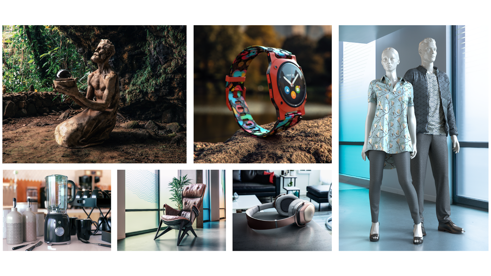

# Adobe di esercitazioni 3D e VR

Crea contenuti coinvolgenti in 3D più velocemente con modelli, materiali e luci di alta qualità. [!DNL Dimension] semplifica la creazione di visualizzazioni del marchio, illustrazioni, modelli di prodotti, progetti di packaging e altri progetti creativi. Selezionate un’immagine per visualizzare un’esercitazione.

<table>
<tr>
 <td>
   
    

   <a href="assets/CreateRealistic3DMockupswithAdobeStockandDimension.pdf"><strong>Creazione di simulazioni 3D realistiche con Adobe [!DNL Stock] e [!DNL Dimension] (PDF)</strong></a>
    

    <em>Possibilità di combinare facilmente un progetto 2D con un modello 3D utilizzando l'Adobe [!DNL Stock] e grafica inserita nell’Adobe [!DNL Dimension]</em>
     
  </td>
  <td>
   
    

   <a href="assets/VisualizeTextileDesignsorPatternson3DObjectswithAdobeDimension.pdf"><strong>Visualizzare progetti o pattern su oggetti 3D con Adobi [!DNL Dimension] (PDF)</strong></a>
    

    <em>Create una rappresentazione ultra realistica del prodotto finale nel giro di pochi minuti</em>
     
  </td>
  <td>
   
    

   <a href="../cce/assets/VisualizeyourProductinaRealisticEnvironment.pdf"><strong>Visualizzazione del prodotto in un ambiente realistico (PDF)</strong></a>
    

    <em>Se vuoi vedere come appariranno i tuoi prodotti nel mondo reale, Adobe [!DNL Dimension] è la tua app di riferimento</em>
     
  </td>
  <td>
   
    

   <a href="mastering3dlighting.md"><strong>Suggerimenti e tecniche per la masterizzazione dell’illuminazione 3D in CGI</strong></a>
    

    <em>Informazioni sull’illuminazione 3D e su come creare diverse condizioni di luce che possono alterare completamente una scena generata dal computer e l’aspetto degli oggetti</em>
     
  </td>
</tr>
<tr>
  <td>
   
    

   <a href="photorealistic.md"><strong>Creazione di fotografie virtuali fotorealistiche con rendering e composizione 3D</strong></a>
    

    <em>Scoprite come creare foto virtuali incredibilmente ingannevoli e fotorealistiche con la composizione e il rendering di immagini 3D in Adobe [!DNL Dimension]</em>
     
  </td>
  <td>
   
    

   <a href="3ddimensionstock.md"><strong>Personalizza e marca un modello 3D con [!DNL Dimension] e Adobe [!DNL Stock]</strong></a>
    

    <em>Personalizza e personalizza un modello 3D in [!DNL Dimension] utilizzo di materiali, proprietà ambientali, illuminazione e fotografia per creare immagini fotorealistiche per qualsiasi progetto di design</em>
     
  </td>
  <td>
    
    

     
  </td>
  <td>
    
    

     
  </td>
</tr>
</table>