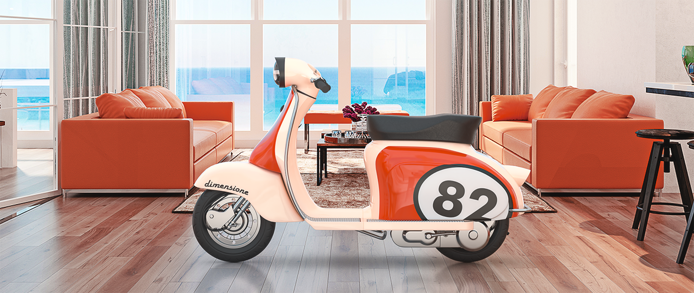
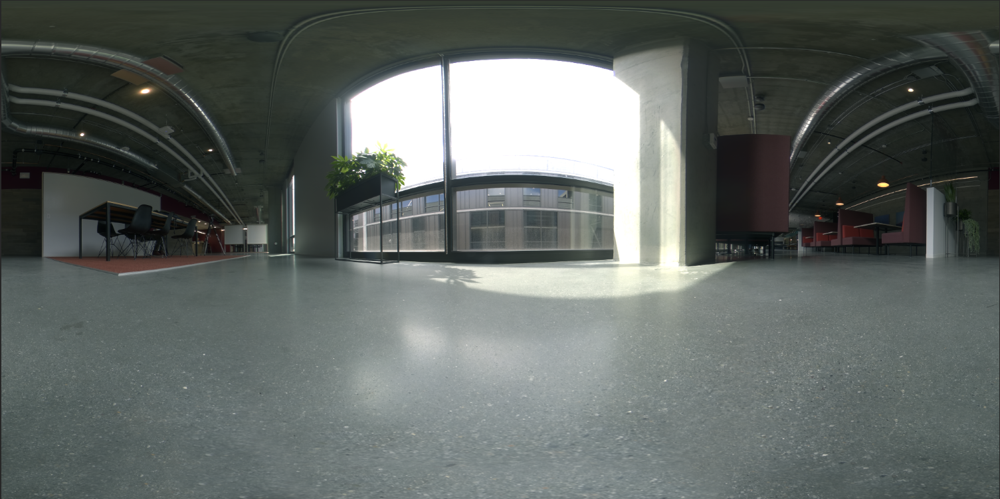

# Creazione di fotografie virtuali fotorealistiche con rendering e composizione 3D

![Esempi di fotografie virtuali fotorealistiche realizzate con l&#39;Adobe [!DNL Dimension]](assets/Photorealistic_1.png)

Guardando le immagini qui sopra, vi perdoneremo se tutto ciò che vedete è reale. Con i progressi tecnologici nel rendering delle immagini 3D fotorealistiche, è più difficile che mai determinare cosa sia reale e cosa sia virtuale. In questo caso, le immagini sono un mix di contenuti reali e renderizzati in 3D: e questo è esattamente il tipo di design 3D in cui le aziende investono.

Questa tecnica di composizione di modelli 3D in un’immagine o un video non è nuova e infatti le sue origini risalgono ai primi tempi del VFX (anni ’80). La novità è che ora è diventata uno strumento potente per gli utenti di [Adobe [!DNL Dimension]](https://www.adobe.com/products/dimension.html) e offre ai fotografi un flusso di lavoro nuovo e interessante.

## Tecnologia per la creazione di immagini composite in Adobe [!DNL Dimension]

![Modifica del piano di un modello di sfera metallica in un Adobe [!DNL Dimension] composito](assets/Photorealistic_3.png)

L&#39;Adobe [!DNL Dimension] ha consentito agli utenti di combinare in modo uniforme elementi 2D e 3D direttamente nell&#39;app utilizzando Adobe AI. Il vantaggio principale della composizione degli elementi in questo modo è che il turbo migliora il processo di creazione di un&#39;immagine realistica sostituendo una scena 3D completamente realizzata con un&#39;immagine di sfondo, che può essere acquisita dalla realtà.

![La funzione Come immagine nell&#39;Adobe [!DNL Dimension] analizza l&#39;immagine di sfondo e valuta la lunghezza focale e la posizione della fotocamera utilizzata per acquisirla](assets/Photorealistic_4.gif)

La funzione Come immagine analizza l’immagine di sfondo e valuta la lunghezza focale e la posizione della fotocamera utilizzata per acquisirla. Viene quindi creata una videocamera 3D nella scena [!DNL Dimension] che può essere utilizzata per eseguire il rendering degli elementi 3D con la stessa prospettiva dell&#39;immagine di sfondo, in modo che vengano composti insieme.

Ma cosa accade con tutto ciò che non è stato inquadrato dalla telecamera?  L&#39;ambiente in cui un&#39;immagine viene acquisita ha un ruolo fondamentale, perché ne definisce ogni aspetto. Un oggetto all’interno di un’immagine riflette la luce dell’ambiente circostante, anche di tutto ciò che si trova dietro alla fotocamera. Quindi, affinché gli elementi 3D a più livelli si integrino perfettamente con lo sfondo dell&#39;immagine, devono riflettere appieno l&#39;illuminazione nell&#39;ambiente in cui è stata scattata l&#39;immagine.

L’opzione Come immagine tenta di simulare l’ambiente di illuminazione in cui è stata scattata un’immagine di sfondo. Fa in breve tempo un ottimo lavoro con risultati eccellenti, ma acquisendo l&#39;ambiente insieme all&#39;immagine di sfondo si otterranno risultati ancora più realistici. Questo è anche il metodo usato per addestrare l&#39;Adobe.

Entra nel mondo delle immagini panoramiche HDR a 360°. Queste immagini sono state a lungo utilizzate nella grafica 3D per accelerare gli effetti di luce di un ambiente di illuminazione completo. In passato, il processo di acquisizione era piuttosto complesso a causa dell&#39;elevato livello di conoscenza e delle apparecchiature specializzate necessarie per realizzarli. Con l’avvento delle fotocamere a 360°, la creazione di queste immagini è ora più possibile che mai.

Le fotocamere Ricoh Theta, Gopro MAX e Insta 360 possono acquisire immagini panoramiche a 360°. La Ricoh Theta è dotata di bracketing dell’esposizione (o esposizione a forcella) automatico, un elemento fondamentale nel processo di acquisizione. In questo modo si riduce il tempo e l’impegno necessari per acquisire immagini HDR e si rende più accessibile ai fotografi.

## Processo per la creazione di immagini composite fotorealistiche

### [!DNL Capture]

Per acquisire ambienti per la composizione, sono necessari due elementi principali: una o più immagini di sfondo di alta qualità e un panorama HDR dell’ambiente in cui è stata scattata.

Per acquisire efficacemente questi contenuti è importante sfruttare le capacità e gli strumenti esistenti di un fotografo. La creazione di una bella immagine di sfondo richiede un occhio per la composizione e l&#39;attenzione ai dettagli. Le immagini di sfondo richiedono anche una mentalità speciale per creare qualcosa di utile per la composizione di elementi 3D in.

### Scelta di un percorso

Cercate luoghi interessanti sia per il contesto che per l&#39;illuminazione. Considerando il contesto, può essere utile immaginare il potenziale uso di una scena. Ad esempio, si potrebbe aggiungere un’auto 3D alla foto di una strada vuota, oppure per [presentare l’imballaggio](https://www.adobe.com/products/dimension/packaging-design-mockup.html) di prodotti alimentari può essere utile un tavolo di un coffee shop.

Quando si tratta di acquisire l’immagine di sfondo, è importante tenere presente che gli elementi 3D verranno composti in essa. Dovrebbe esserci un&#39;area vuota per lasciare spazio a questi oggetti. Il contenuto 3D sarà spesso l’obiettivo principale della composizione finale, quindi è importante che lo sfondo non si distingua eccessivamente da solo.

Altrettanto importante è la situazione di illuminazione all’interno dell’immagine, in quanto influirà notevolmente sul contenuto 3D composito. Lo scatto dovrebbe essere illuminato da sopra la spalla o dal lato. In questo modo si ottengono i risultati migliori, in quanto fungerà da luce principale quando vengono inseriti oggetti 3D nella scena. Potrebbe essere allettante riprendere verso la luce in assenza di elementi di messa a fuoco, ma ricordate che questo produrrà contenuti sempre in controluce. L’aggiunta temporanea di un oggetto sostitutivo alla scena può essere utile per comporre e valutare l’illuminazione.

## Acquisizione dell’immagine panoramica HDR

### Posizionamento della fotocamera

Posizionate la fotocamera a 360° nel centro generale dell&#39;area su cui vi concentrerete per acquisire gli sfondi. Nei casi in cui lo sfondo presenta una scena più ampia, può essere ideale sollevare la fotocamera da terra con un monopiede, altrimenti la si può impostare direttamente a terra.

### Colore

È molto importante mantenere il colore tra la fotocamera utilizzata per riprendere l’ambiente e quella per riprendere lo sfondo, poiché le immagini verranno utilizzate insieme. Qui la temperatura di colore di entrambe le fotocamere è stata impostata a 5000 K e abbiamo fotografato con entrambe una tabella di colori da utilizzare successivamente per l&#39;allineamento.

### Valori di esposizione tra parentesi

Per creare un ambiente HDR con la fotocamera a 360°, è necessario acquisire diversi valori di esposizione per combinarli in un’immagine HDR in fase di post-produzione. La quantità di valori di esposizione non è standardizzata, ma in genere si desidera che l’estremità superiore dell’intervallo di esposizione vada a un punto in cui non ci sono più informazioni nelle ombre e l’estremità inferiore dell’intervallo di esposizione fino a un punto in cui non ci sono più informazioni nelle aree di luce.

Idealmente, la fotocamera a 360° dispone di bracketing automatico che consente di scattare in batch le foto con le varie esposizioni. Le impostazioni ideali prevedono il valore ISO più basso disponibile per evitare il disturbo e un valore di apertura elevato per garantire la nitidezza. I valori di esposizione possono quindi essere modificati usando la velocità dell&#39;otturatore e suddivisi per interruzioni; dimezzando o raddoppiando l&#39;esposizione.

Di seguito è riportato un esempio di valori di esposizione utilizzati per riprendere un’immagine IBL all’aperto:

01 - F 5.6, ISO 80, Velocità otturatore 1/25000, WB 5000 K

02 - F 5.6, ISO 80, Velocità otturatore 1/12500, WB 5000 K

03 - F 5.6, ISO 80, Velocità otturatore 1/6400, WB 5000 K

...

16 - F 5.6, ISO 80, Velocità otturatore 1, WB 5000 K

Se la fotocamera a 360° utilizzata è in grado di produrre immagini RAW, i valori di esposizione possono essere divisi in incrementi di 2-4 stop, poiché conservano più informazioni rispetto alle immagini a 8 bit come JPEG.

Dopo aver regolato il colore dei file dei valori di esposizione, è possibile esportarli temporaneamente come singoli file da unire in Photoshop. Il tipo di file deve dipendere dall&#39;origine, ma in entrambi i casi non utilizzare un formato compresso come JPEG. In Photoshop, utilizzate File > Automatizza > Unisci come HDR Pro e selezionate tutti i file esportati con i valori di esposizione.

Assicurati che &quot;Mode&quot; sia impostato su 32 bit. L’opzione &quot;Rimuovi fantasmi&quot; consente di rimuovere i dettagli che sono cambiati tra i vari valori di esposizione, ma non utilizzarli se non sono necessari. Il cursore sotto l’istogramma influisce solo sull’esposizione dell’anteprima, quindi ignoratelo. Deseleziona &quot;Completa regolazione toni in Adobe Camera Raw&quot; e premi OK.

Il risultato è un’immagine HDR utilizzabile per illuminare le scene in 3D.

I passaggi finali consistono nel rimuovere eventuali ombre e gambe del treppiede visibili nella parte inferiore dell’immagine e regolare l’esposizione predefinita per illuminare correttamente la scena. La rimozione dei dettagli può essere effettuata utilizzando lo strumento Clona in Photoshop. La regolazione dell&#39;esposizione deve essere eseguita in combinazione con gli sfondi in [!DNL Dimension], poiché i valori di esposizione dell&#39;immagine IBL HDR sono i valori di illuminazione per gli oggetti 3D.

### Acquisizione degli sfondi

Dopo aver acquisito l’ambiente, puoi acquisire gli sfondi con una fotocamera a scelta. Migliore è la qualità e risoluzione. Questo, insieme all&#39;occhio per la composizione dei fotografi, è il vantaggio principale di questo processo. Le immagini precedenti sono state acquisite con una Canon 5D MK IV.

C’è molta libertà per inquadrare e comporre con gli sfondi. La fotocamera può avere aperture alte o basse per varie profondità di campo, utilizzare lunghezze focali lunghe o corte e essere angolata in alto o in basso. Il requisito principale è che la fotocamera sia rivolta verso il punto centrale in cui l&#39;ambiente è stato catturato con la fotocamera a 360°.

Al termine dell’acquisizione, le immagini devono essere elaborate in modo da riprodurre quanto più fedelmente possibile il colore dell’ambiente. Il colore e l’esposizione devono essere neutri e naturali. Eventuali effetti di stile dovranno essere applicati dopo la composizione degli elementi 3D nell&#39;immagine con Adobe [!DNL Dimension].

## Assemblaggio dell&#39;immagine composita in [!DNL Dimension]

Dopo aver raccolto e completato questi elementi, è ora possibile assemblarli in una scena nell&#39;Adobe [!DNL Dimension]. È sufficiente trascinare lo sfondo nella scena, dove verrà applicato sullo sfondo; quindi, aggiungere l’immagine panoramica HDR nello slot per le immagini di luce ambiente.

Trascina l’immagine di sfondo in un’area vuota dell’area di lavoro oppure seleziona Ambiente nel pannello della scena e aggiungi l’immagine all’input dello sfondo.

![L&#39;immagine di sfondo di una foto virtuale può essere selezionata dal menu Proprietà nell&#39;Adobe [!DNL Dimension]](assets/Photorealistic_20.png)

Aggiungete l’immagine panoramica HDR selezionando Luce ambiente e aggiungendola all’input Immagine.

![La sorgente di luce ambiente può essere aggiunta all&#39;immagine di sfondo di una foto virtuale dal menu Scena nell&#39;Adobe [!DNL Dimension]](assets/Photorealistic_21.png)

Potete quindi usare &quot;Come immagine&quot; sullo sfondo per abbinare la risoluzione e le proporzioni, nonché la prospettiva della fotocamera. Anziché generare l’ambiente dall’immagine di sfondo, l’immagine panoramica HDR acquisita viene utilizzata per illuminare la scena, lasciando deselezionata l’opzione &quot;Crea luci&quot;.

![Utilizzo della funzione Come immagine nell&#39;Adobe [!DNL Dimension] per eseguire il rendering di un&#39;immagine sferica metallica 3D con le luci ambiente da un&#39;immagine panoramica HDR](assets/Photorealistic_22.png)

Ora gli oggetti che vengono aggiunti alla scena verranno composti realisticamente nello sfondo, poiché sono illuminati dall&#39;ambiente in cui è stata scattata l&#39;immagine.

Per valutare rapidamente l’orientamento e l’esposizione dell’immagine panoramica HDR rispetto allo sfondo, è possibile posizionare nella scena una sfera di materiale metallico, dal pannello di risorse gratuite di [!DNL Dimension]. La rotazione della luce ambiente può quindi essere posizionata in modo che le riflessioni appaiano corrette. Se l’illuminazione dall’immagine panoramica HDR sovraespone o sottoespone la sfera, aumenta o riduci l’esposizione dell’immagine panoramica HDR.

Per valutare rapidamente l’orientamento e l’esposizione dell’immagine panoramica HDR rispetto allo sfondo, è possibile posizionare nella scena una sfera di materiale metallico, dal pannello di risorse gratuite di [!DNL Dimension]. La rotazione della luce ambiente può quindi essere posizionata in modo che le riflessioni appaiano corrette. Se l’illuminazione dall’immagine panoramica HDR sovraespone o sottoespone la sfera, aumenta o riduci l’esposizione dell’immagine panoramica HDR.

## Risultato finale: un’immagine composita fotorealistica

![Time-lapse della composizione e del rendering 3D di una fotografia di prodotto virtuale nell&#39;Adobe [!DNL Dimension]](assets/Photorealistic_24.gif)

Una volta completata la scena, il flusso di lavoro è semplice. Trascina il tuo modello o un contenuto [Adobe [!DNL Stock] 3D](https://stock.adobe.com/3d-assets) direttamente nell&#39;immagine per creare l&#39;impressione che fosse presente quando è stata scattata la foto. Ciò apre nuove possibilità per la creazione di contenuti pubblicitari altamente realistici o la possibilità di lavorare su progetti in molti contesti diversi.

Il risultato finale è una combinazione convincente di realtà e 3D che aiuta gli utenti finali a creare immagini fotorealistiche con il minimo sforzo. Prova anche tu con alcune [scene [!DNL Dimension]  gratuite create per dimostrare il flusso di lavoro.](https://assets.adobe.com/public/3926726a-2a17-43d4-4937-6d84a4d29338)

[Scarica oggi stesso l&#39;ultima versione](https://creativecloud.adobe.com/apps/download/dimension) di [!DNL Dimension] e inizia a creare immagini fotorealistiche.
