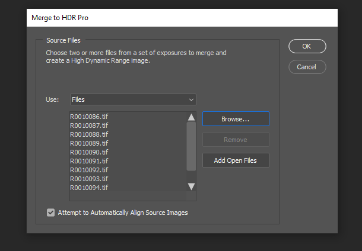

# Creazione di fotografie virtuali fotorealistiche con rendering e composizione 3D

![Un collage di Adobi con fotografie virtuali fotorealistiche [!DNL Dimension]](assets/Photorealistic_1.png)

Guardando le immagini di cui sopra, sareste perdonati supponendo che tutto quello che vedete sia reale. Con i progressi tecnologici nel rendering di immagini 3D fotorealistiche, tuttavia, è più difficile che mai determinare cosa è reale e cosa è virtuale. In questo caso, le immagini sono un mix di contenuti 3D reali, fotografici e renderizzati, e questo è esattamente il tipo di design 3D in cui le aziende investono.

Questa tecnica, di stratificazione, o &quot;composizione&quot; di modelli 3D in un&#39;immagine o un video, non è nuova, e infatti le sue origini risalgono ai primi tempi del VFX (a partire dagli anni &#39;80)&#39;. La novità è che questa tecnica è diventata uno strumento potente per [Adobe [!DNL Dimension]](https://www.adobe.com/products/dimension.html) e un nuovo flusso di lavoro per i fotografi.

## La tecnologia alla base della creazione di immagini composite in Adobe [!DNL Dimension]

![Modifica del piano di un modello di sfera metallica in un Adobe [!DNL Dimension] composto](assets/Photorealistic_3.png)

Adobe [!DNL Dimension] ha consentito agli utenti di combinare senza problemi elementi 2D e 3D direttamente nell&#39;app utilizzando la funzione di corrispondenza delle immagini basata su Adobe Sensei. Il vantaggio principale della composizione degli elementi in questo modo è che turbo migliora il processo di creazione di un&#39;immagine realistica sostituendo una scena 3D completamente realizzata con un&#39;immagine di sfondo, che può essere catturata dalla realtà.

![La funzione Come immagine nell’Adobe [!DNL Dimension] analizza l&#39;immagine di sfondo e stima la lunghezza focale e la posizione della videocamera che è stata utilizzata per acquisirla](assets/Photorealistic_4.gif)

La funzione Come immagine analizza l’immagine di sfondo e stima la lunghezza focale e la posizione della fotocamera utilizzata per acquisirla. Viene quindi creata una videocamera 3D nella [!DNL Dimension] scena che può essere utilizzata per eseguire il rendering degli elementi 3D nella stessa prospettiva dell’immagine di sfondo in modo che vengano composti insieme.

Ma cosa dire di tutto ciò che non è stato acquisito all’interno della cornice della fotocamera?  L&#39;ambiente completo in cui un&#39;immagine viene catturata è importante perché definisce l&#39;aspetto che assume al suo interno. Un oggetto all&#39;interno di un&#39;immagine riflette la luce del mondo che lo circonda, includendo tutto ciò che si trova dietro la videocamera. Pertanto, affinché gli elementi 3D a più livelli si fondano davvero con lo sfondo dell&#39;immagine, devono riflettere pienamente la luce nell&#39;ambiente in cui è stata scattata l&#39;immagine.

Come immagine tenterà di &quot;allucinare&quot; l’ambiente di illuminazione in cui è stata scattata un’immagine di sfondo. Un lavoro impressionante che produce risultati eccellenti in breve tempo, ma catturare l&#39;ambiente insieme all&#39;immagine di sfondo produce risultati ancora più realistici. Questo è anche il metodo utilizzato per addestrare la funzione Adobe Sensei a farlo da sola.

Immettete il mondo delle immagini panoramiche HDR a 360°. Queste immagini sono state a lungo utilizzate nella grafica 3D per velocizzare gli effetti di luce di un intero ambiente di illuminazione mondiale. Il processo per catturarli in passato è stato piuttosto complesso a causa dell&#39;elevato livello di conoscenza e di attrezzature specializzate necessarie per realizzarli. Con l&#39;avvento delle telecamere a 360°, la creazione di queste immagini è oggi più possibile che mai.

Le fotocamere come Ricoh Theta, Gopro MAX e Insta 360 possono acquisire immagini panoramiche a 360°. La Ricoh Theta dispone di una funzione di bracketing automatico dell’esposizione, che è una parte fondamentale del processo di acquisizione. In questo modo si riducono i tempi e le operazioni per l&#39;acquisizione di immagini HDR e si rendono più accessibili ai fotografi.

## Processo di creazione di immagini composite fotorealistiche

### [!DNL Capture]

Per iniziare a catturare gli ambienti per la composizione, sono necessari due elementi principali: una o più immagini di sfondo di alta qualità e un panorama HDR a 360° dell’ambiente in cui è stata scattata.

Uno degli aspetti più importanti per acquisire questo tipo di contenuti in modo efficace è sfruttare le competenze e gli strumenti esistenti di un fotografo. Creare una bellissima immagine di sfondo richiede un occhio per la composizione e l’attenzione ai dettagli. Le immagini di sfondo richiedono anche una mentalità speciale per creare qualcosa di utile per la composizione di elementi 3D in.

### Scelta di una posizione

Cerca luoghi interessanti sia per il contesto che per l&#39;illuminazione. Quando si considera il contesto, può essere utile immaginare un uso potenziale di una scena. Ad esempio, una vista di una strada vuota potrebbe essere utilizzata per aggiungere un’auto 3D, mentre una vista di un tavolo in una caffetteria potrebbe essere utilizzata per [visualizzazione del pacchetto](https://www.adobe.com/products/dimension/packaging-design-mockup.html) di prodotti alimentari.

Quando si tratta di acquisire l’immagine di sfondo, è importante tenere presente che gli elementi 3D verranno composti al suo interno. Dovrebbe esserci un&#39;area di interesse vuota per lasciare spazio a questi oggetti. Il contenuto 3D sarà spesso il fulcro principale della composizione finale, quindi è importante che lo sfondo non si distingua eccessivamente.

Altrettanto importante è la situazione di illuminazione all’interno dell’immagine, in quanto ciò influirà notevolmente sul contenuto 3D composto. La luce dovrebbe entrare nella ripresa da sopra la spalla o di lato, producendo i risultati migliori perché fungerà da luce chiave quando gli oggetti 3D vengono posizionati nella scena. Può essere invitante riprendere verso la luce quando non è presente alcun elemento di messa a fuoco, ma ricorda che questo genererà contenuti sempre retroilluminati. Aggiungere alla scena un oggetto sostitutivo temporaneo può essere utile per comporre e valutare l’illuminazione.

## Acquisizione del piano HDR

### Posizione videocamera

Posizionate la videocamera a 360° nel centro generale dell’area su cui vi concentrerete per l’acquisizione degli sfondi. Può essere ideale nei casi in cui gli sfondi mostrino una scena più ampia per sollevare la telecamera da terra con un cavalletto, altrimenti la telecamera può essere impostata direttamente a terra.

### Colore

Mantenere il colore tra la telecamera usata per riprendere l&#39;ambiente e quella usata per riprendere lo sfondo è molto importante poiché le immagini verranno utilizzate insieme. Qui la temperatura del colore di entrambe le telecamere è stata impostata su 5000k e abbiamo fotografato un grafico a colori con entrambe le telecamere per l&#39;ulteriore allineamento in fase di post-produzione.

### Valori di esposizione tra parentesi quadre

Per creare un ambiente HDR con videocamera a 360°, è necessario acquisire diversi file EV da combinare in un’immagine HDR in fase di post-produzione. La quantità di valori EV non è standardizzata, ma in genere si desidera che l’estremità superiore dell’intervallo di esposizione vada a un punto in cui non vi sono più informazioni nelle ombre e l’estremità inferiore dell’intervallo di esposizione a un punto in cui non vi sono più informazioni nelle luci.

Idealmente, la fotocamera a 360° avrà una funzione di bracketing automatico che consente alle varie esposizioni di essere raggruppate dalla fotocamera. Le impostazioni ideali consentono di utilizzare il valore ISO più basso disponibile per evitare disturbi e un valore di apertura elevato per nitidezza. I valori di esposizione possono quindi essere modificati utilizzando la velocità dell’otturatore e suddivisi in base alle interruzioni; dimezzare o raddoppiare l&#39;esposizione.

Di seguito è riportato un esempio di EV utilizzati per riprendere un&#39;IBL all&#39;aperto:

01 - F 5.6, ISO 80, velocità otturatore 1/25000, WB 5000 K

02 - F 5.6, ISO 80, velocità otturatore 1/12500, WB 5000 K

03 - F 5.6, ISO 80, velocità otturatore 1/6400, WB 5000 K

...

16 - F 5.6, ISO 80, Velocità otturatore 1, WB 5000 K

Se il segnale a 360° utilizzato è in grado di generare immagini RAW, gli EV possono essere suddivisi in incrementi di 2-4 stop dal momento che conservano più informazioni di immagini a 8 bit come JPEG.

Dopo aver apportato le regolazioni cromatiche ai file EV, questi possono essere esportati temporaneamente in singoli file per poi essere uniti in Photoshop. Il tipo di file dovrebbe dipendere dalla sorgente, ma non utilizzare un formato compresso come JPEG in entrambi i casi. In Photoshop, utilizzate File > Automatizza > Unisci come HDR Pro... e selezionate tutti i file EV esportati.

Accertatevi che &quot;Mode&quot; sia impostato su 32 bit. L’uso di &quot;rimuovi fantasmi&quot; può aiutare a rimuovere i dettagli che sono cambiati tra gli effetti visivi, ma non utilizzarli se non ne avete bisogno. Il cursore sotto l’istogramma influisce solo sull’esposizione di anteprima, quindi ignoratelo. Deseleziona &quot;Completa viraggio in Adobe Camera Raw&quot; e premi OK.

Il risultato è un’immagine HDR che può essere utilizzata per illuminare le scene in 3D.

Passaggi finali consisteranno nel rimuovere eventuali ombre e gambe del treppiede visibili al fondo dell’immagine e nel regolare l’esposizione predefinita dell’immagine per illuminare correttamente la scena. La rimozione dei dettagli può essere effettuata con lo strumento clone in Photoshop. La regolazione dell&#39;esposizione deve essere effettuata in combinazione con gli sfondi [!DNL Dimension], poiché il valore di esposizione dell&#39;IBL HDR corrisponde ai valori di illuminazione degli oggetti 3D.

### Acquisizione degli sfondi

Dopo aver acquisito l’ambiente, ora puoi acquisire gli sfondi utilizzando una fotocamera a scelta. Migliore è la qualità e la risoluzione. Questo, insieme a un occhio per la composizione che i fotografi hanno, è il vantaggio principale di questo processo. Le immagini di cui sopra sono state acquisite con una Canon 5D MK IV.

C&#39;è molto margine per inquadrare e comporre con gli sfondi. La fotocamera può avere aperture alte o basse per varie profondità di campo, usare lunghezze focali lunghe o corte e essere angolata in alto o in basso. Il requisito principale è che la videocamera sia rivolta al punto centrale in cui è stata catturata l&#39;ambiente con la videocamera 360.

Al termine dell’acquisizione, le immagini devono essere post-elaborate per corrispondere il più possibile al colore dell’ambiente. Il colore e l&#39;esposizione devono essere quanto più neutri e naturali possibile. Eventuali effetti stilizzati devono essere applicati dopo che gli elementi 3D sono stati composti nell’immagine con Adobe [!DNL Dimension].

## Assemblare l’immagine composita in [!DNL Dimension]

Questi elementi sono stati raccolti e completati e possono ora essere assemblati in una scena in Adobe [!DNL Dimension]. Si tratta di una semplice operazione, come trascinare lo sfondo nella scena, dove verrà poi applicato allo sfondo; quindi, aggiungi il piano HDR nello slot di immagine della luce ambiente.

Trascina e rilascia l’immagine di sfondo in un’area vuota dell’area di lavoro oppure seleziona l’ambiente nel pannello Scena e aggiungi l’immagine all’input dello sfondo.

![L’immagine di sfondo di una foto virtuale può essere selezionata dal menu Proprietà in Adobe [!DNL Dimension]](assets/Photorealistic_20.png)

Aggiungete il piano HDR selezionando Luce ambiente e aggiungendolo all’input Immagine.

![La sorgente Luce ambiente può essere aggiunta all’immagine di sfondo di una foto virtuale dal menu Scena in Adobe [!DNL Dimension]](assets/Photorealistic_21.png)

Potete quindi usare la funzione &quot;Come immagine&quot; sullo sfondo per adattarla alla risoluzione, all’aspetto e alla prospettiva della fotocamera. Invece di generare l&#39;ambiente dall&#39;immagine di sfondo, l&#39;immagine panoramica HDR acquisita viene utilizzata per illuminare la scena, in modo che l&#39;opzione &quot;crea luci&quot; possa essere lasciata non selezionata.

![Utilizzo della funzione Come immagine nell’Adobe [!DNL Dimension] per eseguire il rendering di un’immagine di sfera metallica 3D con le luci ambiente da un’immagine panoramica HDR](assets/Photorealistic_22.png)

Gli oggetti che vengono aggiunti alla scena verranno composti realisticamente sullo sfondo poiché sono illuminati dall&#39;ambiente in cui è stata scattata l&#39;immagine.

Per valutare rapidamente l’orientamento e l’esposizione del piano HDR rispetto allo sfondo, una sfera primitiva con un materiale metallico, tratta dal pannello delle risorse gratuite in [!DNL Dimension], può essere inserito nella scena. La rotazione della luce ambiente può quindi essere posizionata in modo che le riflessioni appaiano corrette. Se l’illuminazione del piano HDR sovraespone o sottoespone la sfera, l’esposizione del piano HDR deve essere aumentata o diminuita per compensare.

Per valutare rapidamente l’orientamento e l’esposizione del piano HDR rispetto allo sfondo, una sfera primitiva con un materiale metallico, tratta dal pannello delle risorse gratuite in [!DNL Dimension], può essere inserito nella scena. La rotazione della luce ambiente può quindi essere posizionata in modo che le riflessioni appaiano corrette. Se l’illuminazione del piano HDR sovraespone o sottoespone la sfera, l’esposizione del piano HDR deve essere aumentata o diminuita per compensare.

## Il risultato finale: Immagine composita fotorealistica

![Un time-lapse di composizione e rendering 3D per una foto di prodotto virtuale in Adobe [!DNL Dimension]](assets/Photorealistic_24.gif)

Una volta completata la scena, il flusso di lavoro per l&#39;utente finale è semplice. Trascina e rilascia il tuo modello o qualsiasi [Adobe [!DNL Stock] 3D](https://stock.adobe.com/3d-assets) all’immagine per renderizzarla come se fosse lì quando è stata scattata. Si aprono così nuove strade per la creazione di contenuti pubblicitari altamente realistici o la possibilità di eseguire iterazioni su progetti in molti contesti diversi.

Il risultato finale è una combinazione convincente di realtà e 3D che aiuta gli utenti finali a raggiungere l&#39;obiettivo di creare immagini fotorealistiche con il minimo sforzo. Prova te stesso con un po&#39; di [libero [!DNL Dimension] scene](https://assets.adobe.com/public/3926726a-2a17-43d4-4937-6d84a4d29338) abbiamo creato per dimostrare il flusso di lavoro.

[Scarica la versione più recente](https://creativecloud.adobe.com/apps/download/dimension) di [!DNL Dimension] e inizia a creare le tue immagini fotorealistiche.
