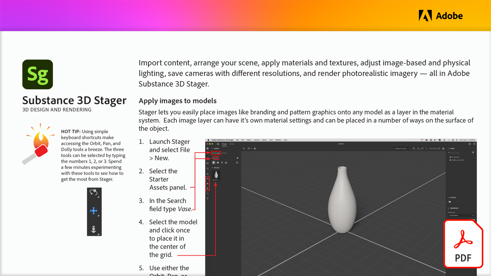

# Progettazione e rendering 3D

Importa i contenuti, disponi la scena, applica materiali e texture, regola l’illuminazione fisica e basata su immagini, salva le fotocamere con diverse risoluzioni ed esegui il rendering delle immagini fotorealistiche, tutto in Adobe Substance 3D Stager.

Seleziona l&#39;immagine seguente per visualizzare o scaricare questo tutorial di PDF.

[{&quot;width=680&quot;}](assets/Adobe-Substance-Stager.pdf){target="blank"}
