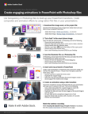

# Decodifica della minestra di alfabeti dei formati grafici

I file JPG, PNG, SVG, GIF e EPS sono tutti usati comunemente nella progettazione, alcuni per le pagine Web, altri per presentazioni, pubblicazioni e progetti creativi. Ma, cosa vogliono dire, e quale dovrebbe scegliere? Scoprite in questo workshop pratico di 15 minuti. Scoprite rapidamente come applicare gli effetti di trasparenza in Photoshop per portare le vostre abilità di presentazione a un nuovo livello, esplorando diverse impostazioni di esportazione e ottimizzazione della grafica. Segui Chris Converse, designer e sviluppatore, per creare un’animazione interessante in PowerPoint utilizzando la grafica personalizzata esportata da Photoshop.

>[!VIDEO](https://video.tv.adobe.com/v/333805?hidetitle=true)

  

[**Download della Guida rapida di PDF**](../quick-reference/Decodingthealphabetsoupofgraphicformats.pdf)

