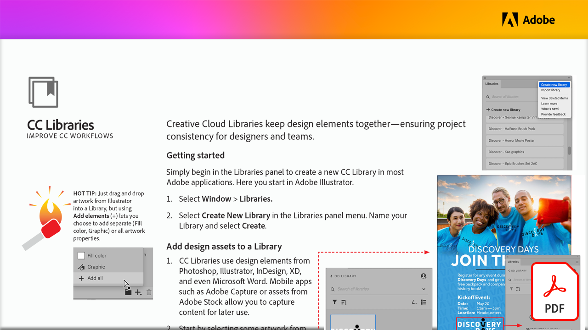

# Migliorare i flussi di lavoro CC con CC Libraries

Scopri come Creative Cloud Libraries unisce gli elementi di progettazione, garantendo la coerenza del progetto per designer e team in queste esercitazioni pratiche.

Seleziona l&#39;immagine seguente per visualizzare o scaricare questo tutorial di PDF.

[{width="680"}](assets/ImproveCCWorkflowsCCLibraries.pdf){target="blank"}
