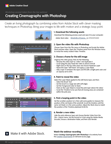

# Creazione di sale cinematografiche con Photoshop

In questa esercitazione video passo passo, create una fotografia vivente combinando video di Adobe [!DNL Stock] con tecniche di mascheramento intelligenti in Photoshop.

>[!VIDEO](https://video.tv.adobe.com/v/331002?hidetitle=true)

  

[**Download Guida rapida di riferimento PDF**](../quick-reference/CreatingCinemagraphswithPhotoshop.pdf)

