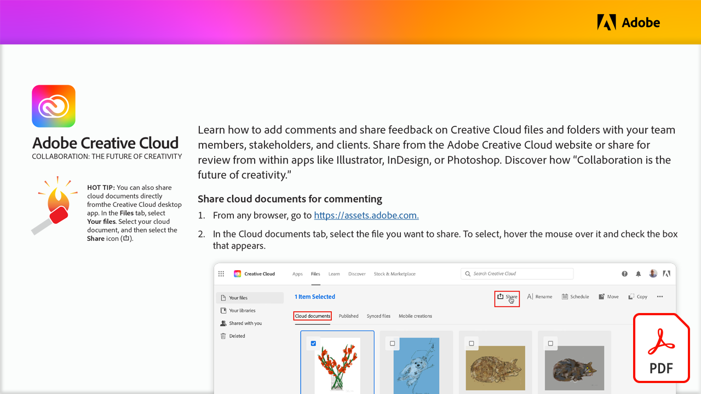

# Collaborazione: il futuro della creatività

Scopri come aggiungere commenti e inviare feedback su file e cartelle Creative Cloud con i membri del team, gli stakeholder e i clienti. Condividi dal sito Web di Adobe Creative Cloud o condividi per la revisione direttamente dalle app come Illustrator, InDesign o Photoshop.

Seleziona l&#39;immagine seguente per visualizzare o scaricare questo tutorial di PDF.

[{width="680"}](assets/Collaboration-The-Future-of-Creativity.pdf){target="blank"}
