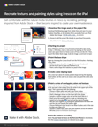

# Prova Fresco su iPad (e iPhone)

Scopri un mondo completamente nuovo di disegno e pittura digitale con Adobe Fresco in questo workshop pratico di 15 minuti. Imparate rapidamente a lavorare con i livelli e le maschere di ritaglio per adattare la pittura e le texture a una forma base. Segui insieme al designer/sviluppatore Chris Converse per ricreare parte di un&#39;illustrazione di natura morta utilizzando Fresco e Adobe Stock.

>[!VIDEO](https://video.tv.adobe.com/v/3410421?hidetitle=true&captions=ita)

  

[**Download della Guida rapida di PDF**](../quick-reference/Frescoworkshop.pdf)

