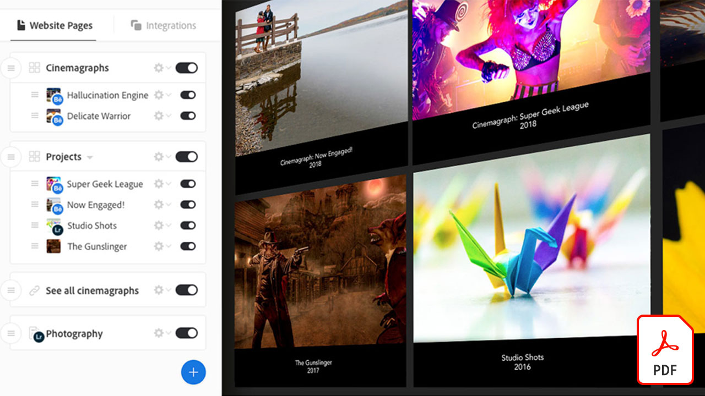
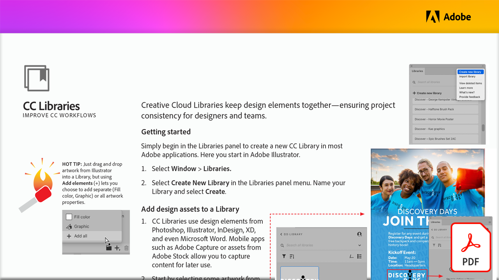
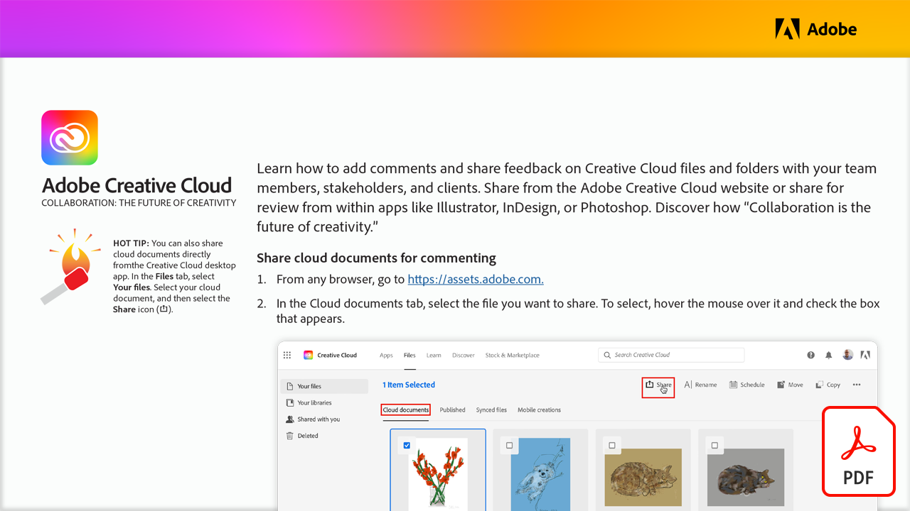
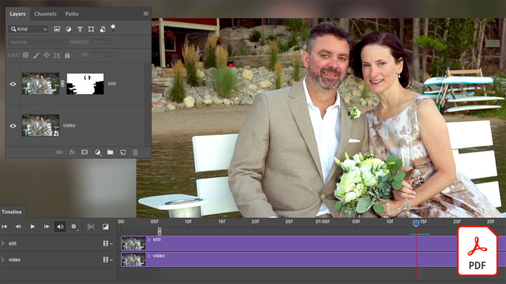

# Esercitazioni per Creative Cloud for enterprise

In qualità di creativo aziendale, devi collaborare con team distribuiti, stabilire processi scalabili e rispettare i sistemi e le linee guida aziendali. Questi tutorial aiutano a scoprire le nuove funzioni di Creative Cloud, da una prospettiva aziendale.

## Fai clic per visualizzare l&#39;esercitazione di un prodotto (elencata in ordine alfabetico)

### Adobe Acrobat

<table style="table-layout:fixed">
<tr>
 <td>
   
    

   <a href="acrobat-content-creators.md"><strong>Acrobat per i creatori di contenuti</strong></a>
    

    <em>Scopri gli strumenti di Acrobat per semplificare i flussi di lavoro creativi</em>
     
  </td>
  <td>
    
    

     
  </td>
  <td>
    
    

     
  </td>
  <td>
    
    

     
  </td>
</tr>
</table>

### Adobe Express (in precedenza Adobe Spark)

<table style="table-layout:fixed">
<tr>
 <td>
   
    

   <a href="adobe-express-content-that-stands-out.md"><strong>Adobe Express: contenuti straordinari</strong></a>
    

    <em> Crea in pochi minuti grafica, pagine Web e racconti video accattivanti con Adobe Express</em>
     
  </td>
  <td>
   
    

   <a href="assets/CreatingYourBrandinAdobeSpark.pdf"><strong>Creazione del marchio in Adobe Spark (PDF)</strong></a>
    

    <em>Adobe Spark semplifica la definizione del tuo marchio</em>
     
  </td>
  <td>
   
    

   <a href="assets/AddingaGlideshowtoyourSparkPageAdobeBlog.pdf"><strong>Aggiunta di una presentazione allo Spark Page (PDF)</strong></a>
    

    <em>Adobe Spark offre alcuni componenti di layout incredibili e facili da usare che danno vita alle tue storie Web</em>
     
  </td>
  <td>
   
    

   <a href="assets/CreatingYourBrandinAdobeSpark.pdf"><strong>Creazione del marchio in Adobe Spark (PDF)</strong></a>
    

    <em>Adobe Spark semplifica la definizione del tuo marchio</em>
     
  </td>
  <td>
   
    

   <a href="assets/MeetYourNewProductionArtistAdobeSparkPost.pdf"><strong>Incontra il tuo nuovo artista di produzione: Adobe Spark Post (PDF)</strong></a>
    

    <em>Adobe Spark impara da te mentre crei layout, definisci i colori, importa grafica e disponi gli elementi all’interno delle tue composizioni</em>
     
  </td>
</tr>
</table>

### Adobe Portfolio

<table  style="table-layout:fixed">
<tr>
   <td>
   
    

   <a href="assets/GettingStartedWithAdobePortfolio.pdf"><strong>Guida Introduttiva Di Adobe Portfolio (PDF)</strong></a>
    

    <em>Condividere i tuoi lavori migliori con Adobe Portfolio è un modo efficace per condividere il tuo successo e attirare nuovi talenti creativi</em>
     
  </td>
  <td>
   
    

   <a href="assets/ConnectingLightroomandBehancetoYourAdobePortfolio.pdf"><strong>Connessione di Lightroom e Bēhance ad Adobe Portfolio (PDF)</strong></a>
    

    <em>Utilizzare i progetti Bēhance come pagine nel portfolio</em>
     
  </td>
  <td>
   
    

   <a href="assets/ShowYourBestWorkwithAdobePortfolio.pdf"><strong>Mostra i tuoi lavori migliori con Adobe Portfolio (PDF)</strong></a>
    

    <em>Adobe Portfolio ti consente di caricare, organizzare e condividere il tuo lavoro con potenziale staff e clienti in tutto il mondo</em>
     
  </td>
  <td>
    
    

     
  </td>
 </tr>
 </table>

### CC Libraries

<table  style="table-layout:fixed">
<tr>
  <td>
   
   

   <a href="cc-workflows-cc-libraries.md"><strong>Migliorare i flussi di lavoro CC con CC Libraries</strong></a>
    

    <em>Scopri come Creative Cloud Libraries unisce gli elementi di progettazione, garantendo la coerenza del progetto per designer e team</em>
     
  </td>
  <td>
   
   

   <a href="ccteamlibraries.md"><strong>Creazione di librerie Creative Cloud per i team</strong></a>
    

    <em>Scopri come condividere le risorse in un gruppo o team utilizzando Creative Cloud Libraries for teams</em>
     
  </td>
  <td>
   
   

   <a href="sharecclibraries.md"><strong>Condivisione di risorse di branding con Creative Cloud Libraries per team</strong></a>
    

    <em>Scopri come creare, utilizzare e condividere risorse di branding per il tuo gruppo o team utilizzando Creative Cloud Libraries for teams</em>
     
  </td>
  <td>
   
    

   <a href="assets/CreateAddandShareYourBrandAssetswithCreativeCloudLibraries.pdf"><strong>Crea, aggiungi e condividi le risorse del tuo marchio con Creative Cloud Libraries (PDF)</strong></a>
    

    <em>Creative Cloud Libraries offre un sistema di marchi integrato che consente ai designer di condividere le risorse del marchio tra team creativi</em>
     
  </td>
  </tr>
  <tr>
  <td>
   
    

   <a href="assets/ShareTextStylesFromIllustratorwithCreativeCloudLibraries.pdf"><strong>Condividere gli stili di testo da Illustrator con Creative Cloud Libraries (PDF)</strong></a>
    

    <em>Lavora in modo più intelligente, non più difficile, in Illustrator</em>
     
  </td>
  <td>
    
    

     
  </td>
  <td>
    
    

     
  </td>
  <td>
    
    

     
  </td>
</tr>
</table>

### Creative Cloud for enterprise

<table style="table-layout:fixed">
<tr>
 <td>
   
    

   <a href="collaboration-the-future-of-creativity.md"><strong>Collaborazione: il futuro della creatività</strong></a>
    

    <em>Tra i molti vantaggi di un abbonamento a Adobe Creative Cloud vi è l'accesso gratuito a più di 20.000 font progettati e curati professionalmente da Adobe Fonts</em>
     
  </td>
  <td>
   
    

   <a href="assets/FromHandLetteringtoIllustratorviaCreativeCloud.pdf"><strong>Dalle scritte a mano ad Illustrator tramite Creative Cloud (PDF)</strong></a>
    

    <em>Grazie alla potenza di Creative Cloud per le aziende, le app per dispositivi mobili e desktop di Adobe consentono di acquisire, convertire e creare ovunque, su qualsiasi dispositivo</em>
     
  </td>
  <td>
   
    

   <a href="assets/FromLightroomWebtoInDesignviaCreativeCloud.pdf"><strong>Da Lightroom Web a InDesign tramite Creative Cloud (PDF)</strong></a>
    

    <em>Porta la tua creatività dalla fotocamera al progetto finale con i file e le librerie di Creative Cloud</em>
     
  </td>
</tr>
</table>

### [!DNL Dimension]

<table  style="table-layout:fixed">
<tr>
   <td>
   
    

   <a href="assets/VisualizeyourProductinaRealisticEnvironment.pdf"><strong>Visualizza il tuo prodotto in un ambiente realistico (PDF)</strong></a>
    

    <em>Quando vuoi vedere come appaiono i tuoi prodotti nel mondo reale, Adobe [!DNL Dimension] è la tua app di destinazione</em>
     
  </td>
  <td>
    
    

     
  </td>
  <td>
    
    

     
  </td>
  <td>
    
    

     
  </td>
</tr>
</table>

### Fresco

<table>
<tr>
 <td>
   
    

   <a href="frescoworkshop.md"><strong>Prova Fresco su iPad (e iPhone)</strong></a>
    

    <em>Esplora un mondo completamente nuovo di disegno e pittura digitale con Adobe Fresco in questo workshop pratico di 15 minuti</em>
     
  </td>
  <td>
    
    

     
  </td>
  <td>
    
    

     
  </td>
  <td>
    
    

     
  </td>
</tr>
</table>

### Font

<table  style="table-layout:fixed">
<tr>
<td>
   
    

   <a href="taming-type-anxiety.md"><strong>Ansia dei tipi di domaggio</strong></a>
    

    <em>Scopri come accedere e utilizzare oltre 20.000 font progettati professionalmente in Creative Cloud</em>
     
  </td>
  <td>
   
    

   <a href="assets/CreatingBeautifulTypographywithCreativeCloud.pdf"><strong>Creare una composizione tipografica stupenda con Creative Cloud (PDF)</strong></a>
    

    <em>Scopri come sfruttare i controlli tipografici all’avanguardia disponibili nei tuoi strumenti di progettazione preferiti</em>
     
  </td>
   <td>
   
    

   <a href="assets/DiscoveringFontswithCreativeCloud.pdf"><strong>Scoprire i font con Creative Cloud (PDF)</strong></a>
    

    <em>Trovare il font giusto per un progetto a volte può sembrare travolgente. Con varie app e servizi Creative Cloud, trovare il font giusto ora è divertente e stimolante</em>
     
  </td>
  <td>
   
    

   <a href="assets/UnleashHiddenGemsinOpenTypefonts.pdf"><strong>Scatena gemme nascoste nei font di OpenType (PDF)</strong></a>
    

    <em>Il formato di OpenType consente di includere un font fino a 65.536 glifi</em>
     
  </td>
</table>

### Illustrator

<table  style="table-layout:fixed">
<tr>
   <td>
   
    

   <a href="assets/GettoKnowGraphicStylesinIllustrator.pdf"><strong>Scoprire gli stili di grafica in Illustrator (PDF)</strong></a>
    

    <em>Illustrator ti dà la possibilità di assegnare stili alla grafica in modo molto simile a come si assegna lo stile al testo</em>
     
  </td>
   <td>
   
    

   <a href="assets/WorkSmarterNotHarderwithIllustrator.pdf"><strong>Lavora in modo più intelligente, non più difficile, con Adobe Illustrator CC (PDF)</strong></a>
    

    <em>Velocizzare i disegni vettoriali in Illustrator</em>
     
  </td>
  <td>
   
    

   <a href="assets/IllustratorSymbolsandLayersequalsPerfectStructureforResponsiveSVG.pdf"><strong>Simboli Illustrator + Livelli = Struttura perfetta per SVG reattivo! (PDF)</strong></a>
    

    <em>Illustrator offre un supporto senza precedenti per il formato SVG, inclusa la possibilità di creare simboli, gruppi, ID e definizioni vettoriali precise della grafica</em>
     
  </td>
  <td>
    
    

     
  </td>
</tr>
</table>

### InDesign

<table  style="table-layout:fixed">
<tr>
  <td>
   
    

   <a href="assets/CreatingInteractivePDFsfromInDesign.pdf"><strong>Creazione di PDF interattivi da InDesign (PDF)</strong></a>
    

    <em>InDesign contiene molte funzioni che consentono di formattare, assegnare uno stile, gestire e tenere traccia del contenuto dei documenti</em>
     
  </td>
   <td>
   
    

   <a href="assets/EasilyGatherandIncorporateDesignFeedbackwithAdobeAcrobatandInDesign.pdf"><strong>Raccogli e incorpora facilmente i feedback di progettazione con Adobe Acrobat e InDesign (PDF)</strong></a>
    

    <em>Gli stakeholder possono utilizzare Acrobat per aggiungere commenti e annotazioni dettagliati e quindi riportarli rapidamente in Adobe InDesign per vederli nel contesto del layout</em>
     
  </td>
  <td>
   
    

   <a href="assets/StyleWebContentwithInDesign.pdf"><strong>Modellare i contenuti Web con Adobe InDesign CC (PDF)</strong></a>
    

    <em>Lo sapevi che puoi sfruttare la potenza dell'InDesign per generare HTML e grafica per il Web?</em>
     
  </td>
  <td>
   
    

   <a href="assets/InteractivePDFBookmarksandLinkedTOCsfromInDesign.pdf"><strong>PDF interattivo: segnalibri e sommari collegati dall’InDesign (PDF)</strong></a>
    

    <em>Scopri come utilizzare la funzionalità Sommario in InDesign per generare sia segnalibri che collegamenti ipertestuali che aiutano i lettori a trovare rapidamente informazioni nei file PDF</em>
     
  </td>
</tr>
<tr>
  <td>
   
    

   <a href="assets/InteractivePDFGraphicalHyperlinksandNestedMasterPagesinInDesign.pdf"><strong>PDF interattivo: collegamenti ipertestuali grafici e pagine mastro nidificate in InDesign (PDF)</strong></a>
    

    <em>L’applicazione di collegamenti ipertestuali con pagine mastro consente di gestire rapidamente un sistema di navigazione in tutte le pagine</em>
     
  </td>
  <td>
    
    

     
  </td>
  <td>
    
    

     
  </td>
  <td>
    
    

     
  </td>
</tr>
</table>

### Photoshop

<table style="table-layout:fixed">
<tr>
  <td>
    
    

    <a href="alphabetsoup.md"><strong>Decodifica della minestra di alfabeti dei formati grafici</strong></a>
    

    <em>I file JPG, PNG, SVG, GIF e EPS sono tutti comunemente utilizzati in fase di progettazione, alcuni per le pagine Web, altri per presentazioni, pubblicazioni e progetti creativi. Ma cosa vogliono dire, e quale scegliere?</em>
     
  </td>
  <td>
    
    

    <a href="compositepsipad.md"><strong>Creazione di composizioni uniche con Adobe [!DNL Stock] e Photoshop per iPad</strong></a>
    

    <em>Porta la potenza di Photoshop a portata di mano. Scoprite come utilizzare una delle vostre applicazioni Creative Cloud preferite in modo completamente nuovo, con un'interfaccia touch riprogettata</em>
     
  </td>
  <td>
    
    

    <a href="cinemagraphps.md"><strong>Creazione di immagini cinematografiche con Photoshop</strong></a>
    

    <em>In questa esercitazione video dettagliata del workshop, potete creare una fotografia vivente combinando i video di un Adobe [!DNL Stock] con tecniche di mascheratura intelligenti in Photoshop</em>
     
  </td>
  <td>
    
    

    <a href="assets/AddRemarkableLightingtoaPhotowithPhotoshopandAfterEffects.pdf"><strong>Aggiungete un'illuminazione notevole a una foto con Photoshop e After Effects (PDF)</strong></a>
    

    <em>Scoprite come utilizzare l’effetto Light Burst in Adobe After Effects per migliorare notevolmente una foto</em>
     
  </td>
</tr>
<tr>
  <td>
    
    

    <a href="assets/CreateCinemagraphsinaSnapwithPhotoshopandAdobeStock.pdf"><strong>Crea rapidamente immagini cinematografiche con Photoshop e Adobe [!DNL Stock] (PDF)</strong></a>
    

    <em>Ricerca di video in ciclo continuo in Adobe [!DNL Stock] per assemblare rapidamente immagini cinematografiche accattivanti in Photoshop</em>
     
  </td>
  <td>
    
    

    <a href="assets/CreatingaLivingPhotographwithPhotoshopPart1.pdf"><strong>Creazione di una fotografia vivente con Photoshop — Parte 1 (PDF)</strong></a>
    

    <em>Adobe Photoshop ti consente di trasformare rapidamente i tuoi brevi video in fotografie viventi che ipnotizzano il tuo pubblico su qualsiasi piattaforma social</em>
     
  </td>
  <td>
    
    

    <a href="assets/CreatingaLivingPhotographwithPhotoshopPart2.pdf"><strong>Creazione di una fotografia vivente con Photoshop — Parte 2 (PDF)</strong></a>
    

    <em>La combinazione di foto e video è un modo efficace per aggiungere una qualità coinvolgente alle foto senza sacrificare il messaggio o il tono dell’immagine originale</em>
     
  </td>
  <td>
    
    

    <a href="assets/PhotoshopAfterEffectsAwesomenessAdobeMAX2018LabRecap.pdf"><strong>Photoshop + After Effects = Consapevolezza: Adobe MAX Lab Recap (PDF) 2018</strong></a>
    

    <em>In questo laboratorio pratico e dettagliato, combina Photoshop con After Effects per creare immagini ed effetti sorprendenti, adatti a qualsiasi tipo di supporto</em>
     
  </td>
</tr>
<tr>
  <td>
    
    

    <a href="assets/QuicklyBrandYourInstagramPhotoswithAdobePhotoshopActions.pdf"><strong>Personalizza rapidamente con il tuo marchio le foto Instagram con Azioni Adobe Photoshop (PDF)</strong></a>
    

    <em>Eliminare il tedio e risparmiare tonnellate di tempo utilizzando Azioni in Photoshop</em>
     
  </td>
  <td>
    
    

    <a href="assets/WorkSmarterNotHarderwithPhotoshop.pdf"><strong>Lavora in modo più intelligente, non più difficile, con Photoshop (PDF)</strong></a>
    

    <em>Le modifiche in Photoshop possono richiedere molto tempo, ma non è necessario</em>
     
  </td>
  <td>
    
    

    <a href="assets/AnyoneCanBeCreativewithAdobeCreativeCloud.pdf"><strong>Aggiungi un po’ di Adobe Photoshop alle tue competenze creative (PDF)</strong></a>
    

    <em>Aggiungi un po’ di Adobe Photoshop alle tue competenze creative</em>
     
  </td>
  <td>
    
    

    <a href="assets/GreenScreenisNotJustforVideo.pdf"><strong>La schermata verde non è solo per il video (PDF)</strong></a>
    

    <em>Potete usare lo schermo verde in uno studio fotografico e After Effects per preparare l’uso della foto in Photoshop</em>
     
  </td>
</tr>  
</table>
