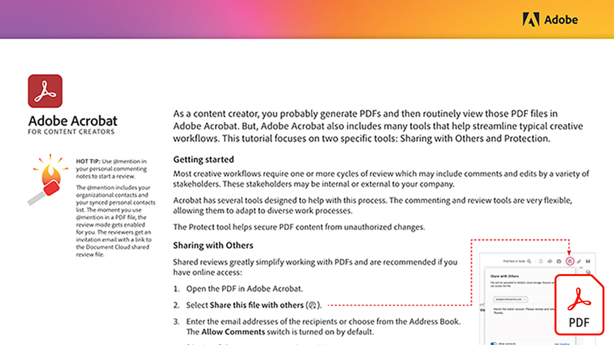

# Tutorial su Creative Cloud for enterprise

In qualità di creativo aziendale, devi collaborare con team distribuiti, stabilire processi scalabili e rispettare i sistemi e le linee guida aziendali. Queste esercitazioni consentono di apprendere le nuove funzioni della Creative Cloud, dal punto di vista aziendale.

## Fai clic per visualizzare un’esercitazione sul prodotto

### Adobe Acrobat

<table style="table-layout:fixed">
<tr>
 <td>
   
    

   <a href="assets/AcrobatforContentCreators.pdf"><strong>Acrobat per creatori di contenuti (PDF)</strong></a>
    

    <em>Scopri gli strumenti di Acrobat che semplificano i flussi di lavoro creativi</em>
     
  </td>
</tr>
</table>

### Creative Cloud for enterprise

<table style="table-layout:fixed">
<tr>
 <td>
   
    

   <a href="assets/FromHandLetteringtoIllustratorviaCreativeCloud.pdf"><strong>Dalla scrittura a mano all'Illustrator tramite Creative Cloud (PDF)</strong></a>
    

    <em>Sfruttando le potenzialità di Creative Cloud for enterprise, l'Adobe di app per dispositivi mobili e desktop ti consente di acquisire, convertire e creare da qualsiasi dispositivo, su qualsiasi dispositivo</em>
     
  </td>
  <td>
   
    

   <a href="assets/FromLightroomWebtoInDesignviaCreativeCloud.pdf"><strong>Da Lightroom Web all’InDesign tramite Creative Cloud (PDF)</strong></a>
    

    <em>Porta la tua creatività dalla fotocamera al design finale con file Creative Cloud e librerie</em>
     
  </td>
  <td>
    
    

     
  </td>
</tr>
</table>

### Adobe Express (già Adobe Spark)

<table style="table-layout:fixed">
<tr>
 <td>
   
    

   <a href="assets/AddingaGlideshowtoyourSparkPageAdobeBlog.pdf"><strong>Aggiunta di una presentazione al vostro Spark Page (PDF)</strong></a>
    

    <em>Adobe Express offre alcuni componenti di layout straordinari e facili da usare che danno vita alle tue storie web</em>
     
  </td>
  <td>
   
    

   <a href="assets/CreatingYourBrandinAdobeSpark.pdf"><strong>Creazione del marchio in Adobe Spark (PDF)</strong></a>
    

    <em>L'Adobe Express semplifica la definizione del marchio</em>
     
  </td>
  <td>
   
    

   <a href="assets/MeetYourNewProductionArtistAdobeSparkPost.pdf"><strong>Scopri Il Tuo Nuovo Artista Di Produzione: Adobe Spark Post (PDF)</strong></a>
    

    <em>Adobe Express impara da te durante la creazione di layout, la definizione dei colori, l’importazione di grafica e la disposizione degli elementi all’interno delle composizioni</em>
     
  </td>
</tr>
</table>

### Photoshop

<table style="table-layout:fixed">
<tr>
   <td>
    
    

    <a href="alphabetsoup.md"><strong>Decodifica della minestra di alfabeti dei formati grafici</strong></a>
    

    <em>I file JPG, PNG, SVG, GIF e EPS vengono comunemente utilizzati nel design, alcuni per pagine web, altri per presentazioni, pubblicazioni e progetti creativi. Ma cosa significano, e quale scegliere?</em>
     
  </td>
  <td>
    
    

    <a href="compositepsipad.md"><strong>Creare composizioni uniche con Adobe [!DNL Stock] e Photoshop per iPad</strong></a>
    

    <em>Porta a portata di mano la potenza di Photoshop. Impara a usare una delle tue applicazioni Creative Cloud preferite in un modo completamente nuovo, con un'interfaccia touch riprogettata</em>
     
  </td>
  <td>
    
    

    <a href="cinemagraphps.md"><strong>Creazione di immagini cinematografiche con Photoshop</strong></a>
    

    <em>In questa esercitazione video passo passo di workshop potete creare una foto vivente combinando i video degli Adobi [!DNL Stock] con tecniche di mascheratura intelligenti in Photoshop</em>
     
  </td>
</tr>
<tr>
   <td>
    
    

    <a href="assets/AddRemarkableLightingtoaPhotowithPhotoshopandAfterEffects.pdf"><strong>Aggiungere un’illuminazione eccezionale a una foto con Photoshop e After Effects (PDF)</strong></a>
    

    <em>Scoprite come utilizzare l’effetto Esplosione di luce in Adobe After Effects per migliorare notevolmente una foto</em>
     
   </td>
   <td>
    
    

    <a href="assets/CreateCinemagraphsinaSnapwithPhotoshopandAdobeStock.pdf"><strong>Creazione immediata di immagini cinematografiche con Photoshop e Adobe [!DNL Stock] (PDF)</strong></a>
    

    <em>Ricerca di video in ciclo continuo senza soluzione di continuità nell’Adobe [!DNL Stock] per assemblare rapidamente immagini cinematografiche accattivanti in Photoshop</em>
     
  </td>
   <td>
    
    

    <a href="assets/CreatingaLivingPhotographwithPhotoshopPart1.pdf"><strong>Creazione di una fotografia vivente con Photoshop - Parte 1 (PDF)</strong></a>
    

    <em>Adobe Photoshop ti consente di trasformare rapidamente i tuoi brevi video in fotografie dinamiche che coinvolgono il pubblico su qualsiasi piattaforma social</em>
     
  </td>
</tr>
<tr>
   <td>
    
    

    <a href="assets/CreatingaLivingPhotographwithPhotoshopPart2.pdf"><strong>Creazione di una fotografia vivente con Photoshop - Parte 2 (PDF)</strong></a>
    

    <em>La combinazione di foto e video è un metodo efficace per aggiungere alle foto una qualità coinvolgente senza sacrificare il messaggio o il tono dell’immagine originale</em>
     
  </td>
  <td>
    
    

    <a href="assets/PhotoshopAfterEffectsAwesomenessAdobeMAX2018LabRecap.pdf"><strong>Photoshop + After Effects = Awesomeness: Adobe MAX 2018 Lab Recap (PDF)</strong></a>
    

    <em>In questo laboratorio pratico passo passo, combinate Photoshop con After Effects per creare immagini ed effetti da usare su qualsiasi supporto</em>
     
  </td>
  <td>
    
    

    <a href="assets/QuicklyBrandYourInstagramPhotoswithAdobePhotoshopActions.pdf"><strong>Personalizzare rapidamente le foto di Instagram con le azioni di Adobe Photoshop (PDF)</strong></a>
    

    <em>Elimina la noia e risparmia tonnellate di tempo utilizzando le azioni in Photoshop</em>
     
  </td>
</tr>
<tr>
    <td>
    
    

    <a href="assets/WorkSmarterNotHarderwithPhotoshop.pdf"><strong>Lavora in modo più intelligente, non più difficile, con Photoshop (PDF)</strong></a>
    

    <em>Le modifiche apportate a Photoshop possono richiedere molto tempo, ma non è necessario</em>
     
  </td>
   <td>
    
    

    <a href="assets/AnyoneCanBeCreativewithAdobeCreativeCloud.pdf"><strong>Aggiungi un piccolo Adobe Photoshop al tuo set di competenze creative (PDF)</strong></a>
    

    <em>Aggiungere un piccolo Adobe Photoshop al proprio set di competenze creative</em>
     
  </td>
  <td>
    
    

    <a href="assets/GreenScreenisNotJustforVideo.pdf"><strong>Schermo verde non solo per video (PDF)</strong></a>
    

    <em>Potete usare lo schermo verde in uno studio fotografico e usare After Effects per preparare le foto da usare in Photoshop</em>
     
  </td>
</tr>  
</table>

### Fresco

<table>
<tr>
 <td>
   
    

   <a href="frescoworkshop.md"><strong>Prova il Fresco su iPad (e iPhone)</strong></a>
    

    <em>Scopri un mondo completamente nuovo di disegno e pittura digitale con Adobe Fresca in questo workshop pratico di 15 minuti</em>
     
  </td>
  <td>
    
    

     
  </td>
  <td>
    
    

     
  </td>
</tr>
</table>

### Adobe Portfolio

<table  style="table-layout:fixed">
<tr>
   <td>
   
    

   <a href="assets/GettingStartedWithAdobePortfolio.pdf"><strong>Guida Introduttiva Ad Adobe Portfolio (PDF)</strong></a>
    

    <em>Condividere i tuoi progetti migliori con Adobe Portfolio è un modo efficace per condividere il tuo successo e attirare nuovi talenti creativi</em>
     
  </td>
   <td>
   
    

   <a href="assets/ConnectingLightroomandBehancetoYourAdobePortfolio.pdf"><strong>Connessione di Lightroom e Bēhance all’Adobe Portfolio (PDF)</strong></a>
    

    <em>Utilizzare i progetti Bēhance come pagine del portfolio</em>
     
  </td>
  <td>
   
    

   <a href="assets/ShowYourBestWorkwithAdobePortfolio.pdf"><strong>Mostra i tuoi progetti migliori con Adobe Portfolio (PDF)</strong></a>
    

    <em>Adobe Portfolio ti consente di caricare, organizzare e condividere il tuo lavoro con potenziali dipendenti e clienti in tutto il mondo</em>
     
  </td>
 </tr>
 </table>

### CC Libraries

<table  style="table-layout:fixed">
<tr>
  <td>
   
   

   <a href="ccteamlibraries.md"><strong>Creazione di librerie Creative Cloud per i team</strong></a>
    

    <em>Scopri come condividere le risorse all’interno di un gruppo o di un team utilizzando Creative Cloud Libraries for teams</em>
     
  </td>
  <td>
   
   

   <a href="sharecclibraries.md"><strong>Condivisione di risorse di branding con Creative Cloud Libraries for teams</strong></a>
    

    <em>Scopri come creare, utilizzare e condividere le risorse di branding per il tuo gruppo o team utilizzando Creative Cloud Libraries for teams</em>
     
  </td>
  <td>
   
    

   <a href="assets/CreateAddandShareYourBrandAssetswithCreativeCloudLibraries.pdf"><strong>Creare, aggiungere e condividere le risorse del tuo marchio con Creative Cloud Libraries (PDF)</strong></a>
    

    <em>Creative Cloud Libraries offre un sistema di brand integrato che consente ai designer di condividere le risorse del marchio tra i team creativi</em>
     
  </td>
</tr>
<tr>
  <td>
   
    

   <a href="assets/ShareTextStylesFromIllustratorwithCreativeCloudLibraries.pdf"><strong>Condividere stili di testo da Illustrator con Creative Cloud Libraries (PDF)</strong></a>
    

    <em>Lavora in modo più intelligente, non più difficile, in Illustrator</em>
     
  </td>
  <td>
    
    

     
  </td>
  <td>
    
    

     
  </td>
</tr>
</table>

### Font

<table  style="table-layout:fixed">
<tr>
  <td>
   
    

   <a href="assets/CreatingBeautifulTypographywithCreativeCloud.pdf"><strong>Creazione di splendidi effetti tipografici con Creative Cloud (PDF)</strong></a>
    

    <em>Scoprite come sfruttare i più avanzati controlli tipografici disponibili nei vostri strumenti di progettazione preferiti</em>
     
  </td>
   <td>
   
    

   <a href="assets/DiscoveringFontswithCreativeCloud.pdf"><strong>Individuazione di font con Creative Cloud (PDF)</strong></a>
    

    <em>Trovare il font giusto per un progetto può sembrare difficile a volte. Con le varie app e i servizi Creative Cloud, trovare il font giusto è ora divertente e stimolante</em>
     
  </td>
  <td>
   
    

   <a href="assets/UnleashHiddenGemsinOpenTypefonts.pdf"><strong>Scatena le gemme nascoste nei font di OpenType (PDF)</strong></a>
    

    <em>Il formato di OpenType consente a un font di contenere fino a 65.536 glifi</em>
     
  </td>
</tr>
</table>

### InDesign

<table  style="table-layout:fixed">
<tr>
  <td>
   
    

   <a href="assets/CreatingInteractivePDFsfromInDesign.pdf"><strong>Creazione di PDF interattivi da InDesign (PDF)</strong></a>
    

    <em>InDesign contiene molte funzioni che consentono di formattare, formattare, gestire e tenere traccia dei contenuti dei documenti</em>
     
  </td>
   <td>
   
    

   <a href="assets/EasilyGatherandIncorporateDesignFeedbackwithAdobeAcrobatandInDesign.pdf"><strong>Raccogli e incorpora facilmente i commenti sulla progettazione con Adobe Acrobat e InDesign (PDF)</strong></a>
    

    <em>Gli stakeholder possono utilizzare Acrobat per aggiungere commenti e annotazioni dettagliati, quindi è possibile riportarli rapidamente in Adobe InDesign per visualizzarli nel contesto del layout.</em>
     
  </td>
  <td>
   
    

   <a href="assets/StyleWebContentwithInDesign.pdf"><strong>Applicare stili ai contenuti web con Adobe InDesign CC (PDF)</strong></a>
    

    <em>Sapevi che puoi sfruttare le potenzialità di InDesign per generare HTML e grafica per il Web?</em>
     
  </td>
</tr>
<tr>
   <td>
   
    

   <a href="assets/InteractivePDFBookmarksandLinkedTOCsfromInDesign.pdf"><strong>PDF interattivo: Segnalibri e sommari collegati da InDesign (PDF)</strong></a>
    

    <em>Scoprite come utilizzare la funzione Sommario in InDesign per generare sia segnalibri che collegamenti ipertestuali che consentono ai lettori di trovare rapidamente le informazioni nei file PDF</em>
     
  </td>
   <td>
   
    

   <a href="assets/InteractivePDFGraphicalHyperlinksandNestedMasterPagesinInDesign.pdf"><strong>PDF interattivo: Collegamenti ipertestuali grafici e pagine mastro nidificate in InDesign (PDF)</strong></a>
    

    <em>L’applicazione di collegamenti ipertestuali con pagine mastro consente di gestire rapidamente un sistema di navigazione in tutte le pagine</em>
     
  </td>
  <td>
    
    

     
  </td>
</tr>
</table>

### Illustrator

<table  style="table-layout:fixed">
<tr>
   <td>
   
    

   <a href="assets/GettoKnowGraphicStylesinIllustrator.pdf"><strong>Impara a conoscere gli stili di grafica in Illustrator (PDF)</strong></a>
    

    <em>Illustrator consente di applicare uno stile alla grafica in modo analogo a come si disegna il testo</em>
     
  </td>
   <td>
   
    

   <a href="assets/WorkSmarterNotHarderwithIllustrator.pdf"><strong>Lavora in modo più intelligente, non più difficile, con Adobe Illustrator CC (PDF)</strong></a>
    

    <em>Velocizza i disegni vettoriali in Illustrator</em>
     
  </td>
  <td>
   
    

   <a href="assets/IllustratorSymbolsandLayersequalsPerfectStructureforResponsiveSVG.pdf"><strong>Illustrator simboli + livelli = Struttura perfetta per Responsive SVG! (PDF)</strong></a>
    

    <em>Illustrator offre un supporto impareggiabile per il formato SVG, inclusa la possibilità di creare simboli, gruppi, ID e definizioni vettoriali precise della grafica</em>
     
  </td>
</tr>
</table>

### [!DNL Dimension]

<table  style="table-layout:fixed">
<tr>
   <td>
   
    

   <a href="assets/VisualizeyourProductinaRealisticEnvironment.pdf"><strong>Visualizzazione del prodotto in un ambiente realistico (PDF)</strong></a>
    

    <em>Se vuoi vedere come appaiono i tuoi prodotti nel mondo reale, Adobe [!DNL Dimension] è la tua app di riferimento</em>
     
  </td>
  <td>
    
    

     
  </td>
  <td>
    
    

     
  </td>
</tr>
</table>
