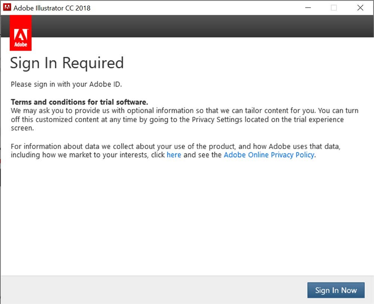

# Informazioni sulla scadenza del numero di serie Creative Cloud for enterprise e Acrobat

Storicamente, un Adobe ha emesso numeri di serie con le nostre app (ad esempio, Creative Suite, Creative Cloud for enterprise, Acrobat XI, Acrobat DC) per i clienti con Enterprise Term License Agreement (ETLA). Questi numeri di serie hanno una data di scadenza. Trascorsa la data di scadenza, il prodotto non funzionerà più ed è quindi importante pianificare la migrazione prima della scadenza dei numeri di serie. Questa pagina descrive i passaggi necessari per garantire agli utenti finali l&#39;accesso continuo alle app e ai servizi di Adobe.

## Controllo dei numeri di serie per la data di scadenza

### Trovare i numeri di serie

Le licenze con numero di serie associate al contratto ETLA sono disponibili tramite [il sito Web delle licenze di Adobe](https://licensing.adobe.com/) (LWS). Segui queste istruzioni per visualizzare e scaricare:

1. Accedi al [sito Web delle licenze di Adobe](https://licensing.adobe.com/) (LWS) con il tuo Adobe ID e la relativa password.
1. Scegli **Licenze > Recupera numeri di serie**.
1. Immetti il tuo **ID utente finale** o **Distribuisci su ID**.
1. (Facoltativo) Selezionare un **nome prodotto**, una **versione prodotto** o una **piattaforma** per filtrare i risultati.
1. Fare clic su Cerca.
1. Vengono visualizzati il nome del prodotto e i numeri di serie.
1. (Facoltativo) Seleziona &quot;ESPORTA IN CSV&quot; per scaricare l’elenco dei numeri di serie.

### Controllare la data di scadenza

[AdobeExpiryCheck](https://helpx.adobe.com/it/enterprise/kb/volume-license-expiration-check.html) è un&#39;utilità della riga di comando per gli amministratori IT che consente di verificare se i prodotti di Adobe su un computer utilizzano numeri di serie scaduti o in scadenza. Lo strumento visualizzerà informazioni quali l&#39;identificativo di licenza del prodotto (LEID), il numero di serie crittografato e la data di scadenza. Questa [pagina](https://helpx.adobe.com/it/enterprise/kb/volume-license-expiration-check.html) contiene istruzioni su come scaricare e utilizzare lo strumento su computer Mac o Windows.

## Esperienza utente finale prima e dopo la scadenza del numero di serie

Sia le app Acrobat che Creative Cloud for enterprise inizieranno a visualizzare messaggi (nelle app) a partire da 60 giorni prima della scadenza. Una volta scaduto il numero di serie, i prodotti smettono di funzionare e richiedono all&#39;utente di intraprendere un&#39;azione.

### Esperienza Creative Cloud for enterprise

Le seguenti informazioni descrivono l&#39;esperienza dell&#39;utente finale. Di seguito è riportato un breve video, seguito da un riepilogo dell&#39;esperienza utente.

>[!VIDEO](https://video.tv.adobe.com/v/3441285?hidetitle=true&captions=ita)

**Prima della scadenza**

A partire da 60 giorni prima della scadenza del numero di serie, tutte le app Creative Cloud for enterprise visualizzano una finestra di dialogo del prodotto per l&#39;utente finale. Questo messaggio verrà visualizzato ogni settimana, fino a 30 giorni prima della scadenza, quindi verrà visualizzato ogni giorno fino alla data di scadenza che indica *La licenza sta per scadere. Questo prodotto di Adobe utilizza una licenza che scadrà il 29 novembre 2020. Contatta il tuo amministratore per garantire l&#39;accesso continuo*.

**Dopo la scadenza**

Una volta scaduto il numero di serie, gli utenti non avranno più accesso alla versione di Creative Cloud per le app aziendali. Al primo avvio dopo la scadenza, all&#39;utente verrà visualizzata una finestra di dialogo che indica *Il numero di serie immesso è scaduto. Impossibile concedere in licenza questo prodotto. Contatta l&#39;Assistenza clienti*.

Per tutti i successivi tentativi di avvio delle app, all&#39;utente finale verrà richiesto di **Accedere ora**, quindi di creare il proprio Adobe ID e di accedere alla modalità di prova. Tuttavia, qualsiasi nuovo Adobe ID creato dall&#39;utente finale non verrà associato alle licenze della tua organizzazione e causerà ulteriore confusione ai tuoi utenti. Per evitare interruzioni delle attività e/o confusione non necessaria, migra gli utenti alla licenza per utente non anonimo prima della scadenza dei numeri di serie.

### Esperienza Acrobat

Le seguenti informazioni descrivono l&#39;esperienza dell&#39;utente finale. Di seguito è riportato un breve video, seguito da un riepilogo dell&#39;esperienza utente.

>[!VIDEO](https://video.tv.adobe.com/v/331749?hidetitle=true)

**Prima della scadenza**

A partire da 60 giorni prima della scadenza del numero di serie, Acrobat visualizza un messaggio a comparsa nel prodotto per l&#39;utente finale. Questa appare una volta alla settimana fino a 7 giorni prima della scadenza. Verrà quindi visualizzato ogni giorno indicando *La licenza Adobe Acrobat scade il 30/11/2020. Contatta il tuo amministratore per continuare a utilizzare Acrobat senza interruzioni.*

**Dopo la scadenza**

Una volta scaduto il numero di serie, gli utenti non avranno più accesso ad Acrobat. Al primo avvio dopo la scadenza, all&#39;utente verrà visualizzata una finestra di dialogo che indica *Il numero di serie immesso è scaduto. Impossibile concedere in licenza questo prodotto. Contatta l&#39;Assistenza clienti.*

Per tutti i successivi tentativi di avviare Acrobat, all&#39;utente finale verrà richiesto di **Accedere ora**, quindi di creare il proprio Adobe ID e di accedere alla modalità di prova. Tuttavia, qualsiasi nuovo Adobe ID creato dall&#39;utente finale non verrà associato alle licenze della tua organizzazione e causerà ulteriore confusione ai tuoi utenti.

## Contattaci se hai bisogno di aiuto

Se hai domande sull&#39;utilizzo dello strumento [AdobeExpiryCheck](https://helpx.adobe.com/it/enterprise/kb/volume-license-expiration-check.html) o hai bisogno di aiuto per migrare dalla distribuzione del numero di serie a un utente nominativo, hai alcune opzioni:
* Invia un&#39;e-mail al team di onboarding aziendale Adobe - **entonb@adobe.com**
* Apri un ticket di supporto in [Admin Console](https://adminconsole.adobe.com/support)
* Contatta il tuo team per l’account Adobe
