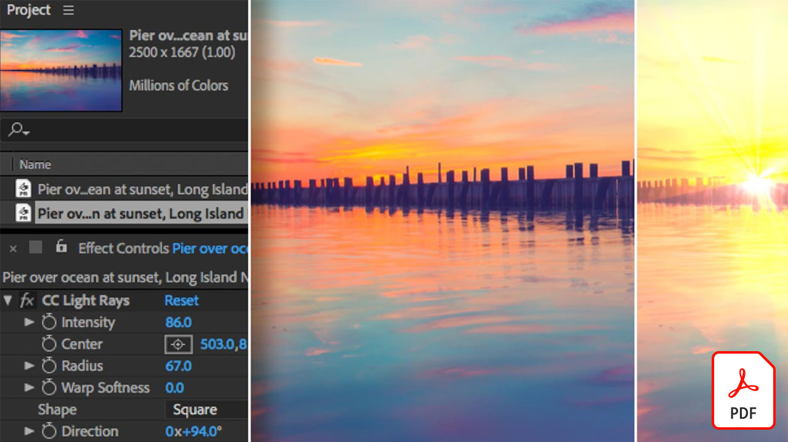

# Guide di riferimento rapido video

Dai vita alle tue idee con software e app Adobi per l&#39;editing video, la grafica animata, gli effetti visivi, l&#39;animazione e altro ancora. Selezionate un’immagine da scaricare o visualizzate un PDF della guida di riferimento rapido.

## Adobe Audition

<table>
<tr>
   <td>
      
      

      <a href="assets/QuicklyRemoveUnwantedAudioContentwiththeSpotHealingBrushinAdobeAudition.pdf" target="_blank"><strong>Rimuovi rapidamente i contenuti audio indesiderati con il pennello correttivo al volo in Adobe Audition (PDF)</strong></a>
      

      <em>Lo sapevi che il Pennello correttivo al volo di Adobe Photoshop consente di rimuovere suoni fastidiosi dai file audio in Adobe Audition?</em>
       
  </td>
  <td>
    
    

     
  </td>
  <td>
    
    

     
  </td>
  <td>
    
    

     
  </td>
</tr>
</table>

## Adobe Express (in precedenza Adobe Spark)

<table>
<tr>
<td>
   
    

   <a href="assets/ShowcaseyourSparkVideoinyourSparkPage.pdf" target="_blank"><strong>Presentazione di Spark Video nello Spark Page (PDF)</strong></a>
    

    <em>Adobe Spark Page consente di caricare video da diverse fonti, inclusi i video creati con Spark Video.</em>
     
  </td>
  <td>
    
    

     
  </td>
  <td>
    
    

     
  </td>
  <td>
    
    

     
  </td>
</tr>
</table>

## After Effects

<table>
<tr>
 <td>
   
    

   <a href="assets/AfterEffectsforPhotography.pdf" target="_blank"><strong>After Effects per la fotografia (PDF)</strong></a>
    

    <em>Scoprite come utilizzare gli straordinari effetti di After Effects per migliorare le vostre fotografie</em>
     
  </td>
  <td>
   
    

   <a href="assets/CinemagraphsTheMesmerizingPlaceBetweenaPhotoandaVideo.pdf" target="_blank"><strong>Cinemagraphs: Il luogo incantevole tra una foto e un video (PDF)</strong></a>
    

    <em>Scoprite di più sui cinemagraphs: quegli ibridi accattivanti che esistono da qualche parte tra una foto e un video</em>
     
  </td>
  <td>
   
    

   <a href="assets/CreateanIllustrationfromanAdobeStockPhotowithAfterEffects.pdf" target="_blank"><strong>Creazione di un'illustrazione da un Adobe [!DNL Stock] Foto con After Effects (PDF)</strong></a>
    

    <em>Combina Tonalità/Saturazione e Livelli con gli effetti Cartone animato in After Effects per creare un'illustrazione stilizzata unica da un Adobe [!DNL Stock] foto</em>
     
  </td>
   <td>
   
    

   <a href="assets/CreateBeautifulKaleidoscopePatternswithAfterEffects.pdf" target="_blank"><strong>Crea splendidi motivi caleidoscopici con After Effects PDF)</strong></a>
    

    <em>Crea un numero illimitato di pattern e texture da qualsiasi immagine, utilizzando l’effetto CC Kaleida in Adobe After Effects</em>
     
  </td>
</tr>
<tr>
<td>
   
    

   <a href="assets/CreateIntricateTransparencyinyourPhotographswithKeyinginAfterEffects.pdf" target="_blank"><strong>Trasparenza complessa nelle foto con l’uso della trasparenza in After Effects (PDF)</strong></a>
    

    <em>Il tipo di trasparenza viene utilizzato in modo massiccio per i video e può essere di grande aiuto anche quando le fotografie sono necessarie per progetti di progettazione</em>
     
  </td>
 <td>
   
    

   <a href="assets/CreateAnimatedTitlesUsingMotionGraphicsTemplatesinAdobePremiereRush.pdf" target="_blank"><strong>Creare titoli animati utilizzando i modelli di grafica animata in Adobe Premiere [!DNL Rush] (PDF)</strong></a>
    

    <em>Rendi i tuoi video ancora più straordinari aggiungendo modelli di grafica animata progettati in modo professionale che si adattano alla tua storia o al tuo marchio personale</em>
     
  </td>
  <td>
      
      

      <a href="assets/DazzlingLightEffectsforPhotographywithAfterEffects.pdf" target="_blank"><strong>Effetti di luce straordinari per la fotografia con After Effects (PDF)</strong></a>
      

      <em>Gli effetti di luce in Adobe After Effects possono modificare notevolmente l’aspetto della foto</em>
       
  </td>
  <td>
      
      

      <a href="assets/EditingVRPhotography360photoswithAfterEffects.pdf" target="_blank"><strong>Modifica della fotografia VR (foto a 360 gradi) con After Effects (PDF)</strong></a>
      

      <em>Mentre i giochi e le esperienze interattive più coinvolgenti non sono poi così comuni, la fotografia a 360 gradi è già qui</em>
       
  </td>
</tr>
</table>

## Premiere Rush

<table>
<tr>
   <td>
      
      

      <a href="assets/SmoothlyCombineMusicandDialogueorNarrationwithAutoduckinginAdobePremiereRush.pdf" target="_blank"><strong>Combina musica e dialogo o narrazione in modo fluido con attenuamento automatico [!DNL Adobe Premiere Rush] (PDF)</strong></a>
      

      <em>Adobe Premiere [!DNL Rush] offre funzioni di editing video avanzate in un'app semplice da utilizzare, in modo che chiunque possa creare un video di qualità professionale in pochi minuti</em>
       
  </td>
  <td>
    
    

     
  </td>
  <td>
    
    

     
  </td>
  <td>
    
    

     
  </td>
</tr>
</table>
