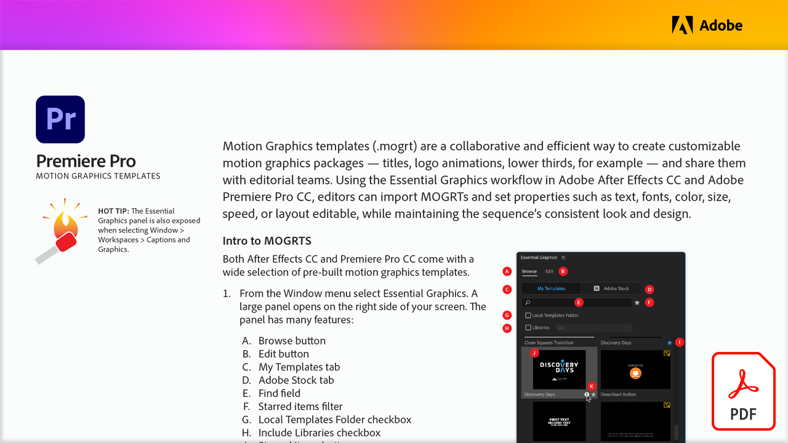

# Adobe di esercitazioni video

Dai vita alle tue idee con app e software di Adobe per l&#39;editing video, l&#39;animazione, gli effetti speciali, l&#39;animazione e non solo. Selezionate un’immagine per visualizzare un’esercitazione.

<table>
<tr>
 <td>
   
    

   <a href="motion-graphics-templates.md"><strong>Modelli professionali di grafica animata</strong></a>
    

    <em>I modelli di grafica animata (.mogrt) sono un modo collaborativo ed efficiente per creare pacchetti di grafica animata personalizzabili: titoli, animazioni logo, terzi inferiori e condividerli con i team editoriali</em>
     
  </td>
  <td>
   
    

   <a href="video-review-frame-io.md"><strong>Recensione video con Frame.io</strong></a>
    

    <em>Scopri come l’estensione Frame.io per Adobe Premiere Pro consente di centralizzare e condividere le risorse, ricevere commenti in tempo reale, monitorare le revisioni e ottenere approvazioni più rapide, il tutto senza uscire dalla timeline</em>
     
  </td>
  <td>
    
    

     
  </td>
  <td>
    
    

     
  </td>
</tr>
</table>
