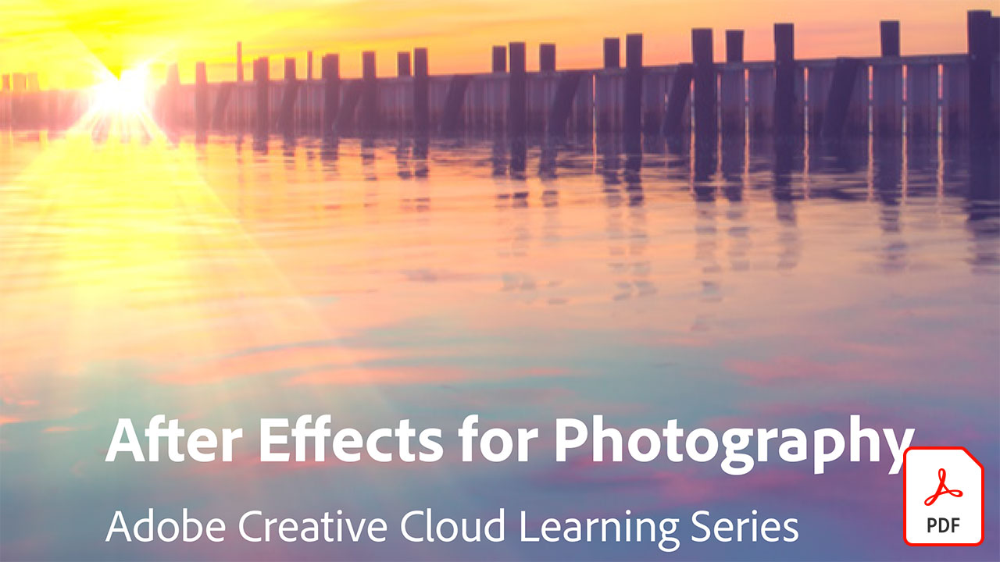

# Esercitazioni di Adobe Video

Fate vivere le vostre idee con il software e le app Adobe per l&#39;editing video, la grafica in movimento, gli effetti visivi, l&#39;animazione e altro ancora.

## Fare clic per visualizzare un&#39;esercitazione di Adobe Video

<table>
<tr>
 <td>
   
    

   <a href="assets/AfterEffectsforPhotography.pdf"><strong>After Effects for Photography (PDF)</strong></a>
    

    <em>Impara a utilizzare gli effetti straordinari di After Effects per migliorare le tue fotografie</em>
     
  </td>
  <td>
   
    

   <a href="assets/CinemagraphsTheMesmerizingPlaceBetweenaPhotoandaVideo.pdf"><strong>Cinemagrafia: Il luogo di smerigliatura tra una foto e un video (PDF)</strong></a>
    

    <em>Ulteriori informazioni sui cinema — quegli ibridi accattivanti che esistono da qualche parte tra una foto e un video</em>
     
  </td>
  <td>
   
    

   <a href="assets/CreateanIllustrationfromanAdobeStockPhotowithAfterEffects.pdf"><strong>Create un'illustrazione da una foto di Adobe [!DNL Stock] Photo con After Effects (PDF)</strong></a>
    

    <em>Combinate la tonalità/saturazione e i livelli con gli effetti Vignetta in After Effects per creare un'illustrazione stilizzata unica da una foto di Adobe [!DNL Stock]</em>
     
  </td>
</tr>
<tr>
 <td>
   
    

   <a href="assets/CreateAnimatedTitlesUsingMotionGraphicsTemplatesinAdobePremiereRush.pdf"><strong>Creazione di titoli animati utilizzando modelli grafici di movimento in Adobe Premiere [!DNL Rush] (PDF)</strong></a>
    

    <em>Rendi i tuoi video ancora più straordinari aggiungendo modelli di grafica Motion progettati professionalmente che si adattano alla tua storia o al tuo marchio personale</em>
     
  </td>
  <td>
   
    

   <a href="assets/CreateBeautifulKaleidoscopePatternswithAfterEffects.pdf"><strong>Creazione di modelli Kaleidoscopio di bellezza con After Effects PDF)</strong></a>
    

    <em>Create un numero infinito di pattern e trame, da qualsiasi immagine, utilizzando l'effetto Caleida in Adobe After Effects</em>
     
  </td>
  <td>
   
    

   <a href="assets/CreateIntricateTransparencyinyourPhotographswithKeyinginAfterEffects.pdf"><strong>Crea trasparenza intricata nelle foto con Keying in After Effects (PDF)</strong></a>
    

    <em>Keying è molto usata per i video, e può essere di grande aiuto quando le fotografie sono necessarie per progetti di design</em>
     
  </td>
</tr>
<tr>
 <td>
   
    

   <a href="assets/DazzlingLightEffectsforPhotographywithAfterEffects.pdf"><strong>Effetti luminosi abbaglianti per la fotografia con After Effects (PDF)</strong></a>
    

    <em>Gli effetti di illuminazione in Adobe After Effects possono cambiare radicalmente l'aspetto della vostra foto</em>
     
  </td>
  <td>
   
    

   <a href="assets/EditingVRPhotography360photoswithAfterEffects.pdf"><strong>Editing della fotografia VR (foto a 360 gradi) con After Effects (PDF)</strong></a>
    

    <em>Mentre i giochi interattivi più coinvolgenti e le esperienze non sono così comuni, la fotografia a 360 gradi è già qui</em>
     
  </td>
  <td>
   
    

   <a href="assets/QuicklyRemoveUnwantedAudioContentwiththeSpotHealingBrushinAdobeAudition.pdf"><strong>Rimuovere rapidamente i contenuti audio indesiderati con il pennello di correzione per il punto vendita in Adobe Audition (PDF)</strong></a>
    

    <em>Sapevate che il pennello di correzione in spot di Adobe Photoshop vi consente di rimuovere i suoni distratti dai file audio in Adobe Audition?</em>
     
  </td>
</tr>
<tr>
   <td>
   
    

   <a href="assets/ShowcaseyourSparkVideoinyourSparkPage.pdf"><strong>Mostra il video dello scatto nella tua pagina (PDF)</strong></a>
    

    <em>Adobe Spark Page consente di caricare video da diverse fonti, inclusi video creati con Spark Video!</em>
     
  </td>
  <td>
   
    

   <a href="assets/SmoothlyCombineMusicandDialogueorNarrationwithAutoduckinginAdobePremiereRush.pdf"><strong>Combina armoniosamente musica e dialogo o narrazione con l'azionamento automatico in Adobe Premiere [!DNL Rush] Adobe (PDF)</strong></a>
    

    <em>Adobe Premiere [!DNL Rush] offre funzioni di editing video avanzate in un'app semplice da usare, in modo che chiunque possa creare un video di qualità professionale in pochi minuti</em>
     
  </td>
</tr>
</table>
