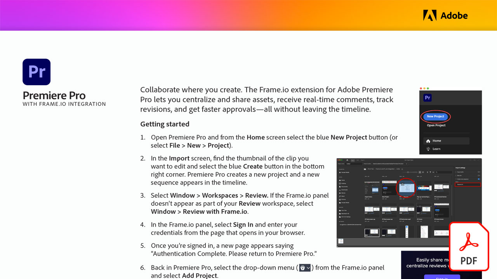

# Recensione video con Frame.io

Collabora dove crei. Scopri come l’estensione Frame.io per Adobe Premiere Pro consente di centralizzare e condividere le risorse, ricevere commenti in tempo reale, monitorare le revisioni e ottenere approvazioni più rapide, il tutto senza uscire dalla timeline in questo tutorial pratico.

Seleziona l’immagine seguente per visualizzare o scaricare questa esercitazione PDF.

[{&quot;width=680&quot;}](assets/Video-review-with-Frame.io.pdf){target=&quot;blank&quot;}