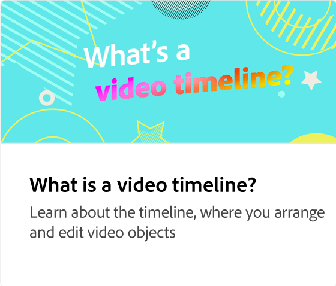

# Come aggiungere l’audio

Scopri come creare progetti coinvolgenti e memorabili aggiungendo l&#39;audio. Puoi caricare i tuoi file audio o scegliere tra audio stock esenti da royalty. Puoi anche registrare voci fuori campo e regolare il volume sia per l’audio che per le voci fuori campo.

>[!VIDEO](https://video.tv.adobe.com/v/3427092?quality=12&learn=on&hidetitle=true)

## Video aggiuntivi di questa serie

<table style="table-layout:fixed">
<tr>
   <td>
         
   </td>
  <td>
         
   </td>
   <td>
         
   </td>
   <td>
         
   </td>
</tr>
<tr>
    <td>
         
   </td>
   <td>
    
    

     
   </td>
   <td>
    
    

     
   </td>
   <td>
    
    

     
   </td>
</tr>
</table>
