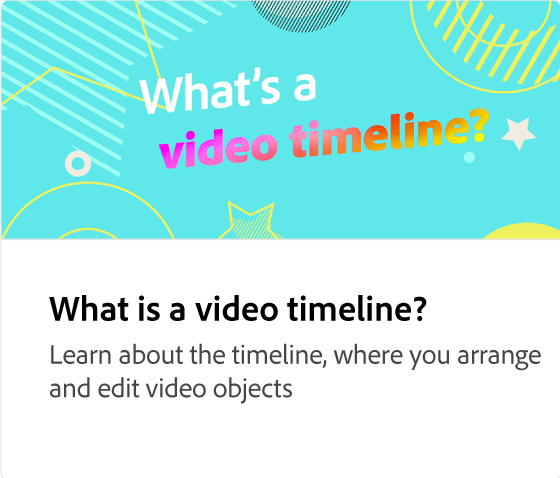

# Come aggiungere clip video

Scopri come creare video straordinari in modo semplice e veloce con la creazione di video tramite trascinamento. Inizia con i modelli o i tuoi progetti statici e aggiungi il tuo marchio, le risorse di progettazione, i video e la musica Adobe Stock e altro ancora.

>[!VIDEO](https://video.tv.adobe.com/v/3427071?quality=12&learn=on&hidetitle=true)

## Video aggiuntivi di questa serie

<table style="table-layout:fixed">
<tr>
   <td>
         
   </td>
   <td>
         
   </td>
   <td>
         
   </td>
   <td>
         
   </td>
</tr>
<tr>
    <td>
         
   </td>
   <td>
    
    

     
   </td>
   <td>
    
    

     
   </td>
   <td>
    
    

     
   </td>
</tr>
</table>
