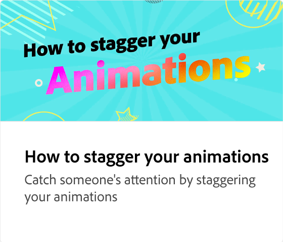

# Che cos&#39;è la sequenza temporale dell&#39;animazione?

Scopri come navigare e regolare la timeline dell’animazione. La linea temporale è una vista generale dell’intera animazione, in cui potete visualizzare in anteprima e ridurre/estendere la lunghezza dell’animazione.

>[!VIDEO](https://video.tv.adobe.com/v/3426978?quality=12&learn=on&hidetitle=true)

## Video aggiuntivi di questa serie

<table style="table-layout:fixed">
<tr>
   <td>
         
   </td>
   <td>
         
   </td>
   <td>
         
   </td>
   <td>
         
   </td>
</tr>
<tr>
   <td>
         
   </td>
   <td>
         
   </td>
   <td>
         
   </td>
   <td>
         
   </td>
</tr>
</table>
