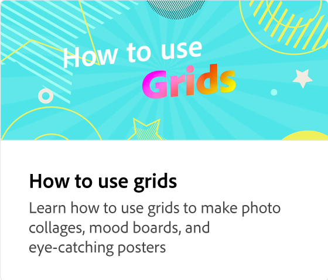
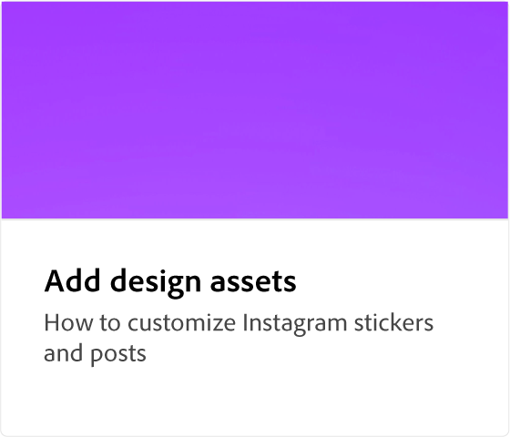

# Come aggiungere un’immagine

Scopri tutti i diversi modi per aggiungere un’immagine e i relativi effetti ai tuoi progetti creativi. Sostituite le immagini modello con elementi grafici Adobe Stock più adatti. Usate il pannello Livelli per riordinare i livelli, cercare nuove immagini e modificare il ritaglio. La natura non distruttiva del ritaglio consente di modificare la forma del ritaglio in qualsiasi momento.

>[!VIDEO](https://video.tv.adobe.com/v/3420226?quality=12&learn=on&hidetitle=true)

## Video aggiuntivi di questa serie

<table style="table-layout:fixed">
<tr>
 <td>
      
  </td>
   <td>
      
  </td>
   <td>
      
  </td>
  <td>
      
  </td>
</tr>
<tr>
  <td>
      
  </td>
   <td>
      
  </td>
   <td>
         
   </td>
   <td>
         
   </td>
</tr>
<tr>
   <td>
   
   </td>
   <td>
   
   </td>
   <td>
   
   </td>
   <td>
      
      

       
   </td>
</tr>
</table>