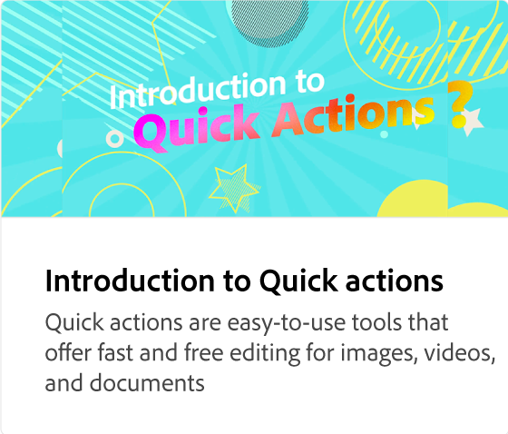

# Introduzione ai modelli

Esplora migliaia di modelli progettati professionalmente per tutte le tue esigenze di social media e marketing. I modelli consentono di creare rapidamente contenuti personalizzati mixando parole e foto dell’utente.

>[!VIDEO](https://video.tv.adobe.com/v/3426927?quality=12&learn=on&hidetitle=true)

## Video aggiuntivi di questa serie

<table style="table-layout:fixed">
<tr>
 <td>
      
 </td>
 <td>
      
 </td>
 <td>
      
      

       
   </td>
    <td>
      
      

       
   </td>
</tr>
</table>
