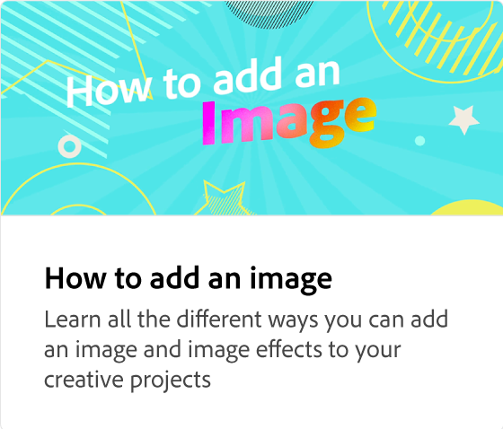

# Adobe [!DNL Express] esercitazioni pratiche

Inizia a creare lavori straordinari che si distinguono con l&#39;intelligenza artificiale generativa basata sull&#39;Adobe Firefly. Progetta volantini, TikToks, curriculum e Reels con Adobe Express.

<table style="table-layout:fixed">
<tr>
 <td>
      
 </td>
 <td>
      
 </td>
 <td>
      
 </td>     
 <td>
      
  </td>
</tr>
<tr>
   <td>
      
  </td>
   <td>
      
  </td>
  <td>
      
  </td>
  <td>
      
  </td>
</tr>
<tr>
   <td>
      
  </td>
  <td>
      
  </td>
  <td>
   
  </td>
  <td>
      
  </td>
</tr>
<tr>
   <td>
   
  </td>
 <td>
         
 </td>
  <td>
         
   </td>
  <td>
         
   </td>
</tr>
<tr>
   <td>
      
  </td>
  <td>
      
   </td>
  <td>
      
  </td>
   <td>
      
  </td>
</tr>
<tr>
   <td>
         
   </td>
  <td>
         
   </td>
  <td>
      
      

       
   </td>
   <td>
      
      

       
   </td>
</tr>
</table>
