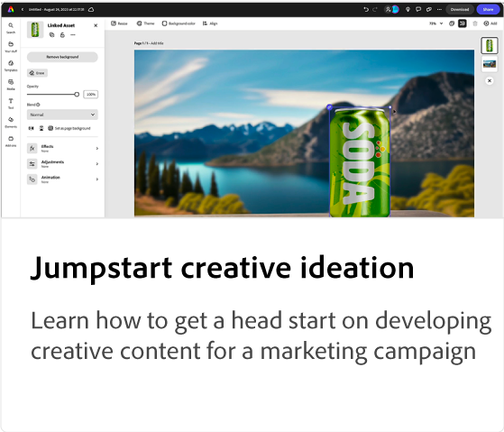

# Adobe [!DNL Express] esercitazioni per casi d’uso

Scopri come i diversi team della tua organizzazione possono trarre vantaggio da Adobi Express.

## Novità

* [Creazione di un video promozionale per un corso di apprendimento online](promo-visual.md)
Scopri come creare un&#39;immagine accattivante per un corso di apprendimento online
* [Creazione di un video di fine anno](end-of-year-video.md)
Scopri come creare un video stimolante di fine anno
* [Come creare un notiziario](newsletter.md)
Informazioni su come creare la prima pagina di un notiziario che può essere utilizzato per la stampa, l&#39;invio tramite e-mail o la pubblicazione sul Web

<table style="table-layout:fixed">
<tr>
   <td>
      
   </td>
   <td>
      
   </td>
   <td>
      
   </td>
   <td>
      
   </td>
</tr>
<tr>
   <td>
      
   </td>
   <td>
      
   </td>
   <td>
      
   </td>
   <td>
      
   </td>
</tr>
<tr>
   <td>
      
   </td>
   <td>
      
   </td>
   <td>
      
   </td>
   <td>
      
   </td>
</tr>
<tr>
   <td>
      
   </td>
   <td>
      
   </td>
   <td>
      
   </td>
   <td>
      
      

       
   </td>
</tr>
</table>
