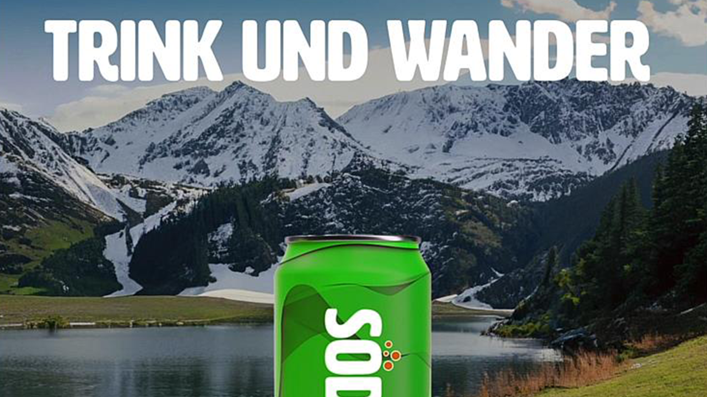

# Adobe [!DNL Express] esercitazioni per lo use case

Scopri come i diversi team della tua organizzazione possono trarre vantaggio da Adobi Express.

## Novità

>[!BEGINTABS]

>[!TAB Creazione di contenuti HR multicanale per gli eventi]

Scopri come [creare rapidamente contenuti HR multicanale per eventi](create-hr-content.md).

>[!TAB Creazione di un&#39;immagine promozionale per un corso di apprendimento online]

Scopri come creare un&#39;immagine accattivante per un [corso di apprendimento online](promo-visual.md).

>[!TAB Creazione di un video di fine anno]

Scopri come creare un [video di fine anno](end-of-year-video.md) stimolante.

>[!ENDTABS]

<table style="table-layout:fixed">
<tr>
   <td>
      
      

      <a href="create-hr-content.md">Creazione di contenuti HR multicanale per gli eventi</a>
      

      Scopri come creare rapidamente contenuti HR multicanale per eventi
       
   </td>
   <td>
      
      

      <a href="promo-visual.md">Creazione di un'immagine promozionale per un corso di apprendimento online</a>
      

      Scopri come creare immagini accattivanti per un corso di apprendimento online
       
   </td>
   <td>
      
      

      <a href="end-of-year-video.md">Creazione di un video di fine anno</a>
      

      Scopri come creare un video stimolante di fine anno
       
   </td>
   <td>
      
      

      <a href="newsletter.md">Come creare un notiziario</a>
      

      Come creare una pagina iniziale dinamica per un notiziario
       
   </td>
</tr>
<tr>
   <td>
      
      

      <a href="create-digital-screens.md">Creazione di annunci sullo schermo digitale per l'ufficio</a>
      

      Scopri come creare annunci coinvolgenti per gli schermi digitali per l'ufficio
       
   </td>
    <td>
      
      

      <a href="create-backgrounds.md">Creazione di sfondi per le presentazioni</a>
      

      Scoprite come creare sfondi coinvolgenti per le presentazioni PowerPoint
       
   </td>
   <td>
      
      

      <a href="update-image.md">Aggiorna l'immagine di riepilogo finanziario</a>
      

      Scoprite come aggiornare rapidamente un'immagine grafica statica
       
   </td>
   <td>
      
      

      <a href="compelling-merchandise.md">Creare contenuti di merchandising accattivanti</a>
      

      Scoprite come creare immagini accattivanti per un nuovo set di inventari
       
   </td>
</tr>
<tr>
   <td>
      
      

      <a href="multi-channel-marketing-content.md">Consentire ai team di marketing di creare contenuti multicanale</a>
      

      Scopri come creare contenuti unici per attirare l’attenzione degli spettatori durante gli eventi online
       
   </td>
   <td>
      
      

      <a href="localized-marketing-content.md">Possibilità per i team distribuiti di localizzare i contenuti</a>
      

      Scopri come localizzare i contenuti per le campagne di marketing regionali
       
   </td>
   <td>
      
      

      <a href="jumpstart-ideation.md">Creazione creativa</a>
      

      Scoprite come ottenere un vantaggio nello sviluppo di contenuti creativi
       
   </td>
   <td>
      
      

      <a href="create-local-marketing.md">Creazione di contenuti volantini per la campagna di marketing con il Firefly</a>
      

      Scopri come localizzare i contenuti per una campagna di marketing globale
       
   </td>
</tr>
<tr>
   <td>
      
      

      <a href="create-on-boarding.md">Creazione di contenuti di selezione e inserimento con Firefly</a>
      

      Scopri come creare grafica univoca per i contenuti di selezione e inserimento dei dipendenti
       
   </td>
   <td>
      
      

      <a href="create-social-posters.md">Creazione di poster social con Firefly</a>
      

      Scopri come creare facilmente una campagna di promozione per i social media
       
   </td>
   <td>
      
      

      <a href="create-blog-graphics.md">Creazione di contenuto grafico per i blog con Firefly</a>
      

      Scopri come creare contenuti grafici unici per Web, blog e campagne social
       
   </td>
   <td>
      
      

      <a href="create-webinar-poster.md">Creazione di poster del webinar con Firefly</a>
      

      Scoprite come creare un interessante poster del webinar per un evento di realtà virtuale
       
   </td>
</tr>
</table>
