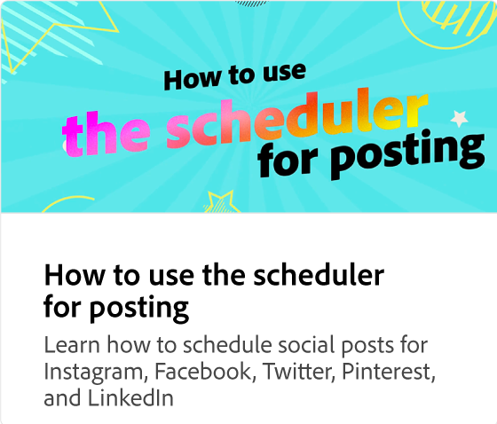
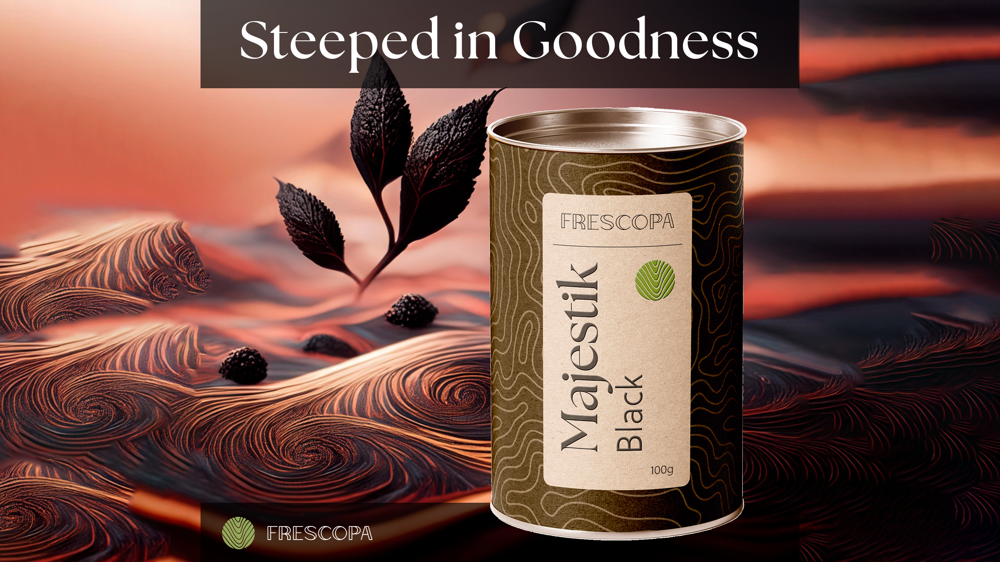

# Adobe [!DNL Express] panoramica

Adobe Express è uno strumento creativo facile da usare, senza bisogno di alcuna esperienza.

  

## Guida introduttiva ad Adobe Express

  

>[!VIDEO](https://video.tv.adobe.com/v/3420204?quality=12&learn=on&hidetitle=true)

## Esercitazioni di Adobe Express

<table>
<tr>
   <td>
      
  </td>
  <td>
      
  </td>
  <td>
      
  </td>
  <td>
   
  </td>
</tr>
<tr>
   <td>
      
  </td>
  <td>
   
  </td>
  <td>
      
  </td>
  <td>
      
  </td>
</tr>
<tr>
   <td>
      
  </td>
  <td>
      
  </td>
  <td>
      
  </td>
  <td>
      
  </td>
</tr>
<tr>
   <td>
      
  </td>
  <td>
      
  </td>
   <td>
      
  </td>
  <td>
      
  </td>
</tr>
  <td>
      
  </td>
  <td>
      
  </td>
  <td>
      
  </td>
  <td>
    
    

     
  </td>
</tr>
</table>
