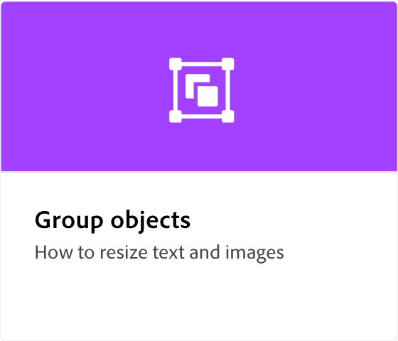
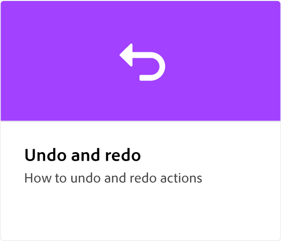

# Adobe [!DNL Express] panoramica

Adobe Express è uno strumento creativo facile da usare, senza bisogno di alcuna esperienza.

  

## Guida introduttiva ad Adobe Express

  

>[!VIDEO](https://video.tv.adobe.com/v/3420204?quality=12&learn=on&hidetitle=true)

## Esercitazioni di Adobe Express

<table>
<tr>
   <td>
      
      

      <a href="get-started.md"><strong>Guida introduttiva ad Adobe Express</strong></a>
      

      <em>Nozioni di base sull'Adobe Express</em>
       
  </td>
  <td>
      
      

      <a href="adobe-express-beginners.md"><strong>Adobe Express per principianti</strong></a>
      

      <em>Esprimiti imparando a creare il tuo primo progetto</em>
       
  </td>
  <td>
      
      

      <a href="get-inspiration.md"><strong>Ispirazione rapida</strong></a>
      

      <em>Non è un designer? Non è un problema. Scoprite come trarre ispirazione rapidamente in Adobe Express</em>
       
  </td>
  <td>
   
    

   <a href="create-templates.md"><strong>Creare modelli</strong></a>
    

    <em>Scopri come utilizzare nuovamente lo stesso layout di progetto</em>
     
  </td>
</tr>
<tr>
   <td>
      
      

      <a href="add-design-assets.md"><strong>Aggiungere risorse di progettazione</strong></a>
      

      <em>Scopri come personalizzare adesivi e post di Instagram</em>
       
  </td>
  <td>
      
      

      <a href="group-objects.md"><strong>Raggruppare gli oggetti</strong></a>
      

      <em>Scopri come ridimensionare testo e immagini</em>
       
  </td>
  <td>
      
      

      <a href="layers.md"><strong>Selezionare e spostare i livelli</strong></a>
      

      <em>Spostare, riordinare o sovrapporre adesivi e testo con livelli</em>
       
  </td>
  <td>
      
      

      <a href="multiple-pages.md"><strong>Creare più pagine</strong></a>
      

      <em>Scoprite come aggiungere più pagine al progetto</em>
       
  </td>
</tr>
<tr>
   <td>
      
      

      <a href="undo-redo.md"><strong>Annullare e ripristinare</strong></a>
      

      <em>Scopri come annullare e ripristinare le azioni</em>
       
  </td>
  <td>
      
      

      <a href="cc-libraries.md"><strong>Utilizzare CC Libraries</strong></a>
      

      <em>Scopri come condividere le risorse CC Library con il tuo team</em>
       
  </td>
  <td>
      
      

      <a href="brand.md"><strong>Applicare il marchio</strong></a>
      

      <em>Scopri come aggiungere il logo e il colore del marchio a qualsiasi modello</em>
       
  </td>
  <td>
      
      

      <a href="google-drive.md"><strong>Integrazione con Google Drive</strong></a>
      

      <em>Scopri come importare immagini da Google Drive</em>
       
  </td>
</tr>
<tr>
    <td>
      
      

      <a href="remove-background.md"><strong>Rimuovi sfondo</strong></a>
      

      <em>Scoprite come rimuovere lo sfondo dalle immagini</em>
       
  </td>
  <td>
      
      

      <a href="refine-cutout.md"><strong>Rifinire un ritaglio</strong></a>
      

      <em>Scopri come perfezionare i ritagli</em>
       
  </td>
  <td>
      
      

      <a href="text-effects.md"><strong>Usare gli effetti di testo</strong></a>
      

      <em>Scopri come aggiungere ombre esterne, forme e contorno del testo</em>
       
  </td>
  <td>
      
      

      <a href="image-effects.md"><strong>Usare gli effetti immagine</strong></a>
      

      <em>Scoprite come schiarire e scurire le immagini</em>
       
  </td>
  <td>
      
      

      <a href="create-curved-text.md"><strong>Creare testo curvo</strong></a>
      

      <em>Scoprite come creare testo curvo nel progetto</em>
       
  </td>
</tr>
</table>
