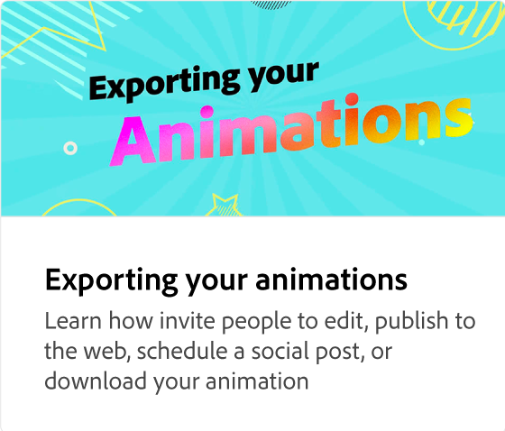

# Come ridimensionare le animazioni

Scopri come ottimizzare le dimensioni dell’animazione utilizzando predefiniti incorporati per post sui social media come Instagram. Indipendentemente da come ridimensionate le animazioni, le impostazioni vengono mantenute e non è necessario ricrearle.

>[!VIDEO](https://video.tv.adobe.com/v/3437730?quality=12&learn=on&hidetitle=true&captions=ita)

## Video aggiuntivi di questa serie

<table style="table-layout:fixed">
<tr>
   <td>
         
   </td>
  <td>
         
   </td>
   <td>
         
   </td>
   <td>
         
   </td>
</tr>
<tr>
    <td>
         
   </td>
   <td>
         
   </td>
   <td>
         
   </td>
   <td>
         
   </td>
</tr>
</table>
