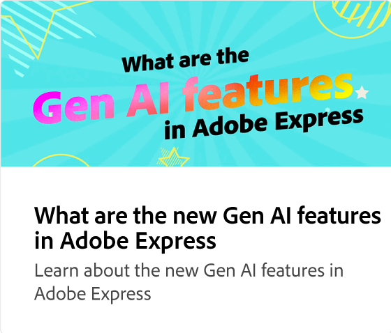

# Come utilizzare la funzione &quot;Text-to-template&quot; Gen AI

Scopri come generare modelli modificabili per post sui social, poster, volantini e biglietti da visita da una descrizione testuale in pochi secondi. Puoi modificare la progettazione, cambiare i font e aggiungere il marchio al progetto prima di scaricarlo o condividerlo.

>[!VIDEO](https://video.tv.adobe.com/v/3438131?quality=12&learn=on&hidetitle=true&captions=ita)

## Video aggiuntivi di questa serie

<table style="table-layout:fixed">
<tr>
   <td>
         
   </td>
   <td>
         
   </td>
   <td>
         
   </td>
   <td>
         
   </td>      
</tr>
<tr>
   <td>
      
   </td>
   <td>
      
   </td>
   <td>
      
   </td>
   <td>
      
   </td>
</tr>
</table>
