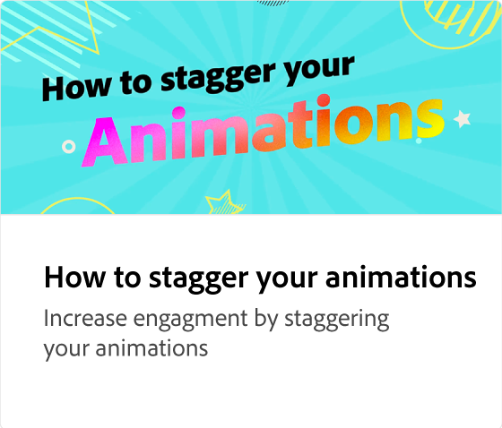

# Modifica delle impostazioni delle animazioni

Scopri come regolare le impostazioni delle animazioni per migliorarne l’efficacia. Puoi modificare la durata, la personalità, la velocità e l’intensità dell’animazione per creare un effetto specifico.

>[!VIDEO](https://video.tv.adobe.com/v/3438529?captions=ita&quality=12&learn=on&hidetitle=true)

## Video aggiuntivi di questa serie

<table style="table-layout:fixed">
<tr>
   <td>
         
   </td>
   <td>
         
   </td>
   <td>
         
   </td>
   <td>
         
   </td>
</tr>
<tr>
   <td>
         
   </td>
   <td>
         
   </td>
   <td>
         
   </td>
   <td>
         
   </td>
</tr>
</table>

