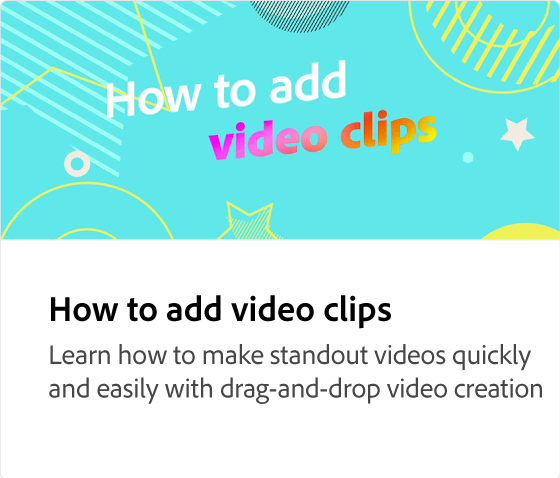

# Che cos&#39;è una timeline video?

Scopri la timeline, dove disporre e modificare oggetti video come video, immagini, testo e grafica nel progetto. La linea temporale è una rappresentazione degli oggetti e dell&#39;ordine degli oggetti che compongono un video.

>[!VIDEO](https://video.tv.adobe.com/v/3427090?quality=12&learn=on&hidetitle=true)

## Video aggiuntivi di questa serie

<table style="table-layout:fixed">
<tr>
   <td>
         
   </td>
  <td>
         
   </td>
   <td>
         
   </td>
   <td>
         
   </td>
</tr>
<tr>
    <td>
         
   </td>
   <td>
    
    

     
   </td>
   <td>
    
    

     
   </td>
   <td>
    
    

     
   </td>
</tr>
</table>
