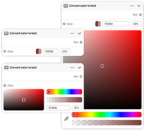
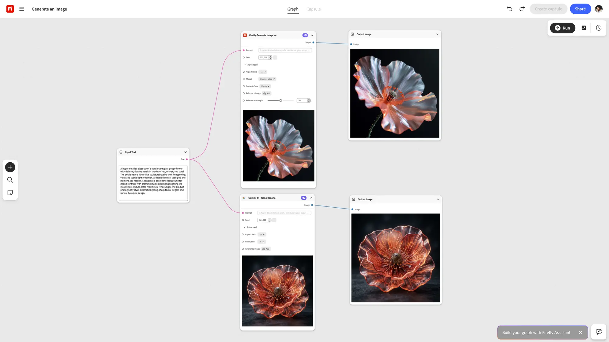

# &#x200B;2. Concetti chiave del grafico di Firefly

Scopri i concetti chiave per iniziare a usare Firefly Graph.

## Nodo

Un nodo esegue un passaggio del flusso di lavoro, ovvero un nodo, un processo. Un nodo può generare un&#39;immagine, applicare una maschera, spostare un colore o eseguire qualsiasi altra azione creativa.

{align="center"}

## Porta

Punti di connessione su un nodo. Le porte di output passano i dati da un nodo; le porte di input ricevono i dati in arrivo. La connessione delle porte consente di stabilire il flusso dei dati nel flusso di lavoro.

{align="center"}

## Widget

I controlli interattivi su un nodo, come campi di testo, menu a discesa e cursori, che consentono di configurarne le impostazioni direttamente nell&#39;editor.

{align="center"}

## Connessione

Una connessione trasporta un input o un output tra due nodi. Un grafico legge da sinistra a destra, dall’input sorgente all’output finale.

{align="center"}

## Grafico

Il flusso di lavoro completo creato nell&#39;editor. Un grafico è composto da nodi e connessioni disposte sull&#39;area di lavoro per produrre un output finale.

{align="center"}

## Passaggio successivo

Sei pronto a costruire qualcosa? Passare a [3. Creare il primo grafico](https://experienceleague.adobe.com/en/docs/creative-cloud-enterprise-learn/cce-learning-hub/fireflyoverview/firefly-graph/create-your-first-graph) per una procedura dettagliata.

Torna a [Introduzione a Firefly Graph](https://experienceleague.adobe.com/en/docs/creative-cloud-enterprise-learn/cce-learning-hub/fireflyoverview/firefly-graph/overview-firefly-graph).
