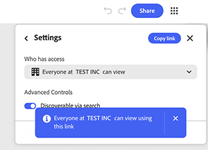

# &#x200B;5. Condividere un grafico

Scopri come condividere un grafico con altri. La condivisione di un grafico consente di condividere il flusso di lavoro in tempo reale, non solo l’output. Chiunque disponga dell&#39;accesso in modifica può rieseguirlo, modificarlo e passarlo a qualcun altro. Utilizza l&#39;accesso a livello di collegamento per un&#39;ampia visibilità all&#39;interno dell&#39;organizzazione e inviti denominati con un ruolo specifico per chiunque abbia bisogno di accesso diretto.

1. Seleziona **Condividi** nell&#39;angolo superiore destro del grafico.

   {align="center"}

   La finestra di dialogo si apre con un campo per aggiungere nomi o e-mail e un riepilogo di chi ha attualmente accesso. Per impostazione predefinita, solo gli utenti invitati possono accedere al grafico.

1. Seleziona l&#39;icona dell&#39;ingranaggio per aprire **Impostazioni**.

   {align="center"}

   Sono disponibili tre livelli di accesso: solo utenti invitati, tutti i membri dell&#39;organizzazione o chiunque disponga del collegamento.

1. Seleziona **Tutti gli utenti dell&#39;[organizzazione] possono visualizzare** per consentire a chiunque all&#39;interno dell&#39;azienda di aprire il grafico con il collegamento.

   {align="center"}

1. Attiva Discoverable tramite la ricerca in modo che i membri possano trovare il grafico senza bisogno del collegamento.

   {align="center"}

   Un banner di conferma indica esattamente chi può visualizzare il grafico utilizzando il collegamento. Prima di inviare il collegamento, controlla questo dato. Si applica a tutti i futuri destinatari di tale collegamento, non solo alla prossima persona invitata.

1. Digita un indirizzo e-mail direttamente nel campo di invito per assegnare un accesso denominato a una persona, separatamente dall&#39;impostazione generale del collegamento. Selezionare la voce corrispondente dal suggerimento visualizzato sotto il campo.

   {align="center"}

1. Seleziona il menu a discesa dei ruoli accanto al nome per scegliere Editor o Visualizzatore.

   {align="center"}

   L’editor può modificare, scaricare e condividere il grafico. Il visualizzatore può solo visualizzarlo. Scegli il ruolo più stretto a meno che la persona non debba modificare il grafico stesso.

1. Aggiungi una nota facoltativa nel campo **Messaggio** in modo che il destinatario sappia perché riceve l’accesso. Seleziona **Invita come editor** o **Invita come visualizzatore** se il ruolo è stato selezionato, per inviarlo.

   {align="center"}

## Passaggio successivo

Intendete iniziare da un modello? Vai a [5. Personalizzare un modello](https://experienceleague.adobe.com/it/docs/creative-cloud-enterprise-learn/cce-learning-hub/fireflyoverview/firefly-graph/customize-template) in modo che rifletta le proprie istruzioni.

Torna a [Introduzione al grafico del Firefly](https://experienceleague.adobe.com/it/docs/creative-cloud-enterprise-learn/cce-learning-hub/fireflyoverview/firefly-graph/overview-firefly-graph).