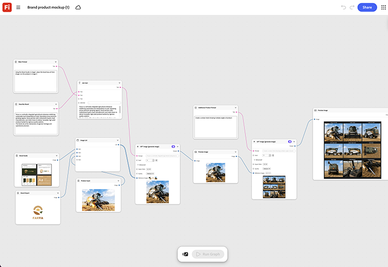

# Modello di prodotto del marchio

Scopri come visualizzare il prodotto in diverse scene. Trascina una foto o un rendering del prodotto nel nodo del modello. Il grafico lo posiziona all&#39;interno di una scena completamente personalizzata, con luci e ombre che corrispondono automaticamente alla scena. [Apri modello di prodotto Marchio](https://firefly.adobe.com/graph/edit/id/urn:aaid:sc:US:18717173-ecd7-5f76-8788-6be6cb977d93).

[!BADGE Esempi di settore]{type=Informative tooltip="Esempi di settore"}

* **Vendita al dettaglio** - Crea una nuova linea di prodotti stagionali all&#39;interno di una scena di visualizzazione in negozio con marchio, prima che esista la visualizzazione fisica.
* **Bevande** - Visualizza in anteprima una nuova progettazione di bottiglie all&#39;interno di una scena di raffreddamento per la vendita al dettaglio completamente personalizzata prima della produzione.
* **Tech** - Crea una nuova periferica all&#39;interno di una scena di scaffale per un lancio.

>[!TIP]
>
>**Prima di iniziare** - Per risultati ottimali, personalizza questo modello per il tuo marchio, prodotto e flusso di lavoro. Scambia le tue immagini di riferimento, i prompt e le copie prima di utilizzare qualsiasi output.

{align="center"}

Torna a [Introduzione a Firefly Graph](https://experienceleague.adobe.com/it/docs/creative-cloud-enterprise-learn/cce-learning-hub/fireflyoverview/firefly-graph/overview-firefly-graph).
