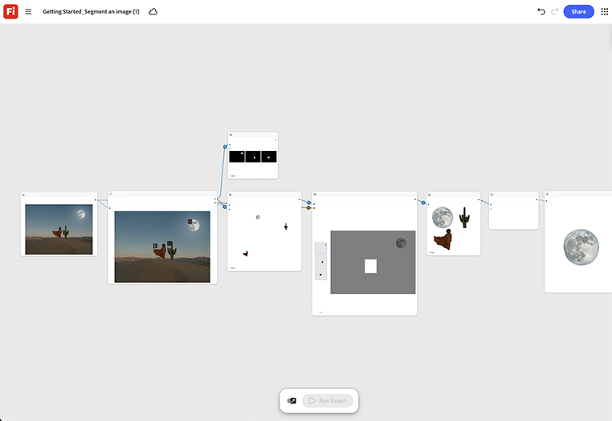

# Guida introduttiva - Segmentare un’immagine

Scoprite come caricare qualsiasi immagine sorgente ed eseguire il nodo di segmentazione per isolare il soggetto dallo sfondo. [Apri Guida introduttiva - Segmenta un modello di immagine](https://firefly.adobe.com/graph/edit/id/urn:aaid:sc:VA6C2:c090820d-b733-44c7-910d-5e216c19c5cc).

[!BADGE Esempi di settore]{type=Informative tooltip="Esempi di settore"}

* **Salute**: segmentare un dispositivo medico da una ripresa da studio occupata per rilasciarlo su uno sfondo clinico pulito per una pagina di prodotto, senza una nuova scansione in background.
* **Vendita al dettaglio** - Isolate un indumento da una foto lifestyle per creare un&#39;immagine pulita del catalogo dei soli prodotti.
* **Automotive** - Tagliate un veicolo fuori da un luogo per effettuare le riprese e posizionatelo sullo sfondo di uno studio per la stampa.

>[!TIP]
>
>**Prima di iniziare** - Per risultati ottimali, personalizza questo modello per il tuo marchio, prodotto e flusso di lavoro. Scambia le tue immagini di riferimento, i prompt e le copie prima di utilizzare qualsiasi output.

{align="center"}

Torna a [Introduzione a Firefly Graph](https://experienceleague.adobe.com/en/docs/creative-cloud-enterprise-learn/cce-learning-hub/fireflyoverview/firefly-graph/overview-firefly-graph).
