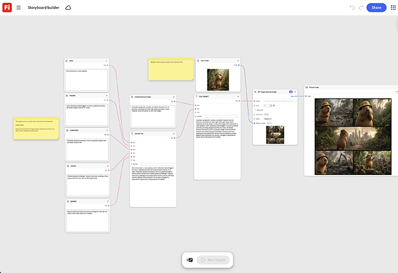

# Generatore storyboard

Scoprite come trasformare automaticamente le vostre idee in uno storyboard utilizzando i prompt di testo. Costruisci scena per scena, aggiungendo un nodo per battuta del commento. Riordinate i nodi per provare una sequenza diversa prima di bloccare l&#39;ordine finale del pannello. [Aprire il modello di creazione storyboard](https://firefly.adobe.com/graph/edit/id/urn:aaid:sc:US:962af654-f338-58eb-ac9a-3ce151c2f4bc).

[!BADGE Esempi di settore]{type=Informative tooltip="Esempi di settore"}

* **Comunicazioni e telecomunicazioni**: lo storyboard offre un punto di lancio di 30 secondi per un nuovo piano, testando tre diverse strutture narrative prima di prenotare una ripresa.
* **Bevande** - Crea uno storyboard scena per scena per una campagna stagionale e riordina le battute per testare il ritmo prima di bloccare il taglio.
* **Viaggi** - Creare uno storyboard dell&#39;arco narrativo di una campagna di destinazione prima di creare una shot list.

>[!TIP]
>
>**Prima di iniziare** - Per risultati ottimali, personalizza questo modello per il tuo marchio, prodotto e flusso di lavoro. Scambia le tue immagini di riferimento, i prompt e le copie prima di utilizzare qualsiasi output.

{align="center"}

Torna a [Introduzione al grafico del Firefly](https://experienceleague.adobe.com/it/docs/creative-cloud-enterprise-learn/cce-learning-hub/fireflyoverview/firefly-graph/overview-firefly-graph).
