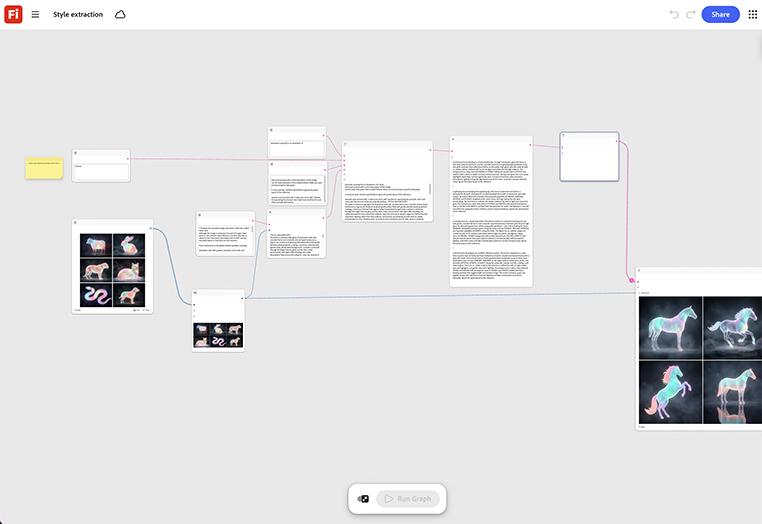

# Estrazione stile

Scoprite come alimentare un’immagine di riferimento per estrarne colore, luce e texture. Potete quindi applicare quel trattamento a qualsiasi nuova immagine che attraversi lo stesso grafico. [Apri modello di estrazione stili](https://firefly.adobe.com/graph/edit/id/urn:aaid:sc:US:6ab4c3c7-ead2-5fa5-9441-75b7a362ce11).

[!BADGE Esempi di settore]{type=Informative tooltip="Esempi di settore"}

* **Viaggi** - Estrai il colore e il trattamento della luce da una foto approvata della campagna per eroi e applicalo a venti nuove immagini di destinazione per coerenza visiva.
* **Vendita al dettaglio** - Estrai l&#39;aspetto approvato di un direttore artistico da uno scatto eroe e applicalo alle fotografie di prodotti di un&#39;intera stagione.
* **Bevande** - I nuovi imballaggi si adattano all&#39;atmosfera di una foto pluripremiata della campagna.

>[!TIP]
>
>**Prima di iniziare** - Per risultati ottimali, personalizza questo modello per il tuo marchio, prodotto e flusso di lavoro. Scambia le tue immagini di riferimento, i prompt e le copie prima di utilizzare qualsiasi output.

{align="center"}

Torna a [Introduzione a Firefly Graph](https://experienceleague.adobe.com/en/docs/creative-cloud-enterprise-learn/cce-learning-hub/fireflyoverview/firefly-graph/overview-firefly-graph).
