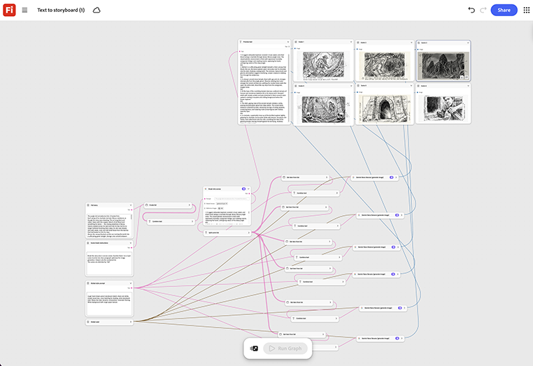

# Da testo a storyboard

Scoprite come generare uno storyboard da uno script o da una shot list. Ogni riga diventa un proprio frame di storyboard, generato in sequenza e disposto per la revisione come un singolo set di pannelli. [Apri testo in modello storyboard](https://firefly.adobe.com/graph/edit/id/urn:aaid:sc:US:8c4d6b7f-a9b6-503c-8a7e-c06cb5cc4ce2).

>[!TIP]
>
>**Prima di iniziare** - Per risultati ottimali, personalizza questo modello per il tuo marchio, prodotto e flusso di lavoro. Scambia le tue immagini di riferimento, i prompt e le copie prima di utilizzare qualsiasi output.

{align="center"}

[!BADGE Casi di utilizzo]{type=Informative tooltip="Esempi di utilizzo"}

* **Finanza** - Trasformare uno script approvato per un nuovo prodotto di risparmio in uno storyboard che l&#39;agenzia può riprendere dallo stesso giorno in cui firma la copia.
* **Vendita al dettaglio** - Storyboard di un video di lancio del prodotto direttamente dalla descrizione della campagna, prima della prenotazione di un regista.
* **Tech** - Storyboard e video tutorial da uno script di funzionalità per allineare gli stakeholder prima dell&#39;inizio dell&#39;animazione.

Torna a [Introduzione al grafico del Firefly](https://experienceleague.adobe.com/it/docs/creative-cloud-enterprise-learn/cce-learning-hub/fireflyoverview/firefly-graph/overview-firefly-graph).
