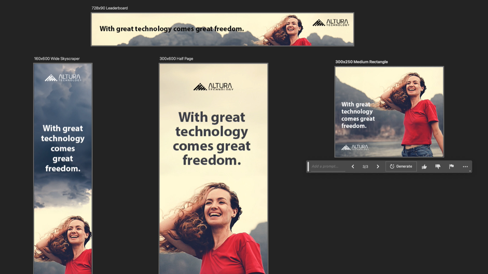

# Adobe [!DNL Firefly] panoramica

Firefly è la nuova famiglia di modelli di IA creativi generativi in arrivo sui prodotti di Adobe, concentrandosi inizialmente sulla generazione di immagini e di effetti di testo. Firefly offre nuovi modi per ideare, creare e comunicare, migliorando allo stesso tempo notevolmente i flussi di lavoro creativi.

  

## Scopri cosa puoi fare con l&#39;Adobe Firefly

  

>[!VIDEO](https://video.tv.adobe.com/v/3416970t1?quality=12&learn=on&hidetitle=true)

## Ulteriori informazioni su Adobe Firefly

<table style="table-layout:fixed">
<tr>
   <td>
      
  </td>
  <td>
      
  </td>
  <td>
      
  </td>
  <td>
    
    

     
  </td>
</tr>
</table>

## Esercitazioni di Firefly

<table style="table-layout:fixed">
<tr>
  <td>
      
  </td>
   <td>
      
  </td>
  <td>
    
    

     
  </td>
  <td>
    
    

     
  </td>
</tr>
</table>
