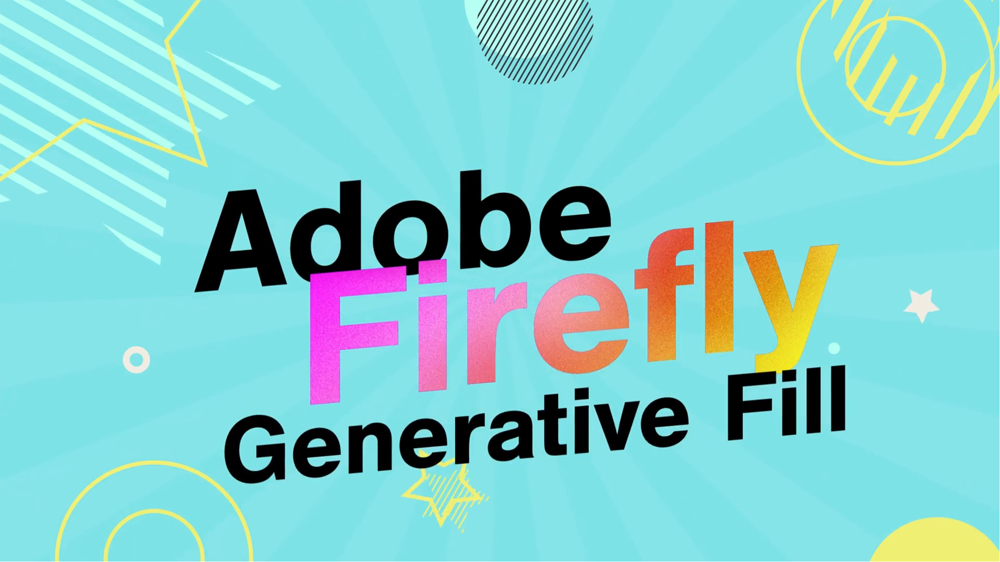

# Adobe [!DNL Firefly] panoramica

Firefly è la nuova famiglia di modelli di intelligenza artificiale generativa creativa che verranno introdotti nei prodotti di Adobe, concentrandosi inizialmente sulla generazione di effetti di immagine e testo. Firefly offre nuovi modi per ideare, creare e comunicare, migliorando significativamente i flussi di lavoro creativi.

  

## Scopri cosa puoi fare con Adobe Firefly

  

>[!VIDEO](https://video.tv.adobe.com/v/3416970t1?quality=12&learn=on&hidetitle=true)

## Ulteriori informazioni su Adobe Firefly

<table style="table-layout:fixed">
<tr>
   <td>
      
  </td>
  <td>
      
  </td>
  <td>
      
  </td>
  <td>
    
    

     
  </td>
</tr>
</table>

## Esercitazioni per Firefly

<table style="table-layout:fixed">
<tr>
   <td>
      
   </td>
   <td>
      
   </td>
   <td>
      
   </td>
  <td>
      
  </td>
</tr>
<tr>
<td>
      
  </td>
<td>
      
  </td>
  <td>
    
    

     
  </td>
  <td>
    
    

     
  </td>
</tr>
</table>
