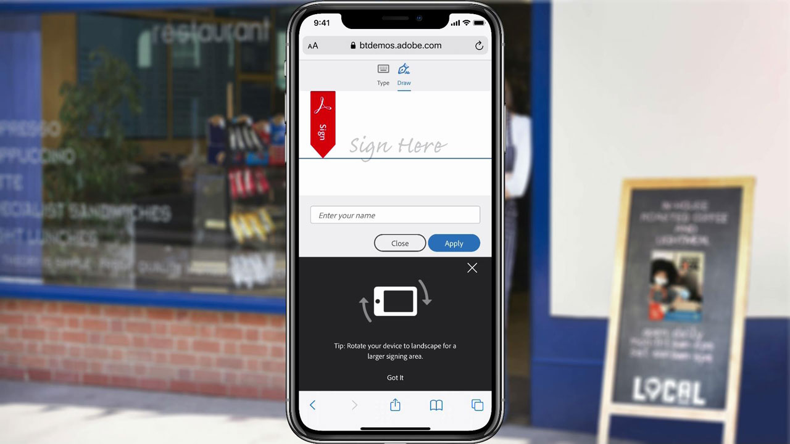

# Acrobat e Sign

Con Adobe Document Cloud, che include le soluzioni leader a livello mondiale per la firma elettronica e la PDF, è possibile trasformare i processi manuali dei documenti in processi digitali efficienti. Ora il tuo team può intervenire rapidamente su documenti, flussi di lavoro e attività, su più schermi e dispositivi, ovunque, in qualsiasi momento e all&#39;interno delle tue app preferite per Microsoft ed enterprise.

## Sfoglia Tutorials di prodotti

<table style="table-layout:fixed">
<tr>
 <td>
   
    

   <a href="acrobat-sign.md#tutorial1"><strong>Avvio di una revisione condivisa di Acrobat</strong></a>
    

    <em>Invita i revisori ad aggiungere i loro commenti a un documento PDF</em>
     
  </td>
  <td>
    
    

    <a href="acrobat-sign.md#tutorial2"><strong>Creazione di un Forms di rinuncia online con Adobe Sign</strong></a>
    

    <em>Trasforma rapidamente i documenti in moduli online e pubblicali online, dove chiunque ne abbia bisogno può compilarli e firmarli</em>
     
  </td>
  <td>
   
    

    <a href="acrobat-sign.md#tutorial3"><strong>Richiedi una firma con Adobe Sign</strong></a>
    

    <em>Passare da Word a PDF e inviarlo per la firma con Adobe Sign</em>
     
  </td>
</tr>
<tr>
 <td>
   
    

   <a href="acrobat-sign.md#tutorial4"><strong>Visualizza i menu su dispositivo mobile con Liquid Mode</strong></a>
    

    <em>Utilizzo della modalità Liquid Mode per migliorare l’esperienza di lettura di PDF sui dispositivi mobili</em>
     
  </td>
  <td>
    
    

    <a href="acrobat-sign.md#tutorial5"><strong>Acquisire documenti in PDF da un cellulare</strong></a>
    

    <em>Con Adobe Scan, acquisisci e converti facilmente documenti, moduli, biglietti da visita e lavagne in PDF Adobi di alta qualità</em>
     
  </td>
  <td>
    
    

     
  </td>
</tr>
</table>

## Avvio di una revisione condivisa con Acrobat (3:49) {#tutorial1}

>[!VIDEO](https://video.tv.adobe.com/v/326777?hidetitle=true)

**Descrizione**
Invita i revisori ad aggiungere i loro commenti a un documento PDF.

In questo tutorial imparerai come:
* Commenti di Host PDF nel Document Cloud
* Raccogli i commenti in un unico luogo
* I commenti simultanei incoraggiano la collaborazione

**PDF di confronto delle opzioni di revisione e commento dell&#39;Adobe**

**Presentato da:**
Dan Armstrong, consulente per le soluzioni (Digital Media) Rick Borstein, Senior Manager Solution Consulting (Digital Media)

## Creazione di Forms di rinuncia online con Adobe Sign (5:19) {#tutorial2}

>[!VIDEO](https://video.tv.adobe.com/v/326776?hidetitle=true)

**Descrizione**
Trasforma rapidamente i documenti in moduli online e pubblicali online, dove chiunque ne abbia bisogno può compilarli e firmarli.

In questo tutorial imparerai come:
* Passare al digitale trasformando i moduli cartacei in documenti digitali
* Pubblica moduli digitali sul tuo sito Web, dove i clienti possono accedervi dal proprio dispositivo
* I moduli completati vengono archiviati automaticamente per i record

**Presentato da:**
Taylor Kobey, consulente soluzioni (Digital Media) Emily Palmer, consulente soluzioni (Digital Media)

## Richiedi una firma con Adobe Sign (3:21) {#tutorial3}

>[!VIDEO](https://video.tv.adobe.com/v/326801?hidetitle=true)

**Descrizione**
Passa da Word a PDF e invialo per la firma con Adobe Sign.

In questo tutorial imparerai come:
* Utilizza gli strumenti che utilizzi quotidianamente per inviare documenti digitali per la firma

**Presentato da:**
Rick Borstein, Senior Manager Solution Consulting (Media Digitali)

## Visualizza menu su dispositivo mobile con Liquid Mode (2:57) {#tutorial4}

>[!VIDEO](https://video.tv.adobe.com/v/327093?hidetitle=true)

**Descrizione**
Utilizza Liquid Mode per migliorare l’esperienza di lettura di PDF sui dispositivi mobili.

In questo tutorial imparerai come:
* Rendere i file PDF reattivi per i dispositivi mobili
* Migliorare il layout dei PDF
* Aggiungi funzionalità rapide per facilitare la lettura dei documenti su smartphone e tablet

**Presentato da:**
Emilie Enke, Consulente Soluzioni Associate (Media Digitali)

## Acquisisci documenti in PDF da cellulare (5:53) {#tutorial5}

>[!VIDEO](https://video.tv.adobe.com/v/327094?hidetitle=true)

**Descrizione**
Con Adobe Scan, acquisisci e converti facilmente documenti, moduli, biglietti da visita e lavagne in PDF Adobi di alta qualità.

In questo tutorial imparerai come:
* Usa il tuo cellulare per acquisire e convertire documenti, moduli, biglietti da visita e lavagne in PDF Adobi di alta qualità
* Identifica e rende più nitido il testo scritto a mano o stampato, eliminando gli elementi indesiderati, come riflessi e ombre
* Apri il PDF scansionato in Acrobat Reader per creare note e commenti e rivederli con il tuo team

**Presentato da:**
Emilie Enke, Consulente Soluzioni Associate (Media Digitali)

**Risorse per Acrobat e Adobe Sign**

[Informazioni e supporto](https://helpx.adobe.com/support/document-cloud.html) è il tuo hub per tutorial aggiuntivi, [Novità](https://helpx.adobe.com/acrobat/using/whats-new.html)e collegamenti ai forum della community.

**Versione di ottobre 2020**

Inizia a utilizzare queste funzioni (e molto altro) scaricando l’aggiornamento più recente dall’app desktop Creative Cloud.
