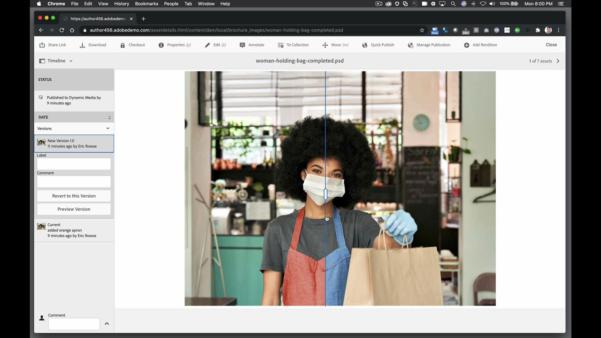
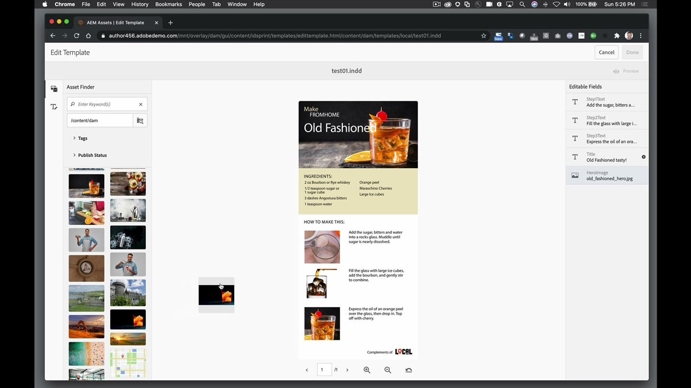

# AEM Assets e Asset Link

Adobe Experience Manager è la soluzione leader di settore per la gestione dell&#39;esperienza digitale nelle aziende di medie dimensioni. Fornisce una base moderna e scalabile per offrire esperienze coinvolgenti che promuovono il coinvolgimento del marchio, stimolano la domanda e aumentano la fedeltà dei clienti. L&#39;Experience Manager include un set completo di strumenti per la creazione, la gestione e la distribuzione di esperienze digitali su tutti i canali.

## Sfoglia Tutorials di prodotti

<table style="table-layout:fixed">
<tr>
 <td>
   
    

   <a href="aem.md#tutorial1"><strong>AEM e Asset Link</strong></a>
    

    <em>Aggiornamenti in tempo reale delle risorse archiviate nell'AEM con Asset Link</em>
     
  </td>
   <td>
   
    

   <a href="aem.md#tutorial2"><strong>File InDesign ospitati nell'AEM</strong></a>
    

    <em>Ospita il documento InDesign nell'AEM in modo che più utenti possano creare variazioni di contenuto contemporaneamente</em>
     
  </td>
  <td>
    
    

     
  </td>
</tr>
</table>

## AEM e Asset Link (5:45) {#tutorial1}

>[!VIDEO](https://video.tv.adobe.com/v/326828?hidetitle=true)

**Descrizione**
Aggiornamenti in tempo reale delle risorse archiviate nell&#39;AEM con Asset Link.

In questo tutorial imparerai come:
* Trova ciò di cui hai bisogno, quando ne hai bisogno con un pannello dedicato per cercare e sfogliare le risorse all&#39;interno dei tuoi programmi di progettazione
* Carica facilmente le risorse direttamente dai tuoi programmi di progettazione
* Check-out e check-in delle risorse dal sistema DAM nel programma di progettazione per effettuare aggiornamenti in tempo reale

**Presentato da:**
Eric Rowse, Consulente Senior Solutions (Digital Media)

## File InDesign ospitati nell&#39;AEM (3:16) {#tutorial2}

>[!VIDEO](https://video.tv.adobe.com/v/326829?hidetitle=true)

**Descrizione**
Ospita il tuo documento InDesign nell&#39;AEM in modo che più utenti possano creare variazioni di contenuto contemporaneamente.

In questo tutorial imparerai come:
* Carica il file InDesign nell’AEM per accedere più facilmente allo spazio di archiviazione
* Crea variazioni in modo sicuro, senza timore di rovinare il file sorgente
* I campi del documento sono preformattati per consentire modifiche o cambiamenti rapidi al contenuto

**Presentato da:**
Eric Rowse, Consulente Senior Solutions (Digital Media)

<table style="table-layout:fixed">
<tr>
 <td>
   
    

   <a href="https://www.adobe.com/marketing/experience-manager.html"><strong>Adobe Experience Manager</strong></a>
    

    <em>Una combinazione potente per le esigenze di gestione dei contenuti e delle risorse digitali</em>
     
  </td>
  <td>
   
    

   <a href="https://www.adobe.com/marketing/experience-manager-assets.html"><strong>AEM Assets</strong></a>
    

    <em>Gestione delle risorse digitali di nuova generazione</em>
     
  </td>
  <td>
   
    

   <a href="https://www.adobe.com/marketing/experience-manager-assets/benefits.html"><strong>AEM Assets: vantaggi</strong></a>
    

    <em>Fai funzionare le tue risorse digitali</em>
     
  </td>
</tr>
</table>

**Asset Link e risorse AEM**

[Informazioni e supporto](https://helpx.adobe.com/support/experience-manager.html) è il tuo hub per esercitazioni aggiuntive, novità e collegamenti ai forum della community.

**Versione di ottobre 2020**

Inizia a utilizzare queste funzioni (e molto altro) scaricando l’aggiornamento più recente dall’app desktop Creative Cloud.
