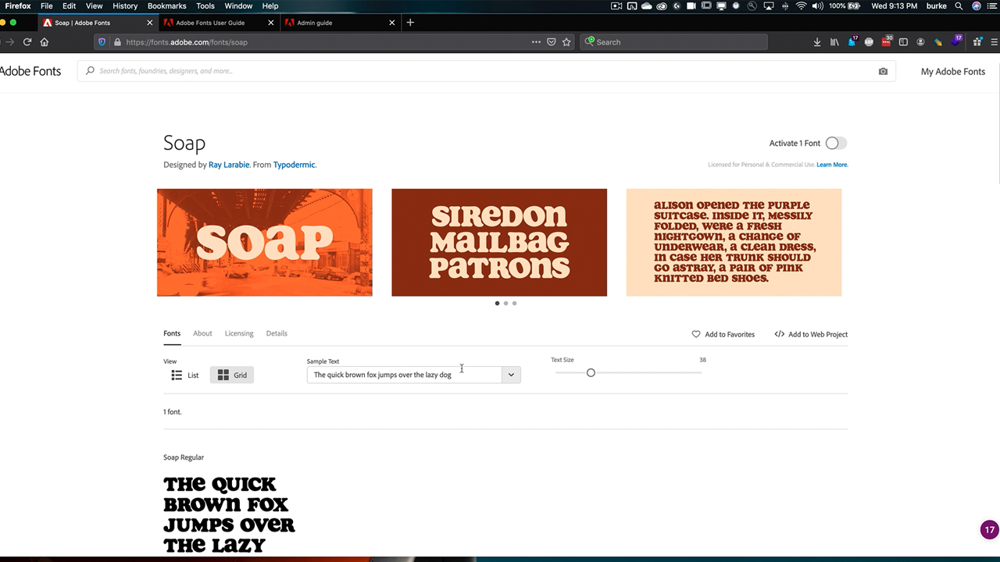

# Amministrazione Enterprise

Gestisci le autorizzazioni e le risorse per gli Adobi in tutta l&#39;organizzazione.

## Sfoglia Tutorials di amministrazione Enterprise

<table style="table-layout:fixed">
<tr>
 <td>
   
    

   <a href="enterprise.md#tutorial1"><strong>Adobe Fonts</strong></a>
    

    <em>Esplorate le quasi 200 famiglie di Adobe Fonts e la facilità d'uso del servizio Adobe Fonts</em>
     
  </td>
  <td>
    
    

     
  </td>
  <td>
    
    

     
  </td>
</tr>
</table>

## Adobe Fonts (5:20) {#tutorial1}

>[!VIDEO](https://video.tv.adobe.com/v/328226?hidetitle=true)

**Descrizione:**

Esplora le quasi 200 famiglie di Adobe Fonts e la facilità d&#39;uso del servizio Adobe Fonts.

In questo tutorial imparerai come:
* Utilizza la potente interfaccia di navigazione per trovare il font giusto in modo semplice e veloce
* Risparmio di tempo e denaro grazie alle integrazioni Creative Cloud native
* Gestisci tutti i tuoi font in un&#39;unica posizione in Adobe Admin Console

**Presentato da:**

Todd Burke, Consulente Principal Solutions (Digital Media)

**Risorse di amministrazione dell&#39;organizzazione:**

[Guida utente di Adobe Fonts](https://helpx.adobe.com/fonts/user-guide.html)

[Guida all&#39;amministrazione aziendale](https://helpx.adobe.com/enterprise/admin-guide.html)
