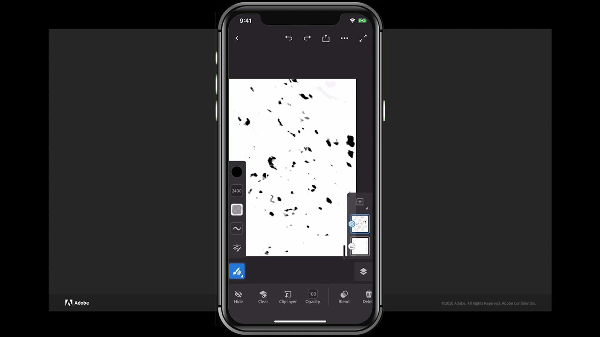

# Fresco

Adobe Fresca è un’app multipiattaforma per la creazione di disegni e dipinti utilizzando metodi basati su pennelli che combinano flussi di lavoro vettoriali e raster con documenti cloud.

## Sfoglia i Tutorials di prodotto

<table style="table-layout:fixed">
<tr>
 <td>
   
    

   <a href="fresco.md#tutorial1"><strong>Introduzione al disegno con Adobe Fresca</strong></a>
    

    <em>Usa gli avanzati strumenti di selezione e modifica del colore di Adobe fresco per modificare notevolmente un'immagine in base alle tue esigenze di branding aziendale</em>
     
  </td>
  <td>
   
    

   <a href="fresco.md#tutorial2"><strong>Creare un disegno con texture - Fresco in Illustrator</strong></a>
    

    <em>Colorare e disegnare texture in Adobe Fresca e imparare a usarle in Illustrator</em>
     
  </td>
  <td>
    
    

     
  </td>
</tr>
</table>

## Introduzione al disegno con Adobe Fresca (19:07) {#tutorial1}

>[!VIDEO](https://video.tv.adobe.com/v/326946?hidetitle=true)

**Descrizione**
Scopri Adobe Fresca per la creazione di disegni e dipinti con metodi basati su pennelli che combinano flussi di lavoro vettoriali e raster con documenti cloud.

In questa esercitazione verrà illustrato come:
* Usa pennelli dal vivo esclusivi che simulano la pittura ad acquerello e a olio insieme ai tuoi pennelli pixel e vettoriali preferiti
* Creare effetti con texture creando livelli diversi di pennelli e utilizzando maschere
* Crea ovunque con la nuova app Fresco per iPhone
* Esportare il lavoro in vari formati da utilizzare in altre app per dispositivi mobili e desktop

**Presentato da:**
Liz Tanonis, Consulente Soluzioni (Digital Media)

## Creare un disegno con texture - Fresco in Illustrator (4:10) {#tutorial2}

>[!VIDEO](https://video.tv.adobe.com/v/326947?hidetitle=true)

**Descrizione**
Dipingi e disegna texture in Adobe Fresca e scopri come utilizzarle in Illustrator.

In questa esercitazione verrà illustrato come:
* Crea grafica nell’app Adobe Fresca per iPhone ed esportala per usarla in altre app Creative Cloud
* Utilizzo dello strumento Ricalco immagine in Illustrator per convertire la grafica in vettori
* Applicare texture personalizzate alla grafica vettoriale in Illustrator

**Presentato da:**
Liz Tanonis, Consulente Soluzioni (Digital Media)

**Risorse Fresco**

[Informazioni e supporto](https://helpx.adobe.com/support/adobe-fresco.html) è il punto di riferimento per ulteriori esercitazioni, [Novità](https://helpx.adobe.com/fresco/using/whats-new.html)e collegamenti ai forum della community.

**Versione di ottobre 2020**

Inizia a usare queste funzionalità (e molto altro!) scaricando l&#39;aggiornamento più recente dall&#39;app desktop Creative Cloud.
