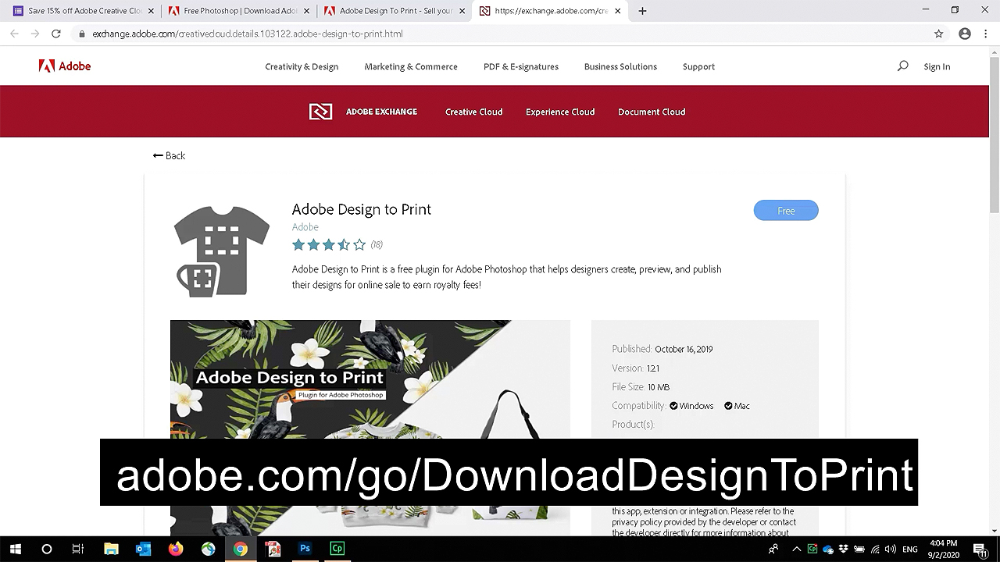
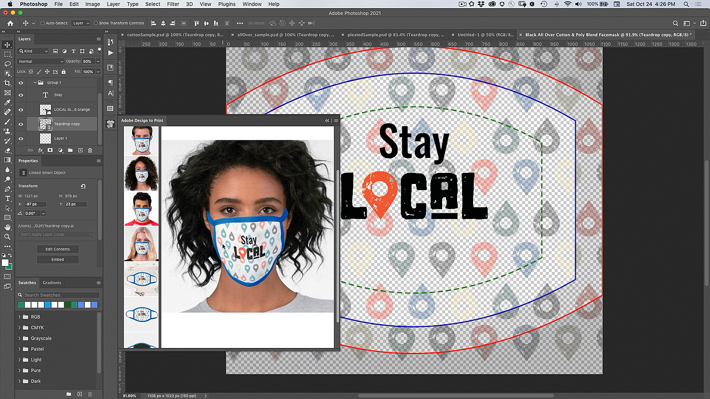
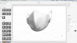

# Plug-in di progettazione per la stampa - Personalizzare una maschera per volti

Non sarebbe bello se potessi personalizzare una maschera per volti con i tuoi disegni? Con il plug-in Design to Print di Adobe, puoi visualizzare i tuoi progetti su centinaia di prodotti Zazzle e pubblicarli direttamente sul loro marketplace online.

## Sfoglia Tutorials progetto maschera a faccia

<table style="table-layout:fixed">
<tr>
 <td>
   
    

   <a href="handsonproject.md#tutorial1"><strong>Installare il plug-in Photoshop Design to Print</strong></a>
    

    <em>Utilizza i potenti strumenti di selezione e modifica del colore di Adobe Photoshop per modificare radicalmente un'immagine in base alle tue esigenze di branding aziendali</em>
     
  </td>
  <td>
    
    

    <a href="handsonproject.md#tutorial2"><strong>Personalizzare una maschera viso con Design to Print</strong></a>
    

    <em>Personalizza la tua maschera Zazzle</em>
     
  </td>
  <td>
    
    

   <a href="handsonproject.md#tutorial3"><strong>Creare una visualizzazione 3D della maschera del volto</strong></a>
    

    <em>Crea una visualizzazione 3D della maschera del volto per la galleria degli eventi</em>
     
  </td>
</tr>
</table>

## Installare il plug-in Photoshop Design to Print (1:50) {#tutorial1}

>[!VIDEO](https://video.tv.adobe.com/v/327096?hidetitle=true)

**Descrizione**
Scopri come installare il plug-in Design to Print per Photoshop.

In questo tutorial imparerai come:
* Visualizza i tuoi progetti su prodotti come abbigliamento, accessori, cancelleria e arte murale in tempo reale!
* Pubblicare sul marketplace online di Dazzle

**Presentato da:**
Patti Sokol, Consulente Principal Solutions (Digital Media)

## Personalizzare una maschera viso con Design to Print (7:54) {#tutorial2}

>[!VIDEO](https://video.tv.adobe.com/v/327097?hidetitle=true)

**Descrizione**
Personalizza la tua maschera Zazzle

In questo tutorial imparerai come:
* Visualizza i tuoi progetti su prodotti come abbigliamento, accessori, cancelleria e arte murale in tempo reale!
* Pubblicare sul marketplace online di Dazzle

**Fate clic sull’immagine per scaricare Learn Design to Print PDF**

**Presentato da:**
Patti Sokol, Consulente Principal Solutions (Digital Media)

## Creare una visualizzazione 3D della maschera del volto (7:54) {#tutorial3}

>[!VIDEO](https://video.tv.adobe.com/v/327098?hidetitle=true)

**Descrizione**
Crea una visualizzazione 3D della maschera del volto per la galleria degli eventi

In questo tutorial imparerai come:
* Crea facilmente visualizzazioni 3D fotorealistiche
* Aggiungi materiali e controlla l&#39;illuminazione per un aspetto professionale
* Importa le risorse per applicare il tuo marchio o altri progetti

**Fare clic sull&#39;immagine da scaricare [!DNL Dimension] File con modello 3D di maschera bianca**

**Presentato da:**
Patti Sokol, Consulente Principal Solutions (Digital Media)
