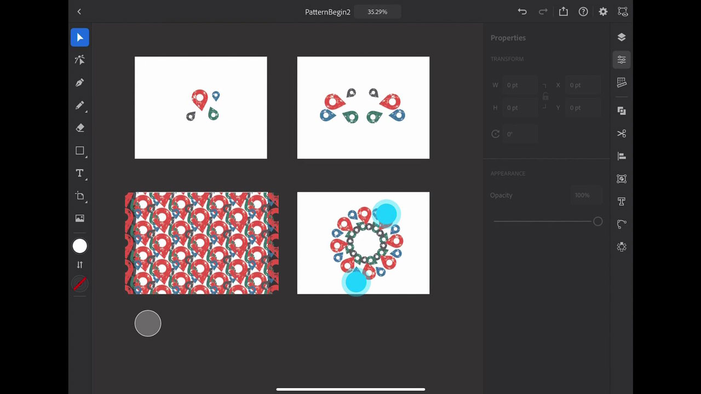

# Illustrator per iPad

Adobe Illustrator per iPad è un&#39;esperienza di progettazione vettoriale riprogettata per touch, Apple Pencil e iPad.

## Sfoglia Tutorials di prodotti

<table style="table-layout:fixed">
<tr>
 <td>
   
    

   <a href="illustratoripad.md#tutorial1"><strong>Introduzione ad Illustrator per iPad</strong></a>
    

    <em>Create un'icona di posizione critica e trasformatela in un pattern da applicare al vostro [!DNL Dimension] e il progetto Zazzle!</em>
     
  </td>
  <td>
    
    

     
  </td>
  <td>
    
    

     
  </td>
</tr>
</table>

## Introduzione ad Illustrator su iPad (9:21) {#tutorial1}

>[!VIDEO](https://video.tv.adobe.com/v/326823?hidetitle=true)

**Descrizione**
Questa rapida panoramica di Illustrator per iPad ti consentirà di iniziare rapidamente a creare un’icona di posizione difficile e di trasformarla in un modello da applicare alle tue [!DNL Dimension] e il progetto Zazzle!

In questo tutorial imparerai come:
* Illustrator riprogettato per iPad trasforma la produttività, accelera la collaborazione, amplia le competenze creative e offre a tutti creatività
* L&#39;interfaccia touch consente un&#39;esperienza più tattile e precisa con Apple Pencil
* Accedere a grafica e colori da CC Libraries
* Flusso di lavoro completo per Illustrator per dispositivi mobili e desktop

**Presentato da:**
Dave Weinberg, Consulente Senior Solutions (Digital Media)

**Risorse per Illustrator su iPad**

[Informazioni e supporto](https://helpx.adobe.com/support/illustrator.html) è il tuo hub per tutorial aggiuntivi, [Novità](https://helpx.adobe.com/illustrator/using/whats-new/mobile-2021.html)e collegamenti ai forum della community.

**Versione di ottobre 2020**

Inizia a utilizzare queste funzioni (e molto altro) scaricando l’aggiornamento più recente dall’app desktop Creative Cloud.
