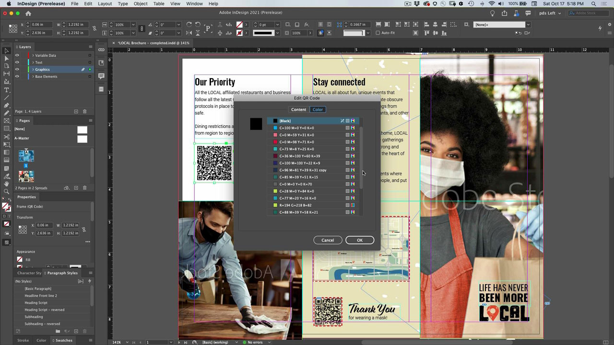
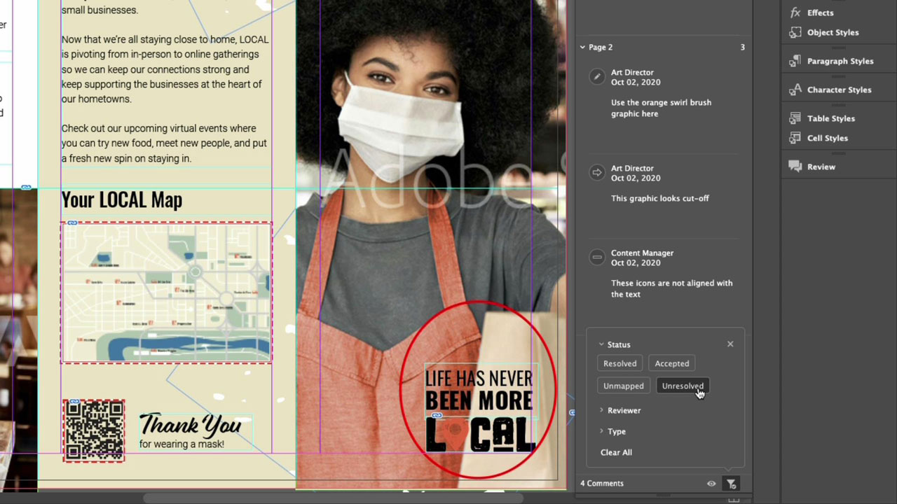
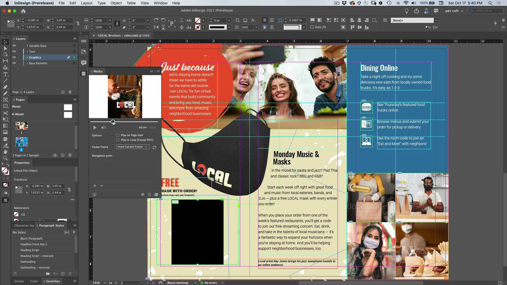

# InDesign

L&#39;app standard di settore per creare splendidi documenti per la stampa e il publishing digitale. Crea esperienze digitali e cartacee avanzate, da eBook e riviste elettroniche a libri, report e white paper.

## Sfoglia i Tutorials di prodotto

<table style="table-layout:fixed">
<tr>
 <td>
    
    

    <a href="indesign.md#tutorial1"><strong>Generare i codici QR</strong></a>
    

    <em>Generare un codice QR che si collega a un sito Web</em>
     
  </td>
  <td>
   
    

   <a href="indesign.md#tutorial2"><strong>Condividi per revisione da InDesign</strong></a>
    

    <em>Esperienza di revisione creativa perfetta per i designer e i membri del team</em>
     
  </td>
  <td>
    
    

    <a href="indesign.md#tutorial3"><strong>Importare commenti PDF da una revisione di Document Cloud</strong></a>
    

    <em>Importare commenti da un PDF direttamente in InDesign e applicare rapidamente le modifiche richieste</em>
     
  </td>
</tr>
<tr>
<td>
   
    

   <a href="indesign.md#tutorial4"><strong>Aggiungi file video al documento InDesign</strong></a>
    

    <em>Aggiungi video all’InDesign. Output su PDF e pubblicazione online</em>
     
  </td>
 <td>
    
    

     
 </td>
 <td>
    
    

     
 </td>
</tr>
</table>

## Generare i codici QR (2:34) {#tutorial1}

>[!VIDEO](https://video.tv.adobe.com/v/326818?hidetitle=true)

**Descrizione**
Generare un codice QR che si collega a un sito Web.

In questa esercitazione verrà illustrato come:
* Accesso ai contenuti web da dispositivi mobili senza bisogno di mani
* Fai sentire al sicuro i tuoi clienti
* Con il digitale è facile mantenere aggiornati i contenuti

**Presentato da:**
Patti Sokol, Principal Solutions Consultant (Digital Media)

## Condividi per revisione da InDesign (4:04) {#tutorial2}

>[!VIDEO](https://video.tv.adobe.com/v/326824?hidetitle=true)

**Descrizione**
InDesign Share for Review offre ai designer e ai membri del team un’esperienza di revisione creativa ancora più fluida.

In questa esercitazione verrà illustrato come:
* Avviare una revisione direttamente da InDesign senza dover creare un PDF
* Revisione e inserimento di commenti da un browser Web
* Raccogli feedback da più parti interessate in un&#39;unica posizione
* Gestisci i commenti in-app, dove è possibile apportare modifiche immediatamente.

**Adobe PDF di confronto delle opzioni di revisione e commento**

**Presentato da:**
Emily Palmer, Consulente Soluzioni (Digital Media)

## Importare i commenti del PDF da una revisione del Document Cloud (4:52) {#tutorial3}

>[!VIDEO](https://video.tv.adobe.com/v/326959?hidetitle=true)

**Descrizione**
Importate i commenti da un PDF direttamente in InDesign e applicate rapidamente le modifiche richieste.

In questa esercitazione verrà illustrato come:
* Supporta i flussi di lavoro di creazione commenti PDF esistenti
* Funzionamento per PDF combinati da più sorgenti

**Adobe PDF di confronto delle opzioni di revisione e commento**

**Presentato da:**
Michael Murphy, Senior Solutions Consultant (Digital Media)

## Aggiungi file video al documento InDesign (5:58) {#tutorial4}

>[!VIDEO](https://video.tv.adobe.com/v/326757?hidetitle=true)

**Descrizione**
Aggiungi video all’InDesign. Output su PDF e pubblicazione online.

In questa esercitazione verrà illustrato come:
* Aggiungere video all’InDesign
* Output su PDF e pubblicazione online

**Presentato da:**
Patti Sokol, Principal Solutions Consultant (Digital Media)

**Risorse InDesign**

[Informazioni e supporto](https://helpx.adobe.com/support/indesign.html) è il punto di riferimento per ulteriori esercitazioni, [Novità](https://helpx.adobe.com/indesign/user-guide.html/indesign/using/whats-new.ug.html)e collegamenti ai forum della community.

**Versione di ottobre 2020**

Inizia a usare queste funzionalità (e molto altro!) scaricando l&#39;aggiornamento più recente dall&#39;app desktop Creative Cloud.
